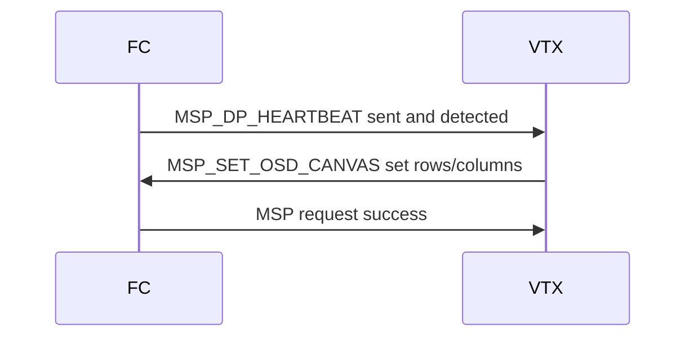
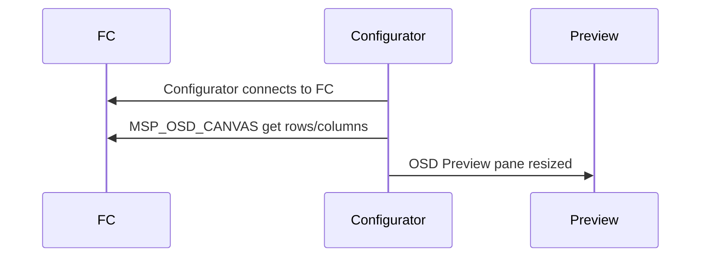

# DisplayPort MSP 扩展

Betaflight 支持有时被称为“画布模式”的模式，其中 OSD 可以发送任意字符串以在给定的屏幕坐标处显示。

## DisplayPort MSP 命令

### MSP_SET_OSD_CANVAS

MSP_SET_OSD_CANVAS 命令由 VTX（或显示设备）发送到 FC，以指示在 HD 模式下可用于 DisplayPort 渲染的画布大小。 HD 模式，如 `vcd_video_system = HD` 所示，在接收到该命令时自动设置。

|命令 |消息 ID |方向 |笔记|
| ------------------ | ------ | ---------| -------------------- |
| MSP_SET_OSD_CANVAS | MSP_SET_OSD_CANVAS | 188 | 188前往FC |设置画布大小 |

|数据|类型 |笔记|
| ----------- | -----| -------------------- |
|画布_列| uint8 |列数 |
|画布行 | uint8 |行数|



### MSP_OSD_CANVAS

MSP_OSD_CANVAS 命令由地面站发送到 FC，以确定在 HD 模式下可用于 DisplayPort 渲染的画布大小。然后在编辑 OSD 元素位置时，在 OSD 选项卡上使用它来显示正确的行/列数。

|命令 |消息 ID |方向 |笔记|
| -------------- | ------ | ---------| -------------------- |
| MSP_OSD_CANVAS | MSP_OSD_CANVAS | 189 | 189前往FC |获取画布大小 |

响应是两个字节。

|数据|类型 |笔记|
| ----------- | -----| -------------------- |
|画布_列| uint8 |列数 |
|画布行 | uint8 |行数|



### MSP_DISPLAYPORT

MSP_DISPLAYPORT 命令由 FC 发送到显示设备/VTX 以执行 DisplayPort 操作。

|命令|消息 ID |方向 |笔记|
| ---------------- | ------ | ---------| ------------------------------------------------ |
| MSP_DISPLAYPORT | 182 | 182来自FC | DisplayPort 特定命令如下 |

随后将出现以下子命令之一。

## DisplayPort 子命令

#### MSP_DP_HEARTBEAT

|命令|消息 ID |笔记|
| ---------------- | ------ | ---------------------------------------------------------------- |
| MSP_DP_HEARTBEAT | MSP_DP_HEARTBEAT 0 |防止 OSD 从板显示“断开连接”状态 |

#### MSP_DP_RELEASE

|命令 |消息 ID |笔记|
| -------------- | ------ | ----------------------------------------------------------------------------------------------------------- |
| MSP_DP_RELEASE | MSP_DP_RELEASE | 1 |清除显示并允许根据遥测信息等在显示设备上进行本地渲染。

#### MSP_DP_CLEAR_SCREEN

|命令 |消息 ID |笔记|
| ------------------- | ------ | ----------------- |
| MSP_DP_CLEAR_SCREEN | MSP_DP_CLEAR_SCREEN | 2 |清除显示|

#### MSP_DP_WRITE_STRING

|命令 |消息 ID |笔记|
| ------------------- | ------ | -------------- |
| MSP_DP_WRITE_STRING | MSP_DP_WRITE_STRING | 3 |写一个字符串 |

|数据|类型 |笔记|
| ---------| ---------| ------------------------------------------------------------------------ |
|行| uint8 |放置字符串第一个字符的行 |
|专栏 | uint8 |放置字符串第一个字符的列 |
|属性| uint8 |指示要使用的字体以及文本是否应该闪烁的字节 |
|字符串| uint8 x n|长度最多为 30 个字符的 NULL 终止字符串 |

`attribute`参数因此被编码。

|领域 |比特|评论 |
| -------------------------- | -----| ------------------------------------------------------------------------ |
|版本 | 7 |必须为 0 |
| DISPLAYPORT_MSP_ATTR_BLINK | 6 |设置让显示设备自动闪烁字符串 ||保留 | 2 - 5 | 2 - 5必须为 0 |
|字体编号| 0 - 1 | 0 - 1选择四种字体之一，每种字体 256 个 8 位字符 |

#### MSP_DP_DRAW_SCREEN

|命令 |消息 ID |笔记|
| ------------------ | ------ | ------------------------------------------------------------------ |
| MSP_DP_DRAW_SCREEN | MSP_DP_DRAW_SCREEN | 4 |在清除/渲染帧后触发帧的显示 |

#### MSP_DP_OPTIONS

|命令 |消息 ID |笔记|
| -------------- | ------ | -------------------------------------------------------------------------------------------------------------------------------------------------------------------------------------------------------------------------------- |
| MSP_DP_OPTIONS | MSP_DP_OPTIONS | 5 | Betaflight 未使用。由 INAV 和 Ardupilot 用于设置显示分辨率。 0 = SD (30x16)、1 = HD (50x18)、2 = 30x16 SD 网格以 HD 50x18 网格为中心（HDZero 使用）、3 = 60x22（INAV / DJI WTF 使用）|

#### MSP_DP_SYS

|命令 |消息 ID |笔记|
| ---------- | ------ | ---------------------------------------------------------------------------------- |
| MSP_DP_SYS | 6 |在给定坐标处显示系统元素displayportSystemElement_e |

|数据|类型 |笔记|
| -------------- | -----| -------------------------------------------------------------------------- |
|行| uint8 |放置字符串第一个字符的行 |
|专栏 | uint8 |放置字符串第一个字符的列 |
|系统元素 | uint8 |由 VTX/护目镜/显示设备渲染的系统元素 |

`system_element` 将是 `displayPortSystemElement_e ` 定义的以下之一。一旦 VTX/护目镜/显示设备接收到一个 MSP_DP_SYS 子命令，则默认系统元素不应再显示在其默认位置，而只能按照该命令的指示明确显示。通过这种方式，默认行为与以前一样，但是一旦显式定位任何系统元素，这些 OSD 元素的行为就像任何其他元素一样，并且可以通过任何给定的 OSD 配置文件在特定位置进行调用。

```
// System elements rendered by VTX or Goggles
typedef enum {
    DISPLAYPORT_SYS_GOGGLE_VOLTAGE = 0,
    DISPLAYPORT_SYS_VTX_VOLTAGE = 1,
    DISPLAYPORT_SYS_BITRATE = 2,
    DISPLAYPORT_SYS_DELAY = 3,
    DISPLAYPORT_SYS_DISTANCE = 4,
    DISPLAYPORT_SYS_LQ = 5,
    DISPLAYPORT_SYS_GOGGLE_DVR = 6,
    DISPLAYPORT_SYS_VTX_DVR = 7,
    DISPLAYPORT_SYS_WARNINGS = 8,
    DISPLAYPORT_SYS_VTX_TEMP = 9,
    DISPLAYPORT_SYS_FAN_SPEED = 10,
    DISPLAYPORT_SYS_COUNT,
} displayPortSystemElement_e;
```