# 在 Eclipse 中构建

如何在 Linux、Windows 和 MacOS 上的 Eclipse 中构建、测试和调试 Betaflight。

> 注意事项
> 本指南针对 Eclipse Luna 时代的工具（2014-2016）并保留以供遗留参考。它不被维护。首选当前的构建指令（Betaflight App/Cloud 构建或支持的 IDE）。如果您仍然使用 Eclipse，预计路径、插件和菜单会有所不同。

## 清单

使用此清单来确保您没有遗漏任何步骤。以下强制版本截至 2016 年 1 月均为最新且正确。

- [ ] [下载并安装](http://www.oracle.com/technetwork/java/javase/downloads/jdk8-downloads-2133151.html) 最新（当前为 1.8）64 位 Oracle JDK [了解更多](#install-the-jdk)
- [ ] [下载并安装](https://eclipse.org/downloads/packages/eclipse-ide-cc-developers/lunasr2) Eclipse Luna (4.4) 64 位 CDT 版本，**注意：** 不是 Mars 或 Neon [阅读更多](#install-eclipse)
- [ ] [下载并安装](https://launchpad.net/gcc-arm-embedded/4.9/4.9-2015-q3-update) GCC ARM 嵌入式工具链 4.9-2015-q3-update [阅读更多](#install-arm-toolchain)
- [ ] _仅限 Windows 平台：_ [下载并安装](https://github.com/gnuarmeclipse/windows-build-tools/releases) 最新的 GNU ARM Eclipse Windows 构建工具
- [ ] _仅限 Windows 平台：_ 下载并安装 [Cygwin](http://cygwin.com/install.html) 或 [MinGW MSYS](http://sourceforge.net/projects/mingw/files/latest/download)
- [ ] 可选地[下载并安装](https://github.com/gnuarmeclipse/openocd/releases) 最新的 GNU ARM Eclipse OpenOCD [阅读更多](#install-openocd)
- [ ] _仅限 Linux 平台：_ [配置 UDEV](http://gnuarmeclipse.github.io/openocd/install/#udev) 以识别 USB JTAG 探针
- [ ] _仅限 Windows 平台：_ [下载并安装](http://www.st.com/web/en/catalog/tools/FM147/SC1887/PF260219) ST-Link / ST-LinkV2 驱动程序。即使 ST 尚未提及，这些驱动程序也可以在 Windows 10 上运行。
- [ ] 可选择[下载并安装](https://github.com/gnuarmeclipse/qemu/releases)最新的 GNU ARM Eclipse QEMU [阅读更多](#install-qemu)
- [ ] 向 Eclipse 添加一个名为“GNU ARM Eclipse Plugins”的新更新站点，URL 为“http://gnuarmeclipse.sourceforge.net/updates"，并安装提供的所有功能
- [ ] 配置[推荐的工作区设置](http://gnuarmeclipse.github.io/eclipse/workspace/preferences/)
- [ ] 查看 betaflight 源代码 [阅读更多](#checkout-betaflight)
- [ ]_仅限Windows平台：_将msys或cygwin bin目录添加到项目路径中
- [ ] 通过转到_Project 菜单 -> Build All_ [阅读更多](#build) 构建代码
- [ ] 通过创建并运行名为“test”的 make 目标来运行测试
- [ ] 配置调试 [阅读更多](#configure-debugging)

## 扩展注释

### 安装JDK

GNU Arm Eclipse 支持的[最低 JDK 版本](http://gnuarmeclipse.github.io/plugins/install/#java) 是 1.7，但建议使用当前最新的 1.8。虽然 Oracle JDK 是推荐版本，[他们也支持](http://gnuarmeclipse.github.io/plugins/install/#java) OpenJDK。

### 安装 Eclipse

Eclipse Luna v4.4 是目前 GNU Arm Tools 的首选版本。最低 Eclipse 版本是 Kepler 4.3。最高版本是 Mars 4.5，尽管它没有经过 GNU Arm Eclipse 测试，而且有些东西[已知已损坏](http://gnuarmeclipse.github.io/plugins/install/#eclipse--cdt)。 Eclipse Neon 目前尚未发布。

建议使用 Eclipse Luna CDT 下载中附带的 CDT v8.6.0。最低 CDT 版本为 8.3。

首选 64 位 Eclipse，但也可以使用 32 位 Eclipse；确保在 32 位 JDK 上运行它。

### 安装 ARM 工具链

最低版本为 4.8-2014-q2。目前推荐的最大版本是 4_9-2015q3。

GNU ARM Tools 建议您不要将工具链添加到路径环境变量中。这意味着您可以安装多个版本的工具链而不会发生冲突。如果您只安装一个版本，那么在 Eclipse 外部工作时将其添加到您的路径中可以让生活变得更轻松。

保留默认安装目录，以便 GNU ARM 插件可以找到工具链。

### 安装 OpenOCD

如果您要在真实硬件（例如 STM32F3DISCOVERY 开发板）上进行调试，则应该安装 OpenOCD。不需要简单地构建 Betaflight 或运行测试。

### 安装 QEMU

当前没有在 QEMU 模拟器上运行任何测试，因此此安装完全是可选的。测试您的安装很有用，因为您可以编译并运行闪烁演示。

### 结帐 Betaflight

如果您要向 betaflight 提交更改，请在 GitHub 上 [fork 存储库](https://help.github.com/articles/fork-a-repo/) 并签出您的副本。

在 Eclipse 中，转到 _File -> Import_ 选择 _Git -> Projects from Git_

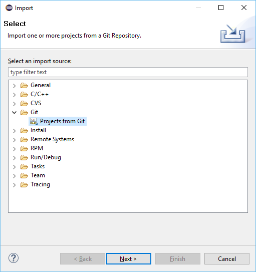

选择_克隆 URI_

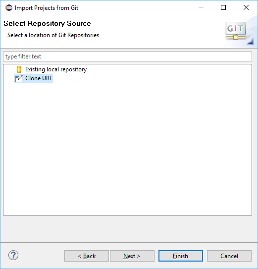输入 URI https://github.com/betaflight/betaflight，或者如果您已分叉存储库，请输入您的 URI。使用分叉时，您需要指定您的身份验证详细信息

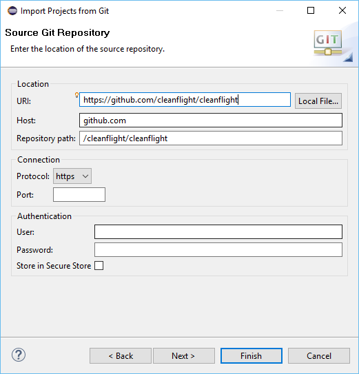

在分支选择对话框中，取消选择所有分支并仅选择 _master_

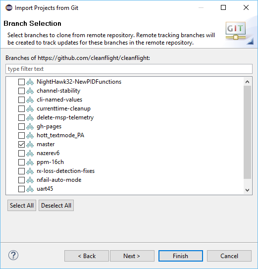

选择默认目标目录

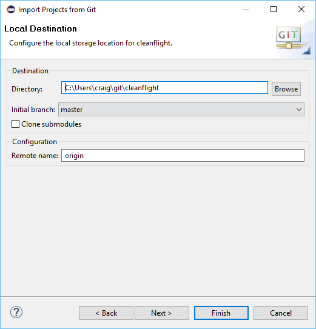

下载完成后，选择_使用新建项目向导_并单击完成

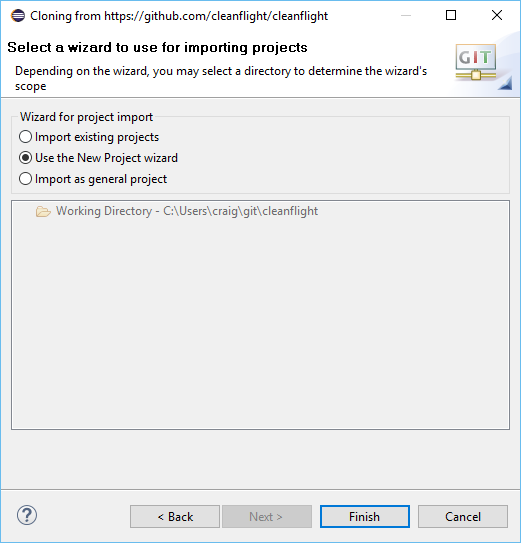

选择_C/C++ -> Makefile Project with Existing Code_

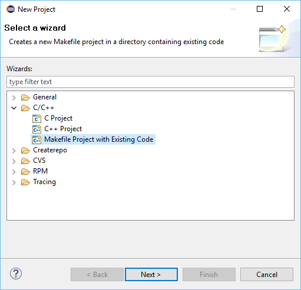

输入 betaflight 作为项目名称，然后浏览到您的主目录 -> git -> betaflight 以查找现有代码位置。确保检查 C（betaflight）和 C++（测试）语言。选择 Cross ARM GCC 工具链作为索引器设置。单击完成。

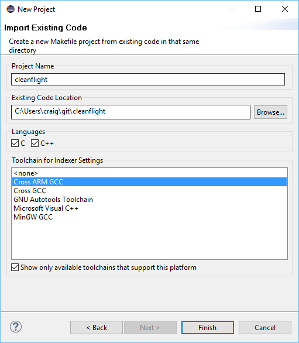

通过转到项目属性 -> C/C++ 构建并选择“行为”选项卡来设置构建和调试目标。将构建框中的 `all` 替换为 `TARGET=[your_target] DEBUG=GDB`（例如，STM32F4DISCOVERY）。

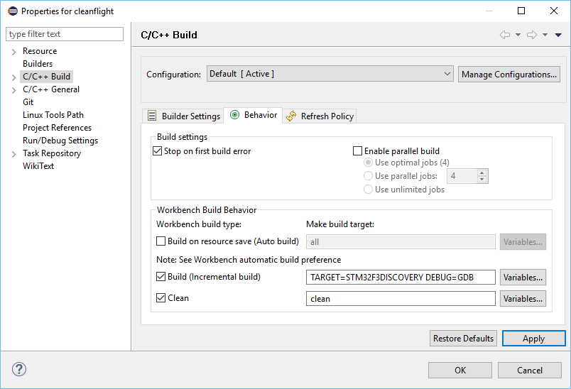

仅在 Windows 上，通过右键单击项目并选择属性，将 msys 或 cygwin bin 目录添加到项目路径

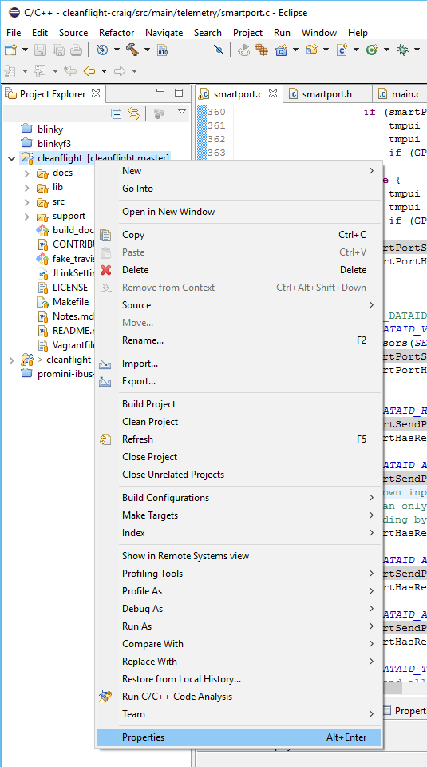

编辑_C/C++ Build -> Environment_中的路径变量

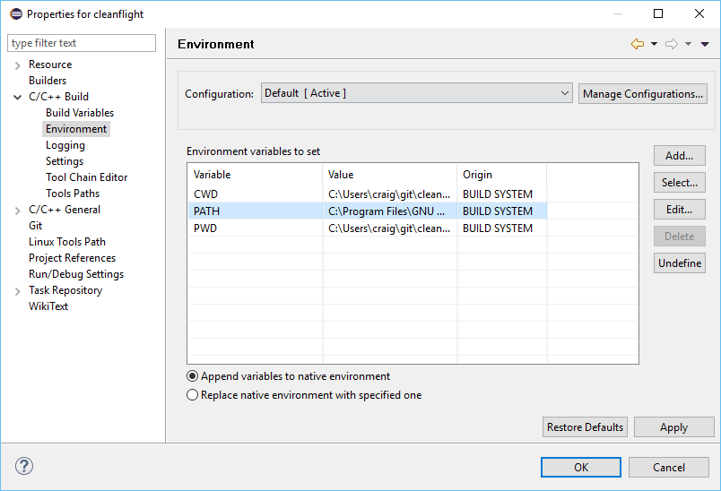

将完整路径附加到相关 bin 目录

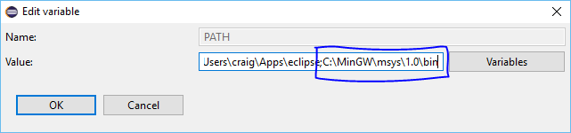

### 构建

选择项目 -> 构建全部

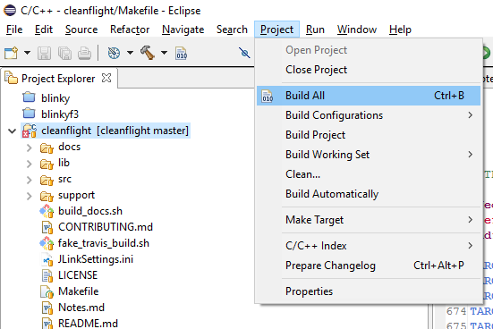

### 配置调试

选择调试 -> 调试配置

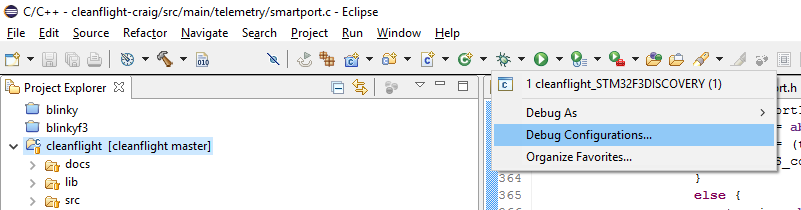

为 obj\main\betaflight_XXX.elf 应用程序创建一个新的 OpenOCD 配置（该文件是由上面的构建步骤生成的）

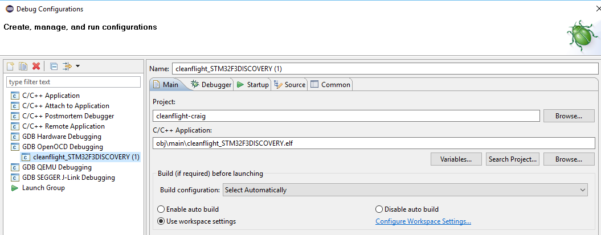

为您的开发平台添加适当的 openocd 板配置参数

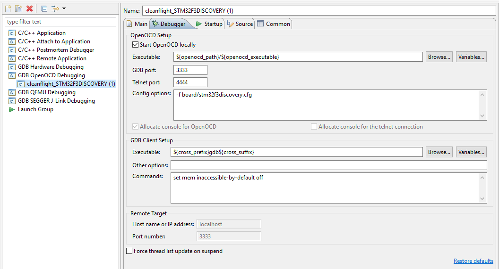

将目标添加到您的调试菜单收藏夹

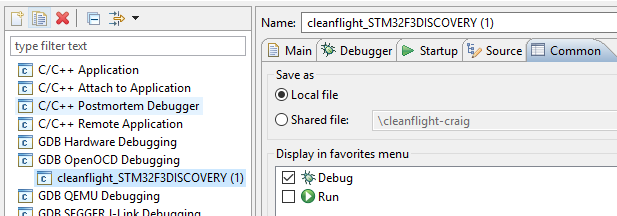