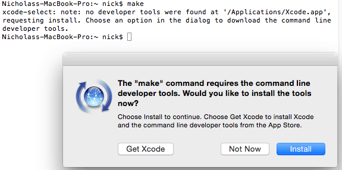

# 在 Mac OS X 中构建

在 Mac OS X 中构建只需几个步骤即可完成：

- 安装通用开发工具（clang、make、git）
- 通过 git 查看 Betaflight 源代码
- 安装ARM GCC编译器
- 构建代码

## 安装通用开发工具（clang、make、git）

打开终端并运行 `make`。如果已经安装，您应该会看到类似这样的消息，这意味着您
已经安装了所需的开发工具：

```
make: *** No targets specified and no makefile found.  Stop.
```

如果尚未安装，您可能会看到这样的弹出窗口。如果是这样，请单击“安装”按钮来安装命令行
开发者工具：



如果您只是收到这样的错误而不是有用的弹出提示：

```
-bash: make: command not found
```

尝试运行 `xcode-select --install` 来触发弹出窗口。

如果这不起作用，您需要[从 App Store][] 安装 Xcode 开发环境。之后
安装后，打开 Xcode 并进入其首选项菜单。转到“下载”选项卡并安装
“命令行工具”包。

[来自应用商店]：https://itunes.apple.com/us/app/xcode/id497799835

## 通过 git 查看 Betaflight 源代码

输入您的开发目录并使用显示在上的“HTTPS 克隆 URL”克隆 [Betaflight 存储库][]
Betaflight GitHub 页面的右侧，如下所示：

```
git clone https://github.com/betaflight/betaflight.git
```

这将为您下载整个 betaflight 存储库到一个名为“betaflight”的新文件夹中。

[betaflight 存储库]：https://github.com/betaflight/betaflight

## 安装ARM GCC编译器

要安装所需的编译器，您只需进入 betaflight 目录并运行 `make arm_sdk_install`

## 构建代码

进入 betaflight 目录并运行 `make configs` 检索板目标，然后运行 `make MATEKH743` 来
为 MATEKH743 构建固件。构建完成后，.hex 固件应该可用
`obj/betaflight_2025.12.0_MATEKH743.hex` 供您使用 Betaflight 应用程序进行闪光。

## 更新到最新源

如果您想删除本地更改并更新到 Betaflight 源的最新版本，请输入您的
betaflight 目录并运行这些命令首先删除本地更改，获取并合并最新的
从存储库中进行更改，然后重建固件：

```
git reset --hard
git pull

make clean CONFIG=MATEKH743
make MATEKH743
```