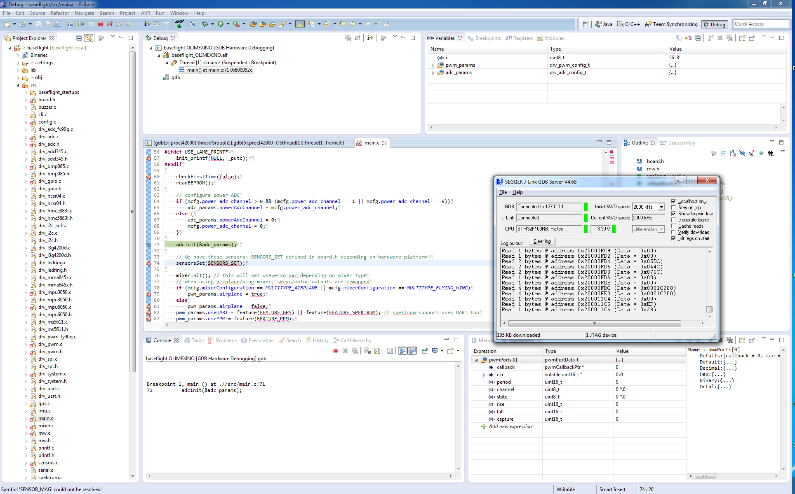

# Eclipse 中的硬件调试

使用命令行或通过 Eclipse make target 构建带有调试信息的二进制文件。

示例 Eclipse 生成目标


# GDB 和 OpenOCD

启动openocd

在 eclipse 中创建一个新的调试配置：


您可以通过 telnet 连接控制 openocd：

```
telnet localhost 4444
```

停止开发板，刷新固件，重新启动：

```
	reset halt
	wait_halt
	sleep 100
	poll
	flash probe 0
	flash write_image erase /home/user/git/betaflight/obj/betaflight_STM32F4DISCOVERY.hex 0x08000000
	sleep 200
	soft_reset_halt
	wait_halt
	poll
	reset halt
```

此时您可以在 Eclipse 中启动调试。


# GDB 和 J 链接

以下是 Hydra 对 Eclipse (Kepler) 配置的一些屏幕截图

如果您使用 cygwin 构建二进制文件，那么请确保首先配置您的公共 `Source Lookup Path`, `Path Mappings`，如下所示：


从 `Run` 菜单创建新的 `GDB Hardware Debugging` 启动配置

首先构建使用 GDB 调试信息编译的可执行文件非常重要。
选择适当的 .elf 文件（不是十六进制文件） - 在这些示例中，目标平台是 OLIMEXINO。

禁用自动构建


选择适当的 gdb 可执行文件 - 最好来自用于构建可执行文件的同一工具链。


配置启动如下

初始化命令

```
target remote localhost:2331
monitor interface SWD
monitor speed 2000
monitor flash device = STM32F103RB
monitor flash download = 1
monitor flash breakpoints = 1
monitor endian little
monitor reset
```


指定运行命令也可能很有用：

```
monitor reg r13 = (0x00000000)
monitor reg pc = (0x00000004)
continue
```


如果您使用 cygwin，“源”选项卡上应显示一个附加条目（此屏幕截图中未显示）


通用选项卡上的默认值无需更改


以USB模式启动J-Link服务器


如果它连接到您的目标设备，它应该看起来像这样


从 Eclipse 中使用运行/调试配置...启动应用程序，Eclipse 应该将编译后的文件上传到目标设备，如下所示


当它运行时，J-Link 服务器应该如下所示。


最后，您可以使用 Eclipse 调试功能来检查变量、内存、堆栈跟踪、设置断点、单步执行代码等。



如果 Eclipse 找不到断点并且它们被忽略，则检查路径映射（如果使用 cygwin）或使用其他调试启动器，如下所示。请注意配置窗口底部的“选择其他...”。

