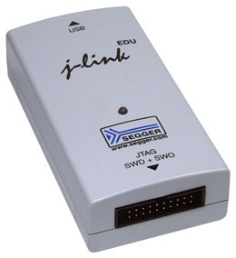
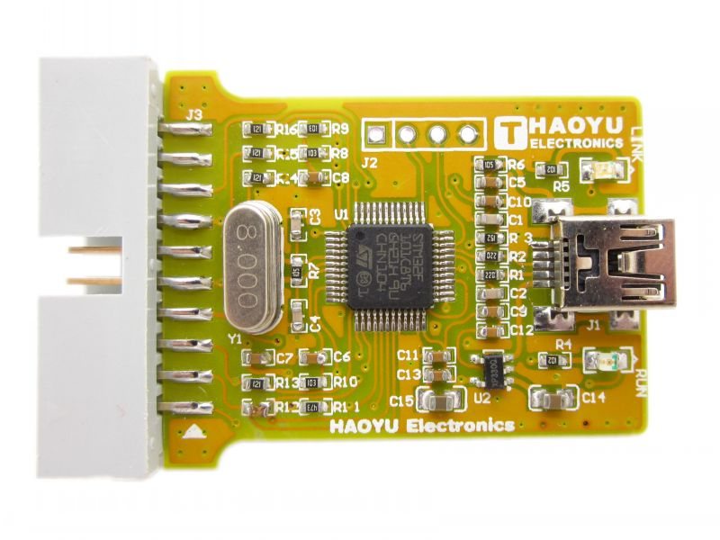
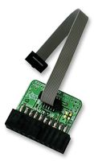
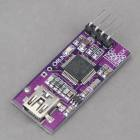
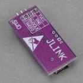
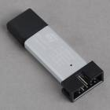

# 硬件调试

可以使用调试信息来编译代码，然后您可以通过 JLink/St-Link 调试适配器将调试版本上传到开发板，并在 IDE 中单步调试代码。

有关必要硬件和设置 Eclipse IDE 的更多信息可以在 [此处](/docs/development/debugging/Hardware-Debugging-in-Eclipse) 找到

可以在此处找到 Visual Studio 指南：
http://visualgdb.com/tutorials/arm/st-link/

该视频也有助于理解该过程：
https://www.youtube.com/watch?v=kjvqySyNw20

## 硬件

存在各种调试硬件解决方案，Segger J-Link 克隆价格便宜，并且可以在 Naze 和 Olimexino 平台的 Windows 上运行。

### J-Link 设备

Segger 提供出色的调试器和调试软件。

Segger J-Link GDB 服务器可以从这里获取。

http://www.segger.com/jlink-software.html

#### Segger J-Link EDU 版本，供业余爱好者和教育用途。



https://www.segger.com/j-link-edu.html

#### USB-MiniJTAG J-Link JTAG/SWD 调试器/仿真器

http://www.hotmcu.com/usbminijtag-jlink-jtagswd-debuggeremula%E2%80%8Btor-p-29.html?cPath=3_25&zenid=fdefvpnod186umrhsek225dc10



##### ARM-JTAG-20-10 适配器

https://www.olimex.com/Products/ARM/JTAG/ARM-JTAG-20-10/
http://uk.farnell.com/jsp/search/productdetail.jsp?sku=2144328



#### CJMCU-STM32单片机开发板 Jlink下载器 Jlink ARM编程器





http://www.goodluckbuy.com/cjmcu-stm32-singlechip-development-board-jlink-downloader-jlink-arm-programmer.html

### STLink V2 设备

也可以通过 OpenOCD 使用 STLink V2 设备。

#### CEPark STLink V2



http://www.goodluckbuy.com/cepark-stlink-st-link-v2-emulator-programmer-stm8-stm32-downloader.html

## 编译选项

使用 `DEBUG=GDB` 进行论证。

您可能会发现，如果您编译所有带有调试信息的文件，则该程序太大而无法适应目标设备。如果发生这种情况，您有一些选择：

- 编译没有调试信息的所有文件（`make clean`、`make ...`），然后重新保存或`touch`您希望能够单步执行的文件，然后运行`make DEBUG=GDB`。然后，这将使用调试符号重新编译您感兴趣的调试文件，您将获得一个较小的二进制文件，该文件应该适合设备。
- 您可以使用诸如 PORT103R 之类的开发板，开发板通常有更多的 flash rom。

## 操作系统

### 通过 Brew 安装 OpenOCD

ruby -e“$(curl -fsSL https://raw.githubusercontent.com/Homebrew/install/master/install)”

酿造安装openocd

### GDB 调试服务器

#### J-Link

##### Windows

运行启动 J-Link GDB 服务器程序并使用 UI 进行配置。

#### 开放强迫症

##### Windows

STM32F103目标

```
"C:\Program Files (x86)\UTILS\openocd-0.8.0\bin-x64\openocd-x64-0.8.0.exe" -f interface/stlink-v2.cfg -f target/stm32f1x_stlink.cfg
```

STM32F30x 目标

```
"C:\Program Files (x86)\UTILS\openocd-0.8.0\bin-x64\openocd-x64-0.8.0.exe" -f scripts\board\stm32f3discovery.cfg
```

##### OSX/Linux

STM32F30x 目标

```
	openocd -f /usr/share/openocd/scripts/board/stm32vldiscovery.cfg
```