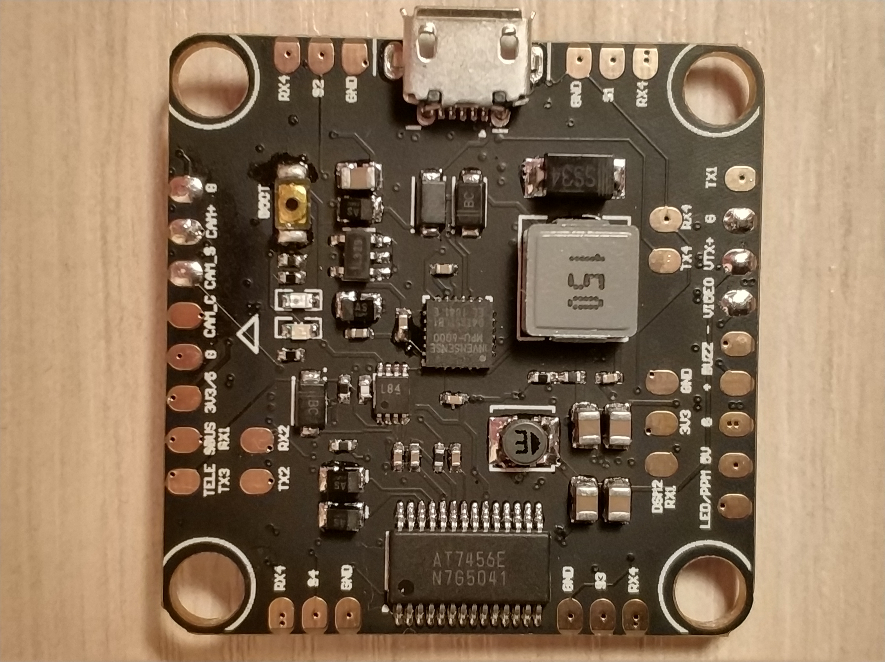
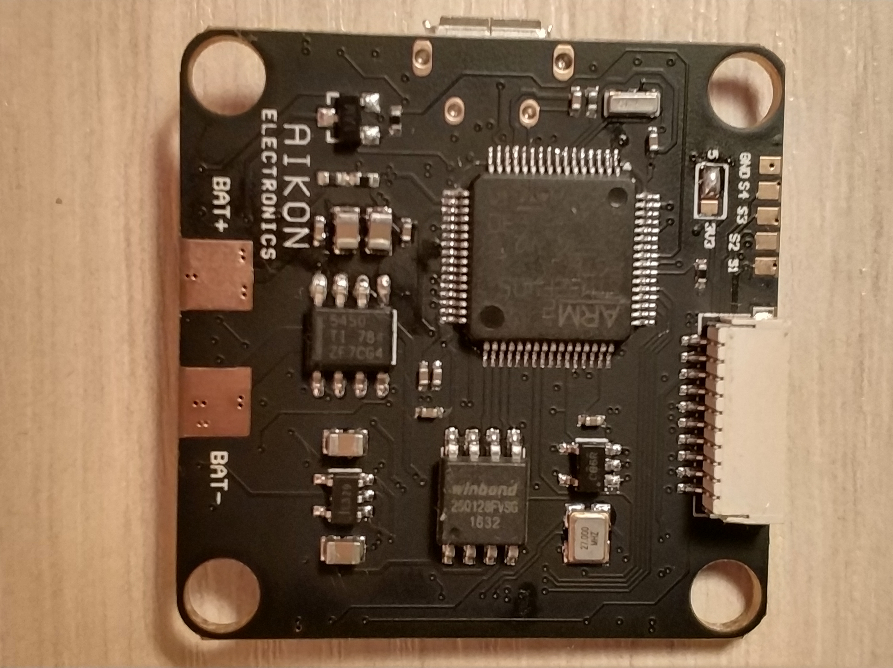

# Aikon F4

## 描述

Aikon F4 是一款不带 PDB 的飞控，面向多旋翼和固定翼。其定时器经过专门设计，可高效驱动 4 至 6 个电机并使用突发 DShot。板上提供 ESC 遥测、VTX 和摄像机控制专用焊盘，并配备 11 针连接器，可与 Aikon AK32 四合一 ESC 即插即用连接，无需额外布线即可读取电压、电流和 ESC 遥测数据。

## MCU、传感器和功能

### 硬件

- MCU：STM32F405
- IMU：ICM-20602
- 电机输出：4-6 路
- IMU 中断：支持
- 气压计：可选
- VCP：支持
- 硬件 UART：UART1 用于 SerialRX，UART3 用于反相 SmartPort；UART2 和 UART4 可作通用串口
- 软件串口：SOFTSERIAL1 用于 VTX 控制（与 UART1TX 复用），SOFTSERIAL2 用于 ESC 遥测（与 UART4RX 复用）
- OSD：支持
- Blackbox：SPI，16 MB
- PPM/LED_STRIP：复用
- 电池电压传感器：支持
- 集成稳压器：支持
- 按键：Boot

### 功能

UART3 的反相器可由软件控制。通过设置 `serialrx_inverted`，可将 SBUS 焊盘用于任意单向协议。板上还提供焊接跳线，可旁路反相器并将 UART3_RX 直接连接到 `DSMX` 焊盘。

软件串口默认已预配置；只需在 Configurator 的“端口”选项卡中启用 SOFTSERIAL1（VTX 控制）和 SOFTSERIAL2（ESC 传感器）即可。

## 制造商和经销商

https://www.aikon-electronics.com/

## 设计者

AIKON Electronics  
Avi Jang

## 维护者

Andrey Mironov（@DieHertz）

## 常见问题与已知问题

- 第一版在 11 针 ESC 连接器的 5V 输入端没有保护二极管。为避免两个稳压器互相“对抗”，请拔除来自 ESC 的 5V 线。
- 第一版在电机输出附近将 RX4（ESC 遥测）和 GND 焊盘的丝印标反。
  
  
