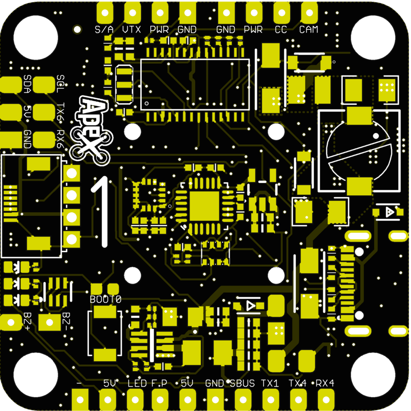
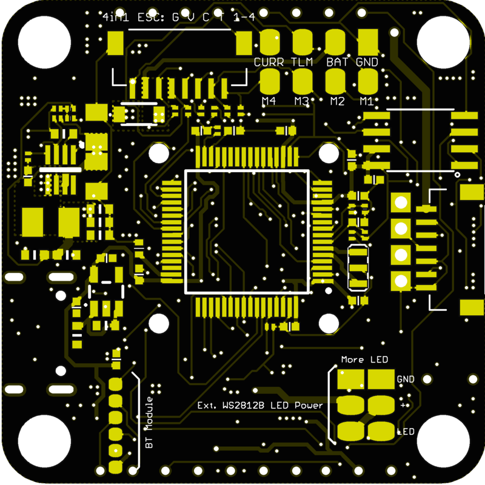

# ApexF7

### 功能

- STM32F722
- 16 MB Flash
- USB-C
- 通过 SPI 连接的双陀螺仪（MPU6000 + ICM20602）
- 通过 I2C 连接的 BMP280 气压计
- VTX 电源开关
- 为 VTX 和摄像机提供 10V BEC
- CamControl
- OSD
- 通过焊接模块提供蓝牙连接（未解锁时启用）
- WS2812 LED 输出
- SmartAudio/Tramp
- 支持最高 6S 输入

### 连接

|     功能      | 焊盘/丝印 |   资源    |   MCU 引脚   |             备注             |
| :-----------: | :-------: | :-------: | :----------: | :--------------------------: |
|     SBUS      |   SBUS    |    RX1    |     PA10     |           无反相器           |
|     DSM2      |    TX1    |    TX1    |     PA9      | CLI `serial_halfduplex = ON` |
|  SmartAudio   |    S/A    |    TX5    |     PC12     |                              |
| F.PORT/S.PORT |    F.P    |    TX3    |     PC10     |           无反相器           |
|   ESC 遥测    |    TLM    |    TX2    |     PA2      |     默认半双工，位于底面     |
|  摄像机控制   |    CC     |           |     PA8      |                              |
|   视频输出    |    VTX    |     -     |      -       |                              |
|  摄像机输入   |    CAM    |     -     |      -       |                              |
|    WS2812     |    LED    | LED_STRIP |     PA15     |                              |
|    蜂鸣器     |  BZ-/BZ+  |  BEEPER   |     PB0      |                              |
|     S1-S4     |   M1-M4   |           | PC8/B6/C9/B7 |       电机输出位于底面       |
|     UART4     |  TX4/RX4  |  TX4/RX4  |   PA0/PA1    |                              |
|     UART6     |  TX6/RX6  |  TX6/RX6  |   PC6/PC7    |                              |
|   VBAT 输入   |    BAT    |     -     |      -       |          3S-6S 输入          |
|     电流      |   CURR    |     -     |     PC1      |           位于底面           |
|      SDA      |    SDA    | I2C1_SDA  |     PB9      |                              |
|      SCL      |    SCL    | I2C1_SCL  |     PB8      |                              |

### 图片

