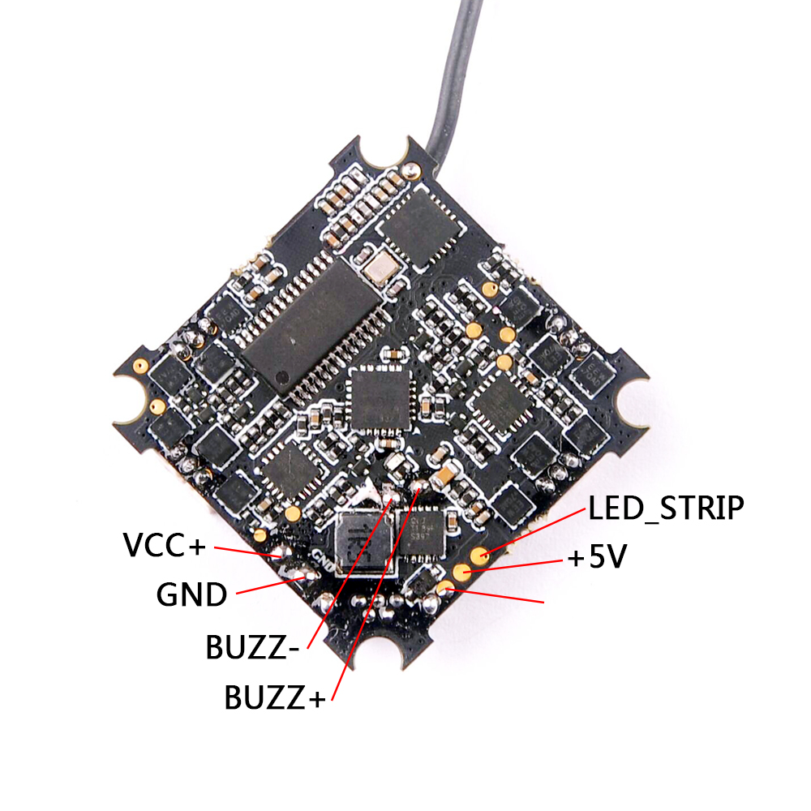
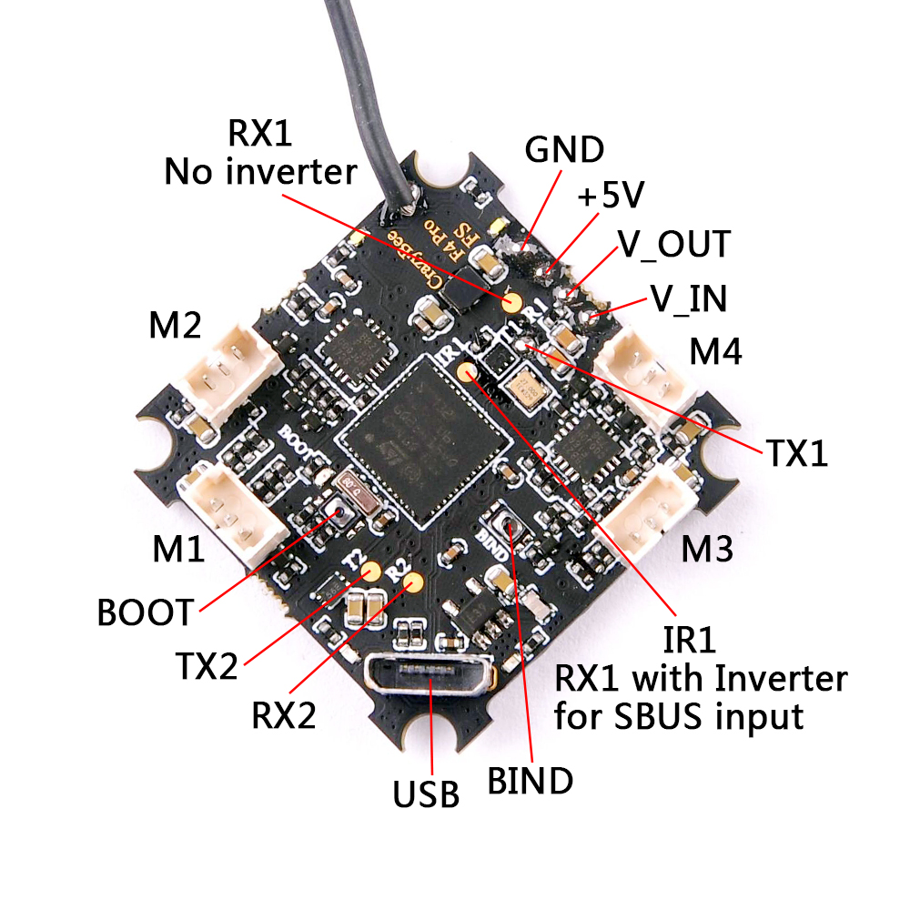

# CrazyBee F4 FS Pro

## 描述

CrazyBee F4 FS Pro 是一款高度集成的飞控板（接收机、四合一 ESC、OSD、电流传感器），适用于 1-2S Whoop 无刷竞速四轴。

## MCU、传感器和功能

### 硬件和功能

- MCU：STM32F411CEU6（100 MHz、512K Flash）
- IMU：MPU6000（SPI）
- OSD：Betaflight OSD
- 电池电压传感器：支持
- 电源：1-2S 电池输入（DC 3.5-8.7V）
- 内置 5V 1A 降压/升压电源，带 LC 滤波
- 集成电流传感器：最大 28A；电流计比例设为 1175
- 内置 SPI FlySky 接收机，支持遥测（AFHDS/AFHDS2A 可切换）
- UART1 RX 集成 SBUS 反相器，可用于外接接收机
- 集成 4 路 BLHeli_S ESC：每路最大 5A（EMF8BB21F16G）
- ESC 接口：3 针，PicoBlade，1.25 mm 间距
- 蜂鸣器输出：2 针焊盘
- 接收机状态 LED：4 个（2 红、2 白）
- 板卡尺寸：28.5 x 28.5 mm

## 资源映射

| 标签             | 引脚 | 定时器    | DMA | 默认值 | 说明 |
| ---------------- | ---- | --------- | --- | ------ | ---- |
| MPU6000_INT_EXTI | PA1  |           |     |        |      |
| MPU6000_CS_PIN   | PA4  |           |     |        | SPI1 |
| MPU6000_SCK_PIN  | PA5  |           |     |        | SPI1 |
| MPU6000_MISO_PIN | PA6  |           |     |        | SPI1 |
| MPU6000_MOSI_PIN | PA7  |           |     |        | SPI1 |
| OSD_CS_PIN       | PB12 |           |     |        | SPI2 |
| OSD_SCK_PIN      | PB13 |           |     |        | SPI2 |
| OSD_MISO_PIN     | PB14 |           |     |        | SPI2 |
| OSD_MOSI_PIN     | PB15 |           |     |        | SPI2 |
| RX_CS_PIN        | PA15 |           |     |        | SPI3 |
| RX_SCK_PIN       | PB3  |           |     |        | SPI3 |
| RX_MISO_PIN      | PB4  |           |     |        | SPI3 |
| RX_MOSI_PIN      | PB5  |           |     |        | SPI3 |
| RX_IRQ_PIN       | PA14 |           |     |        |      |
| BIND_PLUG_PIN    | PB2  |           |     |        |      |
| RX_LED_PIN       | PB9  |           |     |        |      |
| PWM1             | PB8  | TIM2, CH3 |     |        |      |
| PWM2             | PB9  | TIM4, CH1 |     |        |      |
| PWM3             | PA3  | TIM4, CH2 |     |        |      |
| PWM4             | PA2  | TIM4, CH3 |     |        |      |
| VBAT_ADC_PIN     | PB0  |           |     |        | ADC1 |
| CURRENT_ADC_PIN  | PB1  |           |     |        | ADC1 |
| BEEPER           | PC15 |           |     |        |      |
| UART1 TX         | PA9  |           |     |        |      |
| UART1 RX         | PA10 |           |     |        |      |
| UART2 TX         | PA2  |           |     |        |      |
| UART2 RX         | PA3  |           |     |        |      |

## 制造商和经销商

- 制造商：http://www.happymodel.cn/
- 经销商：待补充。

## 设计者

## 维护者

## 常见问题与已知问题

## 其他资源

- 用户手册：待补充。
