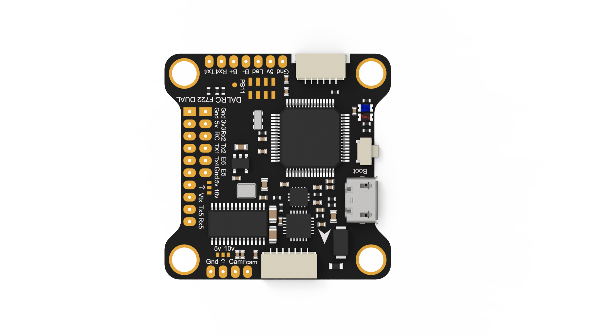
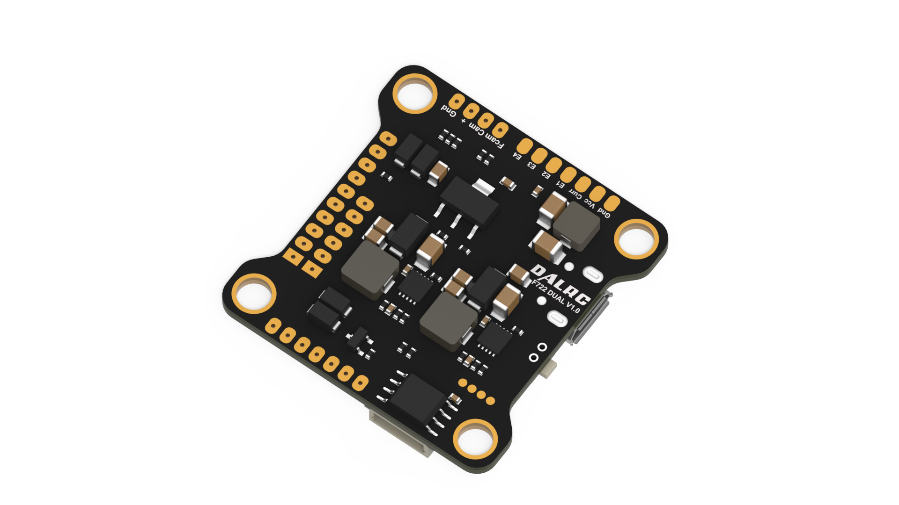

# DALRCF722DUAL

该板使用 STM32F722RET6 微控制器，具有以下特性：

- 高性能 ARM Cortex-M7 MCU，带 DSP 和 FPU，512K Flash
- 216 MHz CPU、462 DMIPS/2.14 DMIPS/MHz（Dhrystone 2.1）、DSP 指令、Art Accelerator、L1 缓存和 SDRAM
- 双陀螺仪 MPU6000 与 ICM20602；可在 CLI 中选择 MPU6000（更稳定平顺）或 ICM20602（更高循环频率，32K/32K）
- 板载 OSD
- 板载 16M SPI Flash，用于数据记录
- 板载 USB VCP 和 Boot 选择按键（用于 DFU）
- 双 BEC：5V/2.5A 与 10V/2A，供 VTX、摄像机等使用；可通过焊盘选择 5V/10V
- 串行 LED 接口（LED_STRIP）
- VBAT/CURR/RSSI 传感器输入
- 支持 IRC Tramp、SmartAudio、FPV 摄像机控制、FPORT 和遥测
- 支持 SBUS（内置反相器）、Spektrum 1024/2048、PPM
- 支持扩展 I2C 设备（气压计、指南针、OLED 等）和 GPS，均配有接口

### 板载 UART 焊盘

| 编号 | 标识符 | RX   | TX   | 说明                                 |
| ---- | ------ | ---- | ---- | ------------------------------------ |
| 1    | USART1 | PB7  | PB6  | PB7 用于 SBUS 输入（内置反相器）/PPM |
| 2    | USART2 | PA3  | PA2  | 焊盘用于 Tramp/SmartAudio            |
| 3    | USART3 | PC11 | PC10 | 用于 GPS                             |
| 4    | USART4 | PA1  | PA0  | PA0 用于 RSSI/FPORT/遥测等           |
| 5    | USART5 | PD2  | PC12 | 焊盘                                 |

### I2C 与 GPS 接口共用

| 编号 | 标识符 | 功能 | 引脚 | 说明 |
| ---- | ------ | ---- | ---- | ---- |
| 1    | I2C1   | SDA  | PB9  |      |
| 2    | I2C1   | SCL  | PB8  |      |

### 蜂鸣器/LED 输出

| 编号 | 标识符 | 功能 | 引脚 | 说明 |
| ---- | ------ | ---- | ---- | ---- |
| 1    | LED0   | LED  | PC14 | 板载 |
| 2    | BEEPER | BEE  | PC13 | 焊盘 |

### 传感器模拟输入

VBAT 采用 1/10 分压；另有电流信号和模拟/数字 RSSI 输入。

| 编号 | 标识符 | 功能 | 引脚 | 说明 |
| ---- | ------ | ---- | ---- | ---- |
| 1    | ADC1   | VBAT | PC1  |      |
| 2    | ADC1   | CURR | PC0  |      |
| 3    | ADC1   | RSSI | PA0  |      |

### 8 路输出

| 编号 | 标识符   | 功能    | 引脚 | 说明                   |
| ---- | -------- | ------- | ---- | ---------------------- |
| 1    | TIM4_CH2 | PPM     | PB7  | PPM                    |
| 2    | TIM8_CH1 | OUTPUT1 | PC6  | DMA                    |
| 3    | TIM8_CH2 | OUTPUT2 | PC7  | DMA                    |
| 4    | TIM8_CH3 | OUTPUT3 | PC8  | DMA                    |
| 5    | TIM8_CH4 | OUTPUT4 | PC9  | DMA                    |
| 6    | TIM1_CH1 | OUTPUT5 | PA8  | DMA                    |
| 7    | TIM1_CH2 | OUTPUT6 | PA9  | DMA                    |
| 8    | TIM1_CH3 | OUTPUT7 | PA10 | DMA，无焊盘            |
| 9    | TIM2_CH4 | OUTPUT8 | PB11 | 无焊盘                 |
| 10   | TIM2_CH1 | PWM     | PA15 | DMA，LED_STRIP         |
| 11   | TIM3_CH4 | PWM     | PB1  | FPV 摄像机控制（FCAM） |

### 陀螺仪和加速度计

支持 ICM20602 与 MPU6000。

| 编号 | 标识符 | 功能 | 引脚 | 说明                |
| ---- | ------ | ---- | ---- | ------------------- |
| 1    | SPI1   | SCK  | PA5  | MPU6000 和 ICM20602 |
| 2    | SPI1   | MISO | PA6  | MPU6000 和 ICM20602 |
| 3    | SPI1   | MOSI | PA7  | MPU6000 和 ICM20602 |
| 4    | SPI1   | CS1  | PB0  | MPU6000             |
| 5    | SPI1   | CS2  | PA4  | ICM20602            |
| 6    | SPI1   | INT1 | PB10 | MPU6000             |
| 7    | SPI1   | INT2 | PC4  | ICM20602            |

### OSD MAX7456

| 编号 | 标识符 | 功能 | 引脚 | 说明 |
| ---- | ------ | ---- | ---- | ---- |
| 1    | SPI2   | SCK  | PB13 |      |
| 2    | SPI2   | MISO | PB14 |      |
| 3    | SPI2   | MOSI | PB15 |      |
| 4    | SPI2   | CS   | PB12 |      |

### 16M Flash

| 编号 | 标识符 | 功能 | 引脚 | 说明 |
| ---- | ------ | ---- | ---- | ---- |
| 1    | SPI3   | SCK  | PB3  |      |
| 2    | SPI3   | MISO | PB4  |      |
| 3    | SPI3   | MOSI | PB4  |      |
| 4    | SPI3   | CS   | PB2  |      |

### SWD

| 引脚 | 功能   | 说明 |
| ---- | ------ | ---- |
| 1    | SWCLK  | 焊盘 |
| 2    | Ground | 焊盘 |
| 3    | SWDIO  | 焊盘 |
| 4    | 3V3    | 焊盘 |

### 设计者

- ZhengNyway（nyway@vip.qq.com）
