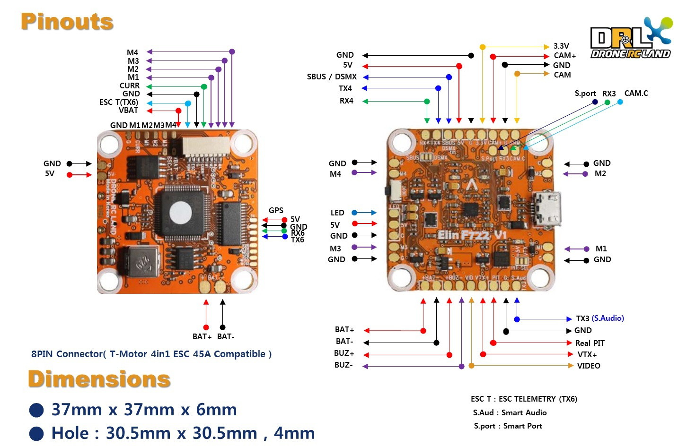

# Elin F722

## 硬件特性

- MCU：STM32F722
- IMU：ICM-20602
- 电机输出：4 路
- OSD
- VCP
- 硬件 UART：
  - UART1：`Serial RX`
  - UART3：反相 Smart Port
  - UART4：通用
  - UART6：通用
  - SoftSerial 1：Smart Port
  - SoftSerial 2：ESC 遥测
- Blackbox：16 MB SPI Flash
- LED 灯带
- 集成稳压器：5 V / 3 A
- 负载开关，支持 VTX Real Pit Mode：30 V / 30 A，可控制 VTX 或 LED 开关
- 低通 LC 滤波器
- 按钮：Boot

## 引脚定义

