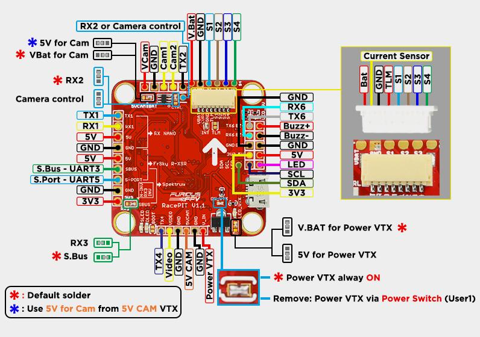

# FuriousFPV RacePIT

适用于 RacePIT v1.x。

## 特性

- 内置 RealPIT，用于控制 VTX 电源
- 6 个完整 UART，可同时连接 USB、RunCam 设备、GPS、CRSF 接收机、Blackbox 与 Bluetooth
- 可选择内部或外部 5 V ESC 供电
- 两路相机控制和 LED 灯带控制，可同时连接，仅限 RacePIT
- 内置 ESC 连接器，便于连接 4 合 1 ESC
- 使用 MPU6000 加速度计与陀螺仪
- 高度简化的 OSD 界面，无需电脑
- UART 连接选项，支持 TBS SmartAudio 或 ImmersionRC Tramp
- 集成软安装硅胶减振，充分发挥 FC 性能
- 通过瞬态电压抑制器提供输入与输出浪涌电压保护
- 高品质 5 V / 1.5 A BEC，输入范围 2S 至 6S
- 内置 SBUS 连接反相器
- 陀螺仪独立 LDO 供电，降低噪声并提高精度
- 便于连接支持遥测的 VTX，例如 Stealth Race、Tramp、Unify

## 硬件

- STM32F405 主芯片
- 内置 RealPIT，用于 VTX 供电
- 6 个 UART
- 相机控制，支持 Foxeer，带内置电容；也支持另一类不带电容的相机，仅限 RacePIT
- LED 灯带控制
- MPU6000
- 5 V / 1.5 A BEC，2S 至 6S
- SBUS 反相器信号
- 内置 AT7456 OSD
- 支持电流传感器
- 4 路 ESC 信号

## RacePIT 板卡布局

