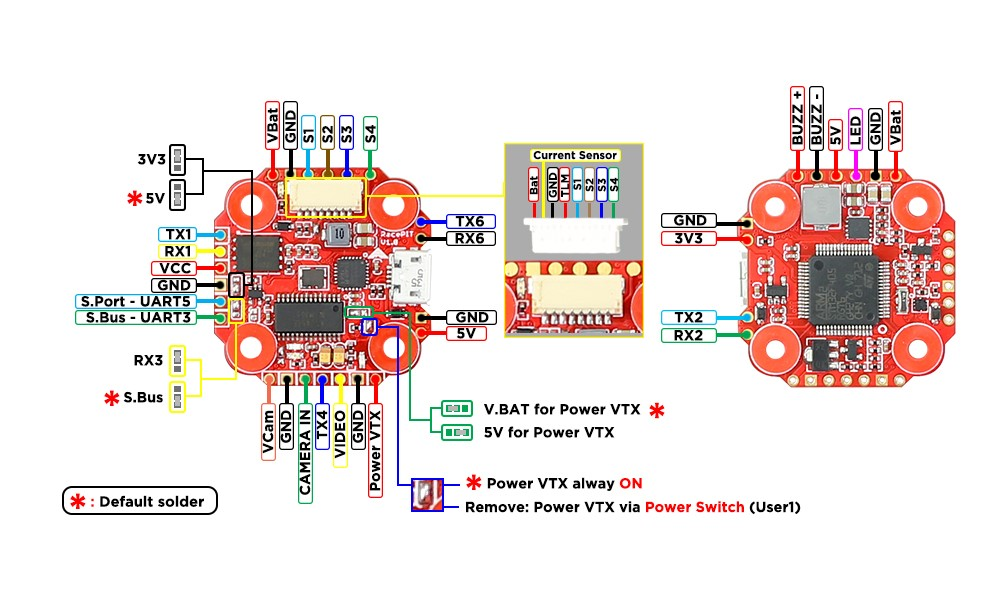

# FuriousFPV RacePIT Mini

适用于 RacePIT Mini（V2.x）。

## 功能

- 内置 RealPIT VTX 供电管理。
- 提供 6 个完整 UART，可同时连接 USB、RunCam 设备、GPS、CRSF 接收机、Blackbox、蓝牙等。
- 可选择内部 5V 或外部 5V ESC 供电。
- 双路摄像机控制和 LED 灯带接口可同时使用（仅 RacePIT）。
- 内置 ESC 接口，便于整洁连接四合一 ESC。
- 使用 MPU6000 加速度计和陀螺仪。
- 高度简化的 OSD 界面，无需 PC。
- UART 可用于 TBS SmartAudio 或 ImmersionRC Tramp。
- 集成软安装硅胶减震，提升飞控工作表现。
- 输入和输出均通过瞬态电压抑制器提供浪涌保护。
- 高品质 5V 1.5A BEC，支持 2S-6S 输入。
- 内置 SBUS 连接反相器。
- 陀螺仪使用独立 LDO 供电，降低噪声并提高精度。
- VTX 接口接线整洁并支持遥测（Stealth Race、Tramp、Unify）。

## 硬件

- STM32F405 主控
- 内置 REALPIT VTX 电源管理
- 6 个 UART
- 摄像机控制：支持 Foxeer（带内置电容）及另一类无电容摄像机（仅 RacePIT）
- LED 灯带控制
- MPU6000
- 5V 1.5A BEC，2S-6S
- SBUS 反相信号
- 内置 AT7456 OSD
- 支持电流传感器
- 4 路 ESC 信号

## RacePIT Mini 板卡布局

