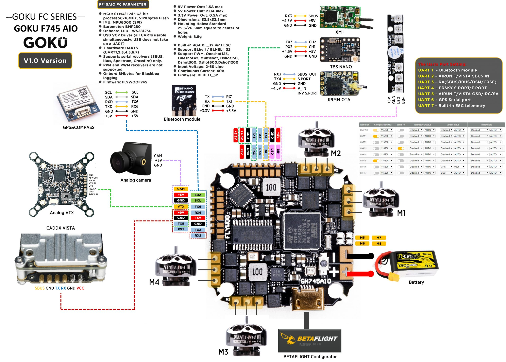

# FLYWOOF745AIO

FLYWOOF745AIO 用于 GN745 AIO 板 v1.2；v1.0 版本应选择基础目标 FLYWOOF745，后者的电机输出映射略有不同。

该板采用 STM32F745VGT6 微控制器，具备以下功能：

- 带 FPU 的高性能 DSP、ARM Cortex-M7 MCU，配备 1024 KB 闪存
- 216 MHz CPU、462 DMIPS/2.14 DMIPS/MHz（Dhrystone 2.1），支持 DSP 指令、Art Accelerator、L1 缓存和 SDRAM
- MPU6000 陀螺仪
- 32 位 ESC 采用 STM32F051 和 BLHELI_32；可使用 iFlight F051 目标及 PB4 引导加载程序刷写为 AM32
- 用于黑匣子记录的 16 MB SPI 闪存
- 板载 USB VCP 和启动选择按钮（用于 DFU）
- 稳定的电源调节：9 V/2 A DCDC BEC，可为 VTX、摄像头等供电；通过焊盘可选择 5 V 或 9 V 输出
- 串行 LED 接口（LED_STRIP）
- VBAT/CURR/RSSI 传感器输入
- 支持 IRC Tramp、SmartAudio、FPV 摄像头控制、FPORT 和遥测
- 支持 SBus、Spektrum 1024/2048、PPM，无需外部反相器（板载集成）
- 支持扩展 I2C 设备（气压计、指南针、OLED 等，带接口）
- 支持 GPS（带接口）

### 板上为所有 UART 提供焊盘

| 编号 | 标识符 | RX   | TX   | 备注                        |
| ---- | ------ | ---- | ---- | --------------------------- |
| 1    | USART1 | PA10 | PA9  | SBUS 输入（内置反相器）     |
| 2    | USART2 | PD6  | PD5  | 用于 Tramp/SmartAudio       |
| 3    | USART3 | PB11 | PB10 | 用于 GPS                    |
| 4    | USART4 | PA1  | PA0  | 焊盘，用于 Tramp/SmartAudio |
| 5    | USART5 | PD2  | PC12 | 焊盘，ESC 传感器            |
| 6    | USART6 | PC7  | PC6  | 焊盘                        |
| 7    | USART7 | PE7  | PE8  | 焊盘                        |

### I2C 与 GPS 共用端口

可用于气压计、指南针等设备。

| 编号 | 标识符 | 功能 | 引脚 | 备注            |
| ---- | ------ | ---- | ---- | --------------- |
| 1    | I2C1   | SDA  | PB7  | 与 GPS 接口共用 |
| 2    | I2C1   | SCL  | PB6  | 与 GPS 接口共用 |

### 蜂鸣器/LED 输出

| 编号 | 标识符 | 功能   | 引脚 | 备注 |
| ---- | ------ | ------ | ---- | ---- |
| 1    | LED0   | LED    | PC15 |      |
| 2    | BEEPER | 蜂鸣器 | PC14 |      |

### VBAT、电流和 RSSI 输入

VBAT 输入分压比为 1:10；同时提供电流信号和模拟/数字 RSSI 输入。

| 编号 | 标识符 | 功能 | 引脚 | 备注 |
| ---- | ------ | ---- | ---- | ---- |
| 1    | ADC1   | VBAT | PC3  |      |
| 2    | ADC1   | CURR | PC2  |      |
| 3    | ADC1   | RSSI | PC5  |      |

- FLYWOO TECH
- www.flywoo.net
