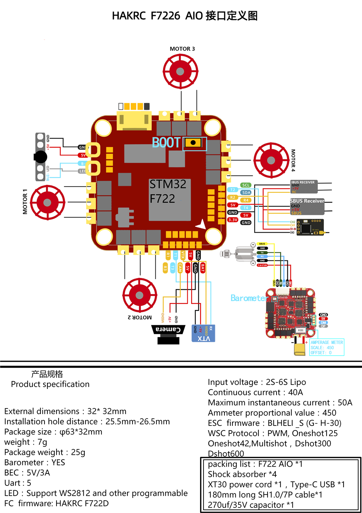
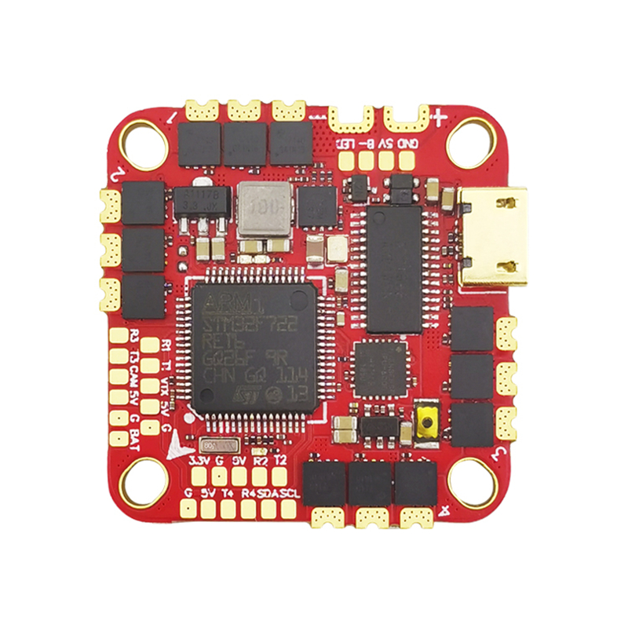
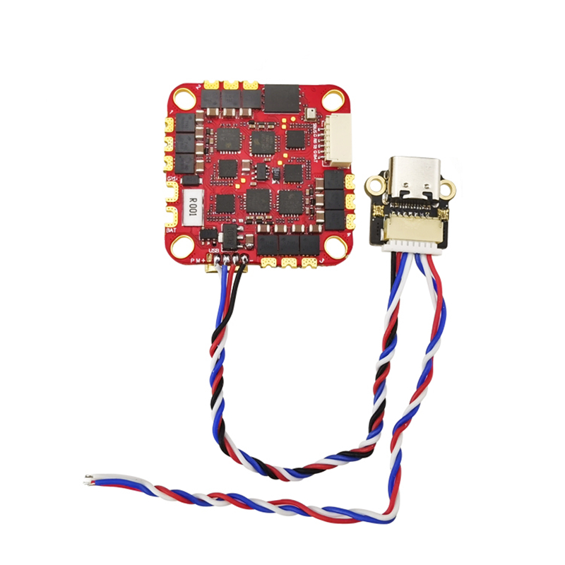

# HAKRCF722D

### 硬件与特性

- MCU：STM32F722RET6
- IMU：ICM42688
- OSD：AT7456E
- 气压计：集成式
- BEC：5 V / 3 A
- UART：5 个
- LED：支持 WS2812 等可编程 LED
- 传感器：内置电流传感器

HAKRC F722D 的特点是采用外接 USB-C 插头和 LED 焊盘，二者均通过 JST 插头连接至 FC。即使 FC 封装在机架内部，也可借此完成 USB 连接。

## 制造商与经销商

HAKRC Loopur

## 设计者

HAKRC Loopur
