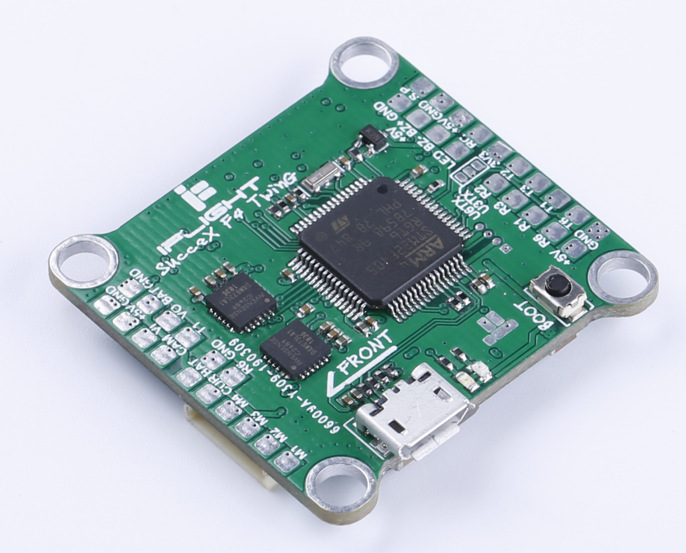
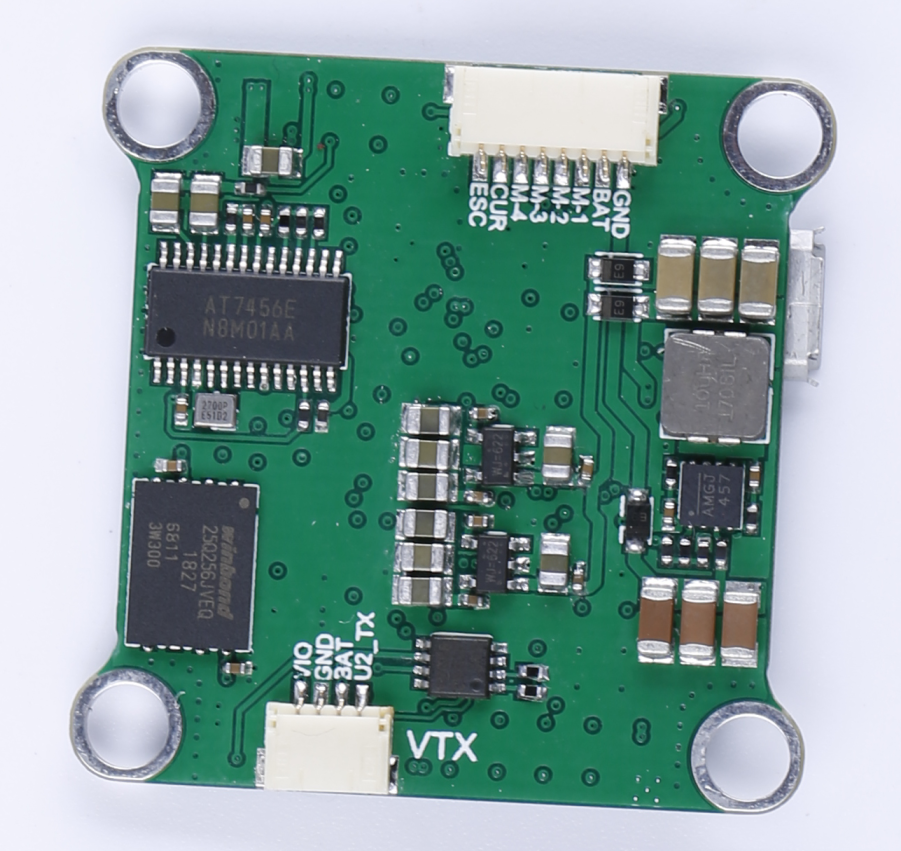
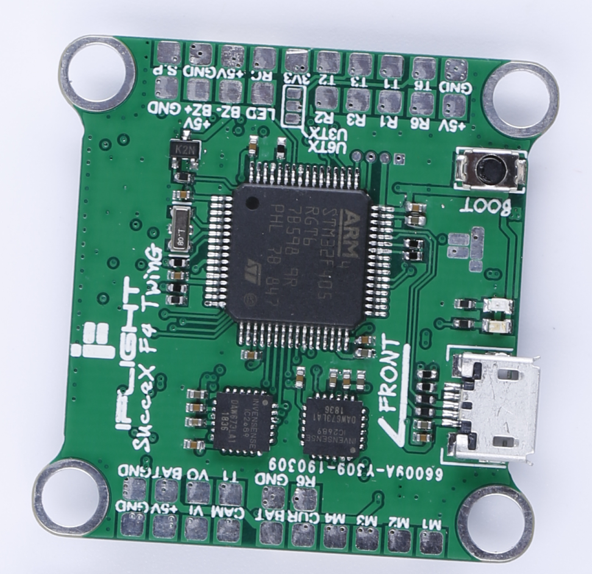

# iFlight F4 双陀螺仪

> **IFlightF4_TWIN_G：真正的双陀螺仪。**
>
> **该飞控可同时使用两颗真实陀螺仪，为 FPV 飞手提供更好的飞行性能。**

## 功能

- 处理器与传感器
  - _MCU：_ STM32F405RGT6
  - IMU_1：ICM20689（0°）
  - IMU_2：ICM20689（90°）
  - _OSD：_ Betaflight OSD（AT7456E，通过 SPI2 连接）
  - 黑匣子：FLASH M25Q256（通过 SPI3 连接）
- 4 路 DShot 输出
- 板载 USB VCP 和启动选择按钮（用于 DFU）
- 串行 LED 接口（LED_STRIP）
- VBAT/CURR 传感器输入
- 支持 IRC Tramp、SmartAudio、FPV 摄像头控制、FPORT 和遥测
- 支持 SBus、Spektrum 1024/2048、PPM，无需外部反相器（板载集成）

## 图片

## 引脚定义

### 板上为所有 UART 提供焊盘

| 编号 | 标识符 |  RX  |  TX  |  备注   |
| :--: | :----: | :--: | :--: | :-----: |
|  1   | USART1 | PA10 | PA9  |         |
|  2   | USART2 | PA3  | PA2  | RX 输入 |
|  3   | USART3 | PB11 | PB10 |         |
|  6   | USART6 | PC7  | PC6  |         |

### 蜂鸣器/LED 输出

| 编号 | 标识符 |  功能  | 引脚 | 备注 |
| :--: | :----: | :----: | :--: | :--: |
|  1   |  LED0  |  LED   | PB5  |      |
|  2   | BEEPER | 蜂鸣器 | PB4  |      |

### VBAT、电流和模拟 RSSI 输入

| 编号 | 标识符 |  功能   | 引脚 | 备注 |
| :--: | :----: | :-----: | :--: | :--: |
|  1   |  ADC1  |  VBAT   | PC2  |      |
|  2   |  ADC1  | CURRENT | PC1  |      |

### PWM 输入与 PWM 输出

| 编号 |  标识符  |    功能    | 引脚 | 备注 |
| :--: | :------: | :--------: | :--: | :--: |
|  1   | TIM9_CH2 |    PPM     | PA3  |      |
|  2   | TIM3_CH3 |   电机 1   | PB0  |      |
|  3   | TIM3_CH4 |   电机 2   | PB1  |      |
|  4   | TIM8_CH4 |   电机 5   | PC9  |      |
|  5   | TIM8_CH3 |   电机 6   | PC8  |      |
|  6   | TIM4_CH1 | LED_STRIP  | PB6  |      |
|  7   | TIM5_CH1 | 摄像头控制 | PA0  |      |

### 陀螺仪与加速度计 ICM20689

| 编号 | 标识符 | 功能 | 引脚 |      备注      |
| :--: | :----: | :--: | :--: | :------------: |
|  1   |  SPI1  | SCK  | PA5  |    ICM20689    |
|  2   |  SPI1  | MISO | PA6  |    ICM20689    |
|  3   |  SPI1  | MOSI | PA7  |    ICM20689    |
|  4   |   IO   | CS1  | PA4  | ICM20689_A_CS  |
|  5   |   IO   | CS2  | PC3  | ICM20689_B_CS  |
|  6   |   IO   | INT1 | PC4  | ICM20689_A_INT |
|  7   |   IO   | INT2 | PA8  | ICM20689_B_INT |

### OSD MAX7456

| 编号 | 标识符 | 功能 | 引脚 | 备注 |
| :--: | :----: | :--: | :--: | :--: |
|  1   |  SPI2  | SCK  | PB13 |      |
|  2   |  SPI2  | MISO | PB14 |      |
|  3   |  SPI2  | MOSI | PB15 |      |
|  4   |  SPI2  |  CS  | PB12 |      |

### 闪存黑匣子

| 编号 | 标识符 | 功能 | 引脚 | 备注 |
| :--: | :----: | :--: | :--: | :--: |
|  1   |  SPI3  | SCK  | PC10 |      |
|  2   |  SPI3  | MISO | PC11 |      |
|  3   |  SPI3  | MOSI | PC12 |      |
|  4   |  SPI3  |  CS  | PA15 |      |

### SWD

| 引脚 | 功能  | 备注 |
| :--: | :---: | :--: |
|  1   | SWCLK | 焊盘 |
|  2   |  GND  | 焊盘 |
|  3   | SWDIO | 焊盘 |
|  4   |  3V3  | 焊盘 |
