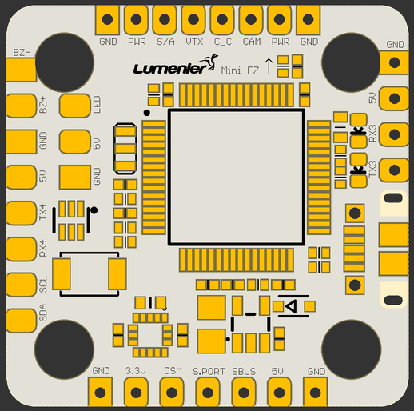

# Lux Mini F7

## 功能

- 通过 SPI 连接 ICM20602 陀螺仪
- STM32F722
- 支持 3-6S LiPo
- AB7456 芯片，支持 Betaflight OSD
- 20×20 mm 安装孔
- 通过 PinIO（User1）控制电源开关

## 资源

|    功能     | 焊盘/丝印 |   资源   |    MCU 引脚     |              备注              |
| :---------: | :-------: | :------: | :-------------: | :----------------------------: |
|    SBUS     |   SBUS    |   RX1    |      PA10       |            无反相器            |
|    DSM2     |    DSM    |   TX1    |       PA9       | CLI：`serialrx_halduplex = ON` |
| SmartAudio  |    S/A    |   TX5    |      PC12       |                                |
|  SmartPort  |  S.PORT   |   TX6    |       PC6       |            无反相器            |
|  ESC 遥测   |    TLM    |   RX2    |       PA3       |              板底              |
| 摄像头控制  |    CC     |          |       PA8       |                                |
|     SDA     |    SDA    | I2C1_SDA |       PB9       |                                |
|     SCL     |    SCL    | I2C1_SCL |       PB8       |                                |
|    UART4    |  RX4/TX4  |  UART4   |     PA1/PA0     |                                |
| WS2812B LED |    LED    |          |      PA15       |                                |
|   蜂鸣器    |  BZ-/BZ+  |          |       PB0       |                                |
|    UART3    |  RX3/TX3  |          |    PC11/PC10    |                                |
|  电源开关   |    PWR    |  USER1   |      PB10       |                                |
|    S1-S4    |   S1-S4   |  M1-M4   | PB6/PC8/PB7/PC9 |          板底电机输出          |
|    电流     |   CRNT    |          |       PC1       |              板底              |

## 图片

