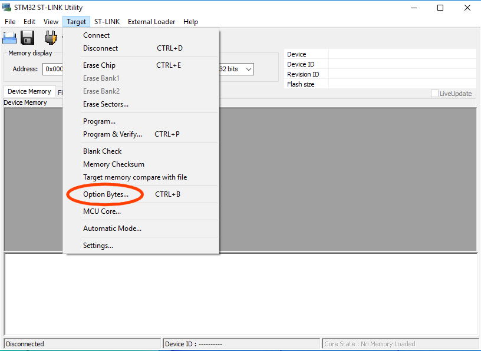
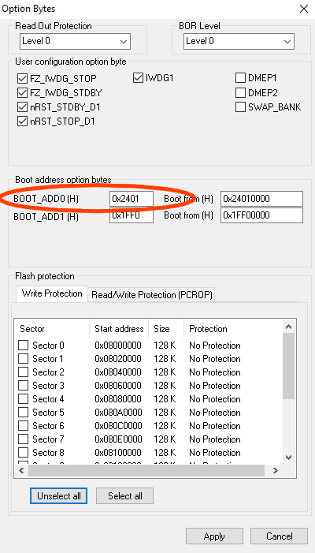
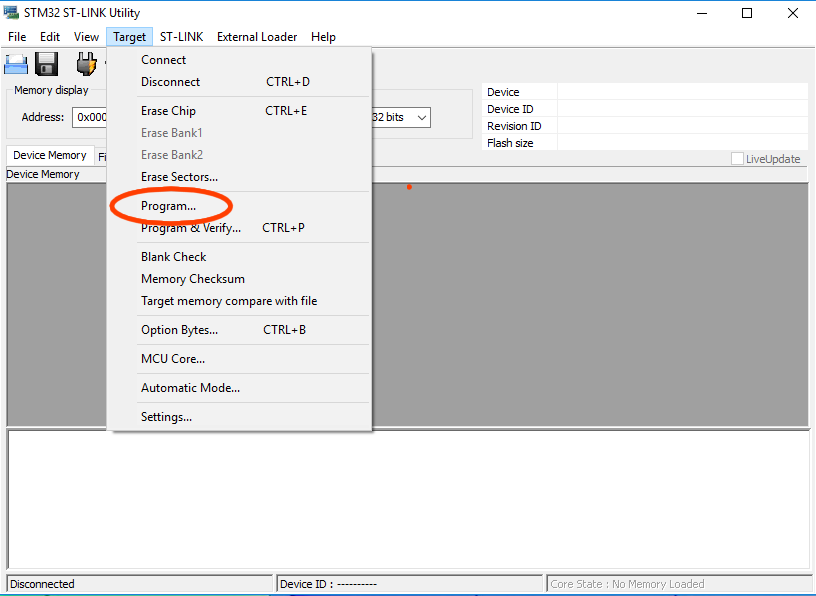
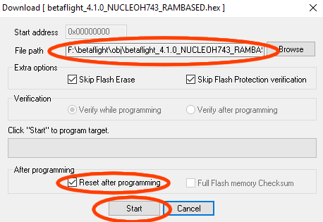

# Nucleo H743 - 基于 RAM

Nucleo H743 的此 target 会完全加载到 MCU RAM 中，因此适合快速迭代开发测试，且不会造成 Flash 存储磨损。

刷写和运行时必须使用 STMicroelectronics 提供的 ST-Link 工具。

## 板卡准备

若要让 MCU 在复位后从 RAM 运行固件，必须修改启动地址：

- 打开 `Option Bytes` 对话框：

- 将 `BOOT_ADD0` 的高位字设为 `0x2401`：

- 点击 `Apply`。

## 安装

固件映像仅存储在 RAM 中，因此每次板卡重新上电后都必须重新执行安装。

- 打开 `Program` 对话框：

- 点击 `Browse`，选择 `NUCLEOH743_RAMBASED` hex 映像；
- 确认已勾选 `Reset after programming`；
- 点击 `Start` 开始编程：

- 编程完成后，固件会开始运行。
