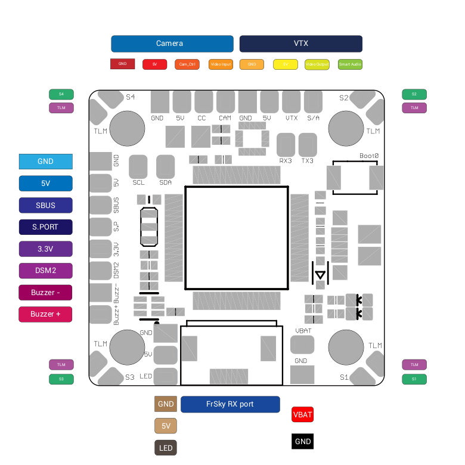
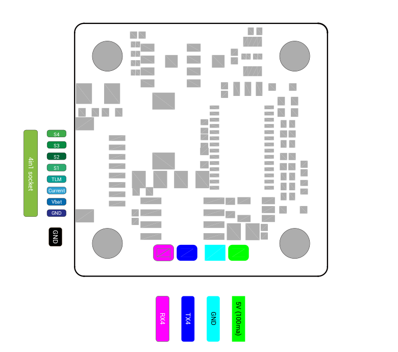

# Omnibus F4 Nano V7

这是 Airbot 的新款 Nano FC，相比前代增加了更多功能。

## 特性

- 通过 SPI 连接的 ICM20602 陀螺仪
- 用于 FrSky 接收机的 FPC 接口
- STM32F405
- 通过 SPI 连接的 16 MB Flash
- 支持 3S 至 6S LiPo
- AB7456 芯片，用于 Betaflight OSD
- 20 x 20 mm 安装孔
- 5 V / 3 A BEC
- SmartAudio 和 CamControl 焊盘
- 电机输出位于板卡四角

## 资源

| 功能        | 焊盘/丝印 | 资源     | MCU 引脚 | 说明                            |
| ----------- | --------- | -------- | -------- | ------------------------------- |
| SBUS        | SBUS      | RX1      | PA10     | 内置反相器                      |
| DSM2        | TX1       | TX1      | PA9      | CLI：`serialrx_halfduplex = ON` |
| SmartAudio  | S/A       | TX5      | PC12     |                                 |
| SmartPort   | S.P       | UART4    | PA0/1    | 内置反相器                      |
| ESC 遥测    | TLM       | RX2      | PA3      |                                 |
| CamControl  | CC        |          | PA8      |                                 |
| SDA         | SDA       | I2C1_SDA | PB9      |                                 |
| SCL         | SCL       | I2C1_SCL | PB8      |                                 |
| GPS         | RX6/TX6   | UART6    | PC6/7    | 位于底面                        |
| WS2812B LED | LED       |          | PA15     |                                 |
| 蜂鸣器      | BZ-/BZ+   |          | PC5      |                                 |
| UART3       | RX3/TX3   |          | PC11/10  |                                 |

## 修订版

- 修订版 1.0：UART4 与 UART6 互换
- 修订版 1.1：使用上表定义

## 引脚图

