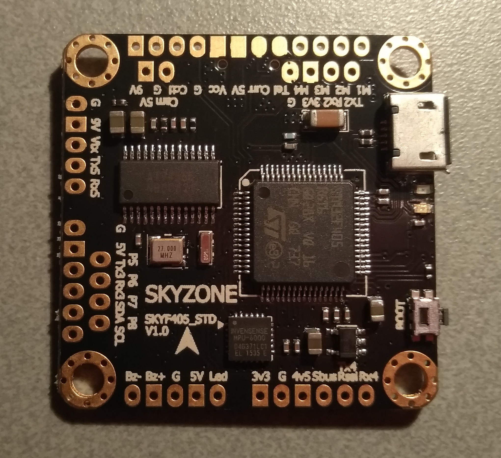
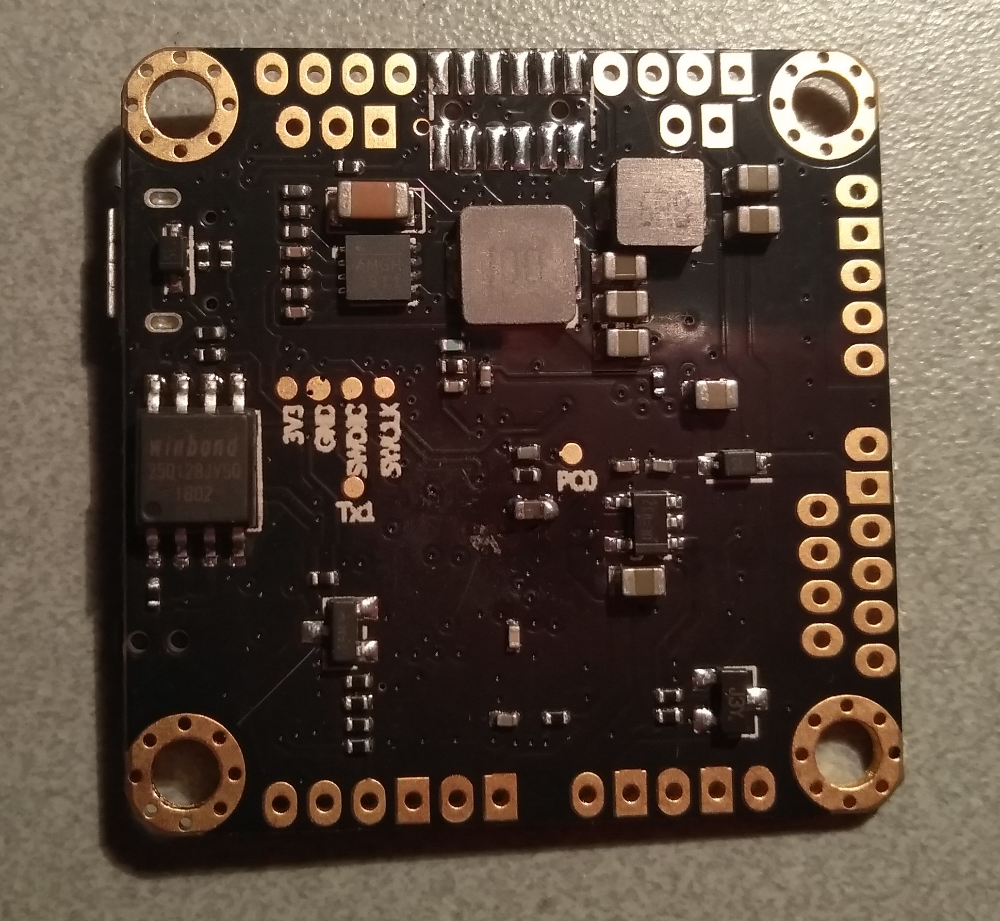
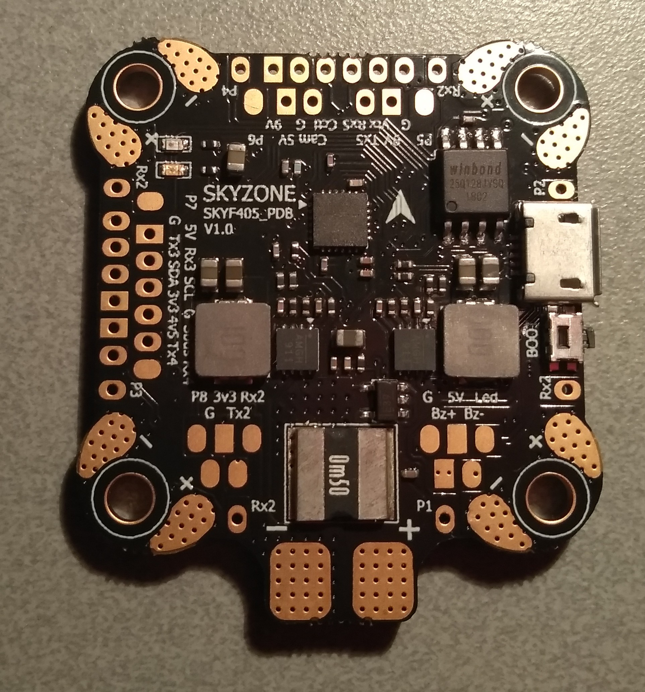
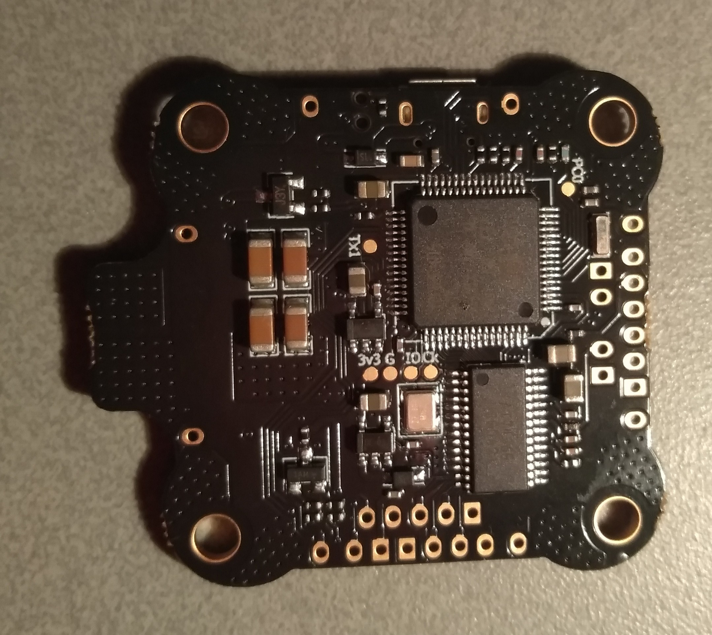

# SKYZONEF405

## 描述

SKYZONEF405 是一款多用途飞控，可高效控制配备 4、6 或 8 个电机的飞行器。

提供两个版本：

### SKYZONEF405_STD

标准 30×30mm 尺寸。

### SKYZONEF405_PDB

30×30mm“扩展角”设计，集成 PDB/电流检测分流器。

## 硬件

| 类型                   | 描述                            |
| ---------------------- | ------------------------------- |
| MCU                    | STM32F405                       |
| IMU                    | 可选 MPU6000 或 ICM-20689       |
| IMU 中断               | 支持                            |
| 电机输出               | 最多 8 路                       |
| 气压计                 | 可选                            |
| 磁力计                 | 可选                            |
| VCP（支持摇杆模拟）    | 支持                            |
| 硬件串口               | 5 个（其中 1 个带 SBUS 反相器） |
| 软件串口               | 2 个                            |
| OSD                    | 支持                            |
| Blackbox               | 16MB 板载 Flash                 |
| PPM 输入               | 支持                            |
| 相机控制输出           | 支持                            |
| LED 灯带（WS2811）输出 | 支持                            |
| 电池电压传感器         | 支持                            |
| 电流传感器             | 支持（仅 `SKYZONEF405_PDB`）    |
| 集成稳压器             | 支持                            |
| 按钮                   | BOOT                            |
| LED                    | 电源、状态                      |

## 特性

提供丰富连接选项，包括 5 个 UART；其中大多数为通孔焊点，可最大限度降低焊盘脱落风险。

电机 1–4 的板角旁设有 ESC 信号/遥测焊点（仅 `SKYZONEF405_PDB`）。

## 制造商与经销商

Skyzone Hobbies

## 设计者

Skyzone Hobbies

## 维护者

[Daniel Zhou](mailto:daniel@skyzonehobbies.com)
