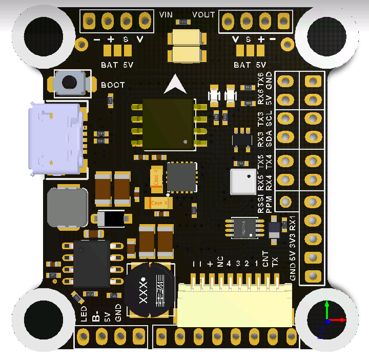

# SPEDIX F4

## 说明

SPEDIX F4 的设计重点之一是在保持高效率的同时，尽可能提供更多 UART 和电机输出。通过精心规划引脚映射，可仅用两个定时器驱动 6 至 8 路 DShot 电机，同时引出 STM32F405 提供的全部 6 个 UART。

定时器设计同时适合多旋翼和固定翼使用。

可与 SPEDIX 和 AIKON 4 合 1 ESC 即插即用连接。

## MCU、传感器与特性

### 硬件

- MCU：STM32F405
- IMU：ICM-20602 或 MPU-6000
- 6 路 DShot 电机输出；将 UART6 重映射为 M7 与 M8 后可扩展至 8 路，且仅使用两个定时器
- BMP280（SPI）
- 6 个硬件 UART；UART5 配有可控反相器用于 SBUS，USART1 配有双向反相器用于 FPORT/SPORT
- 板载稳压器，最高支持 6S
- Dataflash Blackbox
- 外部 I2C 接口
- JST-SH 10 针 4 合 1 ESC 插头

## 设计者

Kyle Lee（SPEDIX）
Andrey Mironov（@DieHertz）

## 维护者

Andrey Mironov（@DieHertz）

