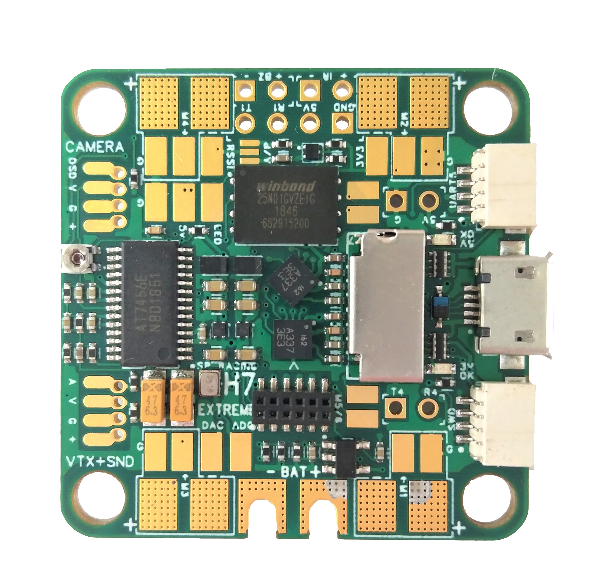
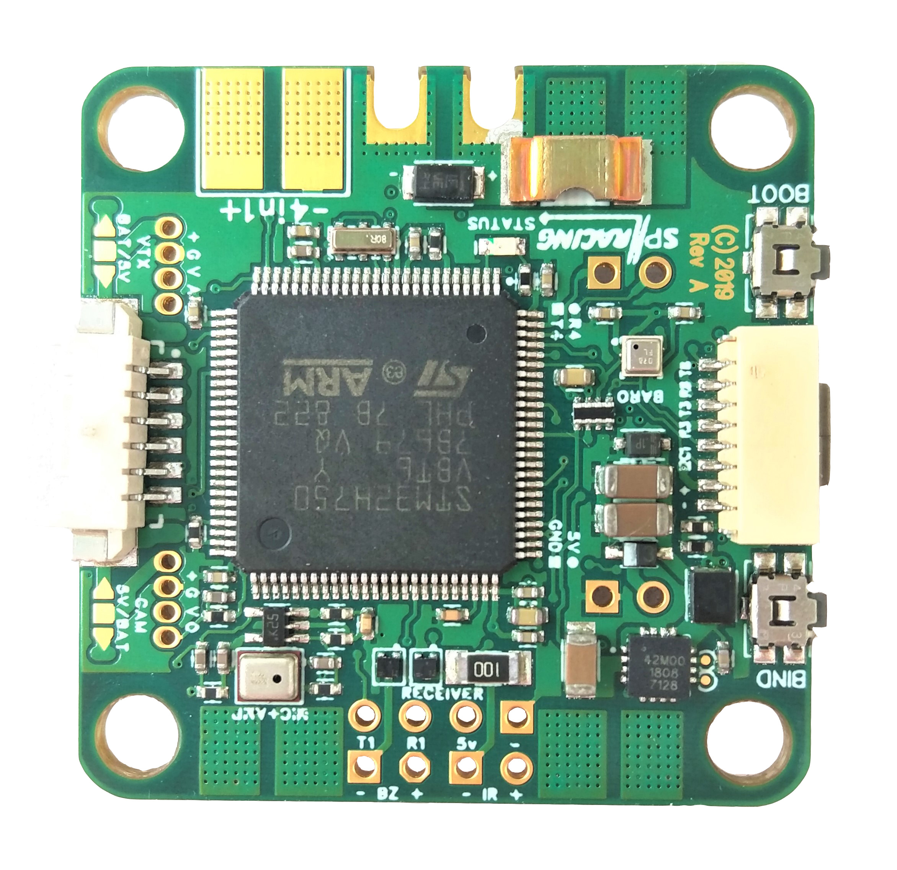
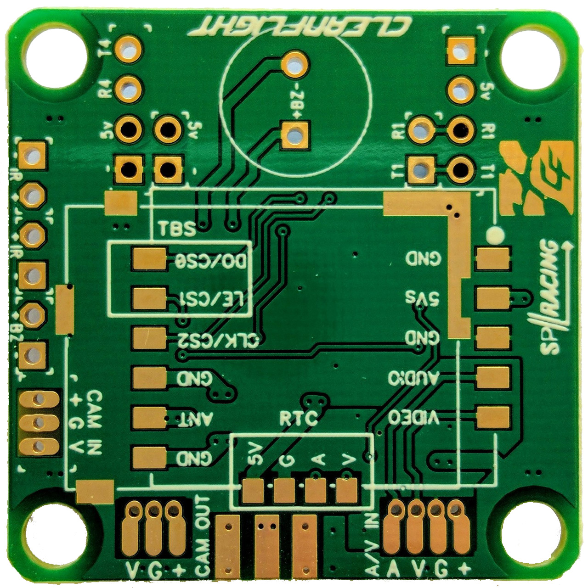
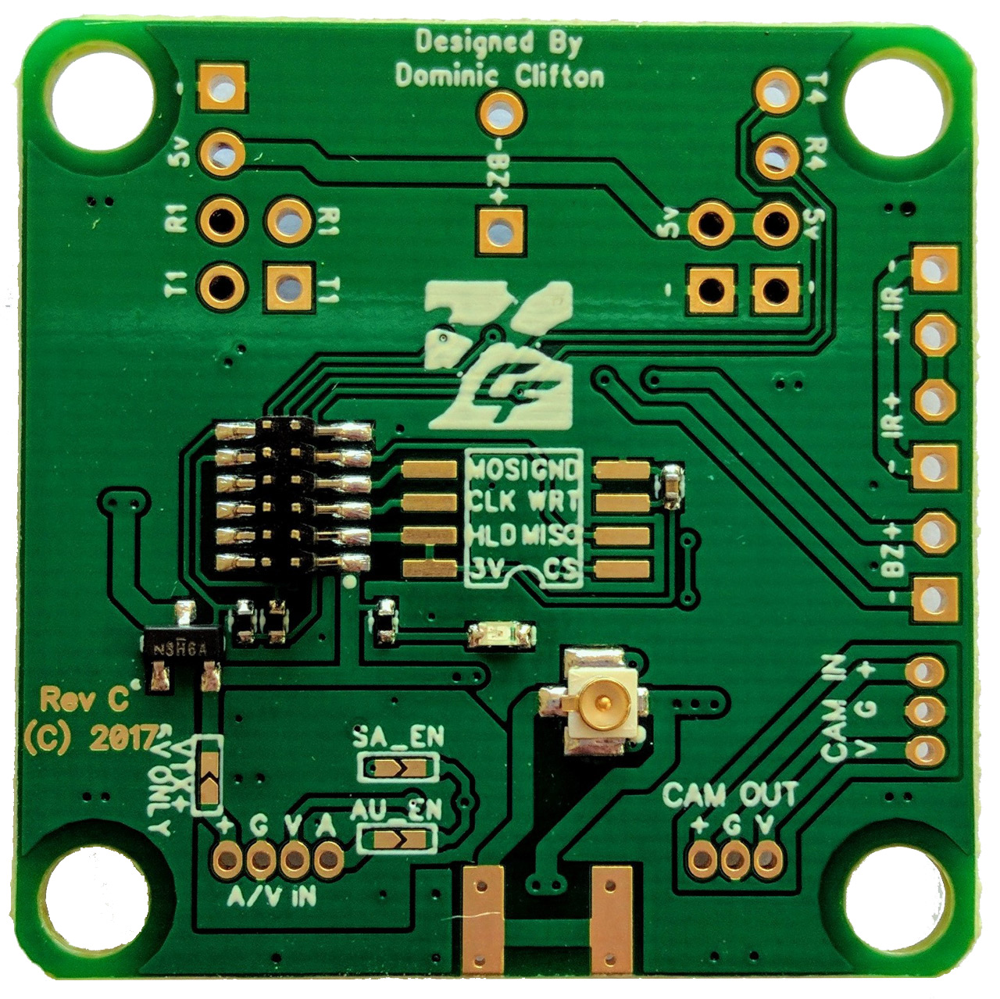
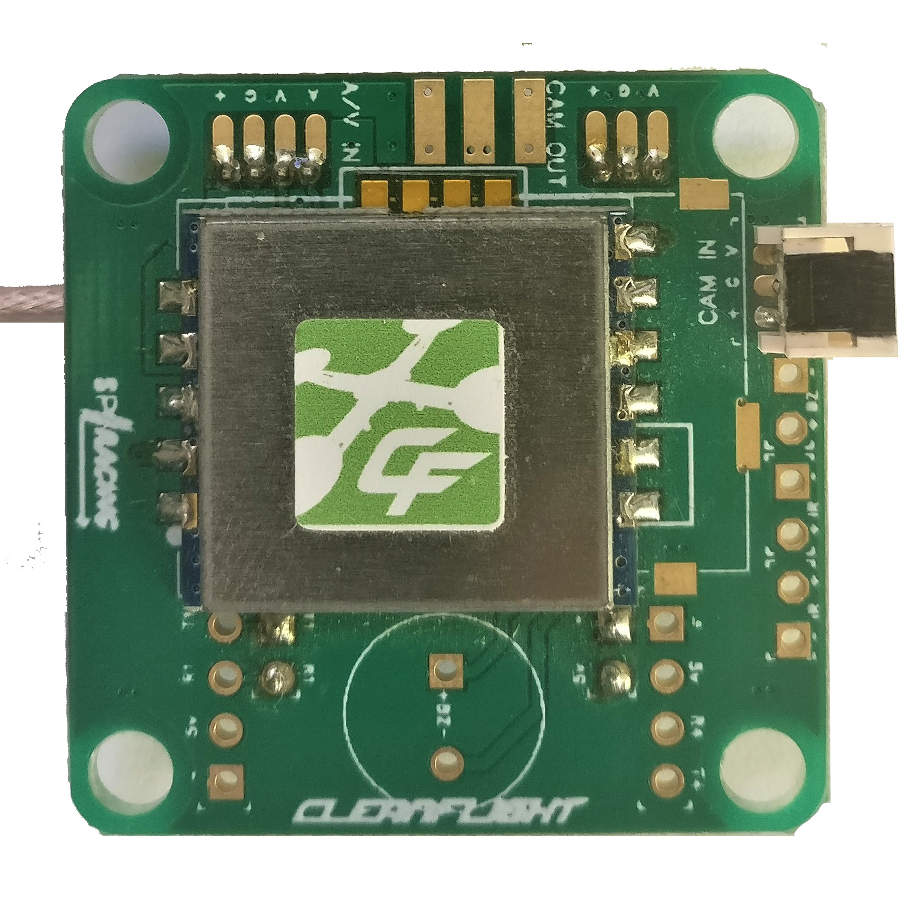
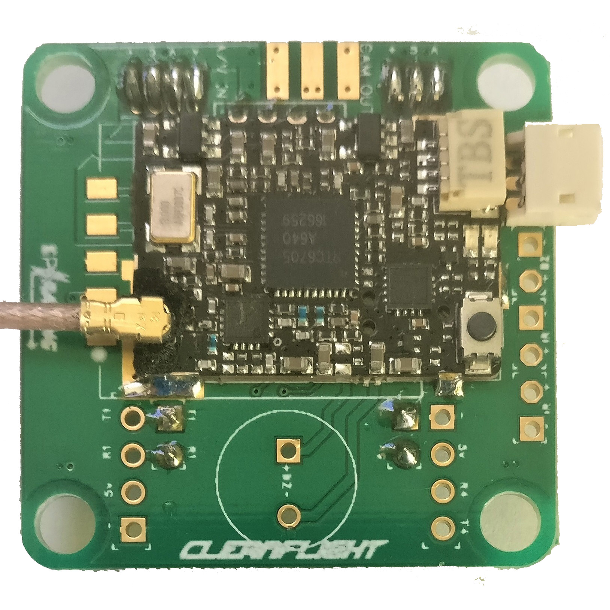

# SP Racing H7 EXTREME

Seriously Pro SPRacingH7EXTREME 飞控配备 400MHz H7 CPU，运行速度是上一代 F7 板的两倍。高频控制环是实现优异飞行性能的关键，而 400MHz H7 可提供所需的处理能力。

SPRacingH7EXTREME 集成 OSD（屏幕显示）和 PDB（配电板），并采用当时可用的先进技术。

完整信息请参阅：

http://seriouslypro.com/spracingh7extreme

直接从 SeriouslyPro / SP Racing 和官方零售商处购买主板有助于为软件开发提供资金。

购买链接：https://shop.seriouslypro.com/sp-racing-h7-extreme

## 背景

SPRacingH7EXTREME FC 是首款搭载 Betaflight 的 STM32H750 飞控。它是首款采用外部存储（EXST）构建系统的 Cleanflight/Betaflight 飞控；该系统允许引导加载程序从外部 Flash 或 SD 卡加载飞控固件。

有关 EXST 系统的更多详细信息，请参阅 EXST 文档。

## 硬件特性

SPRacingH7EXTREME 可独立使用，也可组成堆叠，安装 TBS Unify Pro 或 FX578-2-SPI VTX 模块。

1. SPRacingH7EXTREME FC/PDB - https://shop.seriouslypro.com/sp-racing-h7-extreme
2. SPRacingStackingVTX - https://shop.seriouslypro.com/sp-racing-f7-vtx-board-without-vtx-module

### SPRacingH7EXTREME FC/PDB 板。

- STM32H750 CPU，400MHz，含 FPU
- 通过 QuadSPI 的 128MByte 1GBit NAND 闪存
- 2x 低噪声 ICM20602 加速度计/陀螺仪，带专用 VREG（通过 SPI 连接）
- BMP388 气压计 - 底部安装用于风隔离（I2C + 中断）
- OSD 具有可定制的布局、配置文件和配置菜单系统
- 板载 MEMS 麦克风
- PID-Audio，带 CPU 音频输出和音频混控器
- 通过 4 位 SDIO 连接的 MicroSD 卡插槽（SD/SDHC，最大 32GB）
- 耐用的 1.6 毫米厚 6 层铜镀金 PCB，带有电池线切口
- 电流传感器/电流表（110A）
- 2-6S BEC 5V 开关稳压器，1A
- TVS 保护二极管
- 陀螺仪专用 500mA VREG，带有额外滤波电容
- 第二个 500mA VREG 用于 CPU 和其他外设
- 应答器电路（LED 和代码单独提供）
- 蜂鸣器电路
- RSSI 模拟和 PWM 电路
- 12 个电机输出（4 个位于电机垫上，4 个位于中间，4 个位于堆叠连接器上）
- 1x SPI 分线至堆叠连接器
- 6 个串行端口（5x TX+RX + 1x TX 仅双向）
- 3 个 LED 用于 5V、3V 和状态（绿色、蓝色、红色）
- 37x37mm PCB，带 30.5mm 安装孔图案
- 4mm 安装孔，用于软安装索环和 M3 螺栓
- FC/PDB + OSD/VTX 的 FPV 堆栈重量 ~16 克
- 用于配置和 ESC 编程的 MicroUSB 插座
- 可从 SD 卡或外部 Flash 启动。
- 随附 4 个软安装减振胶圈。
- 可选配 2 根音频/视频电缆。 （相机输入、VTX 输出）
- 可选配 2 个音频/视频 PicoBlade 连接器。 （用于摄像机输入，用于 VTX 输出）
- 提供适用于 FrSky XSR 接收机和 3 针式接收机的可选接收机电缆
- 4x 对焊盘用于 ESC 信号/GND 连接（双向 DSHOT 兼容）
- 4x 对焊盘用于 ESC 电源/GND 连接
- 4 个带通孔的特殊焊盘，用于相机输入 + 相机 OSD
- 4 个带通孔的特殊焊盘，用于音频+视频输出 (VTX)
- 1 个用于 PWM RSSI 的焊盘
- 1x LED 灯条焊盘
- 1x DAC 输出焊盘
- 1 个用于 ADC 输入的焊盘（用于 4 合 1 电流传感器输出等）
- 2x 焊盘用于 5V/GND 电源
- 2 个大焊盘，带有电池线切口
- 2x 大焊盘，用于 4 合 1 ESC 电源连接
- 1 个 2 针通孔，用于 UART4 RX/TX 排针
- 1 个 2 针通孔，用于蜂鸣器排针
- 1 个 2 针通孔，用于 5V/GND 排针
- 1x 2pin 通孔，用于 IR 应答器 LED 排针
- 1x 4pin 通孔，用于接收机的排针 (GND/5V/UART1 RX+TX)
- 1x 8pin 底部安装，JST-SH 插座，用于 GND/5V/I2C/UART3/UART8（IO 端口，例如用于外部 GPS 模块）
- 1x 6pin 底部安装，PicoBlade 接收机插座，用于 UART1(PPM/SerialRX)/UART2 TX(Telemetry)/RSSI/GND/5V
- 1x 4pin 顶部安装 JST-SH 插座，用于 SWD 调试- 1 个 4 针顶部安装 JST-SH 插座，用于 UART5 RX+TX/GPIO/GND
- 1x 12 针堆叠连接器（SPI、UART8、DSHOT/PWM 9-12/TIM3-CH1-4、5V BEC、3.3V 等）
- 1x 侧按启动按钮（顶部安装）
- 1x 侧按 VTX/设置按钮（顶部安装）
- 1x 混控器控制（顶部安装，靠近摄像机输入/输出）
- 用于摄像头和 VTX 输出的 2x 5V/电池电压选择器
- 1x 模拟/数字 RSSI 选择器
- Cleanflight 和 Betaflight 徽标 - 它们就在那里，您只需找到它们
- SP 赛车标志
- 2 个额外的复活节彩蛋！

### SPRacingStackingVTX 板。

- 适合可选的 RTC6705 VTX 25/200mw 输出（仅限 SPI 模块）
- 适合可选的 TBS Unify Pro VTX，具有无线 SmartAudio 连接
- 适合可选的 FrSKy XM+ 全范围分集接收机
- 远程 VTX ON/OFF 电路（适用于 RTC6705 模块）
- 36.8x36.8mm PCB，带 30.5mm 安装孔图案
- 配有 4 个软安装索环。
- 配有超薄型堆叠 I/O 连接器（2x 2 针公头 + 2x 2 针母头）
- 配有超薄型堆叠 A/V 连接器（1x 4 针公头 + 1x 4 针母头）
- Cleanflight 标志
- SPRacing 标志
- 1x U.FL 插座用于天线连接，镀金。 （适用于 RTC6705 模块）
- 1 套用于边缘安装同轴插座的焊盘。 （适用于 RTC6705 模块）
- 1 个 4 针通孔，用于 UART1 接收机/蓝牙/等（RX/TX/5V/GND）
- 1x 4pin 通孔，用于 UART4 蓝牙/Wifi/GPS/等（RX/TX/5V/GND）的排针
- 4x 2pin 通孔，用于堆叠到 H7 EXTREME (5V/GND/UART 4 RX+TX)
- 1x 2pin 通孔，用于蜂鸣器输出的排针
- 1 个 3 针通孔，用于 JST-ZH 相机插座的排针
- 1 个 6 针通孔，用于 IR 输入/输出 + 蜂鸣器输入的排针
- 1 个 3 针通孔，用于 JST-ZH 连接器，用于摄像机直通连接
- 1x 组 SOIC-8 209mil 焊盘，用于用户可安装的 SPI 闪存芯片（例如 25Q064A
- 2x SmartAudio 启用跳线（使用 TBS Unify 时为 UART8 TX）

## 连接图

连接图可以在网站上找到：

http://seriouslypro.com/spracingh7extreme#diagrams

## 手册

该手册可以从网站下载：

http://seriouslypro.com/files/SPRacingH7EXTREME-Manual-latest.pdf
