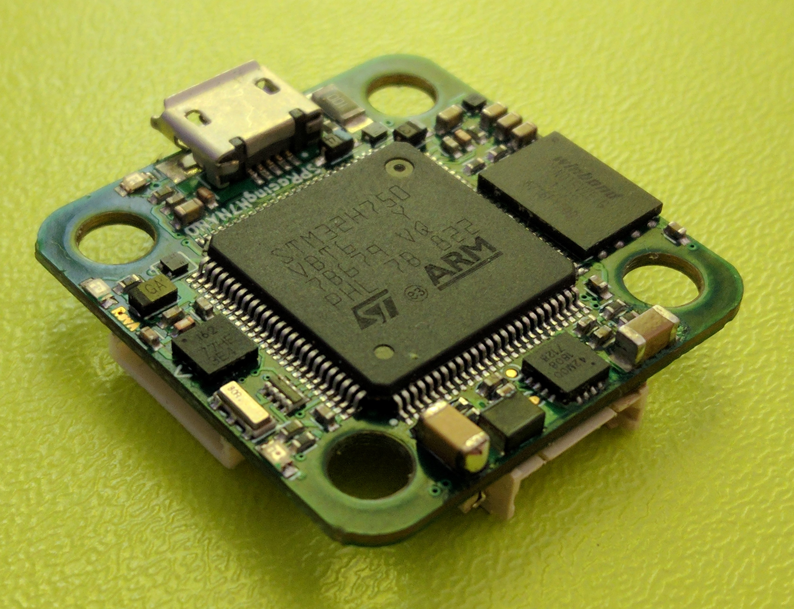
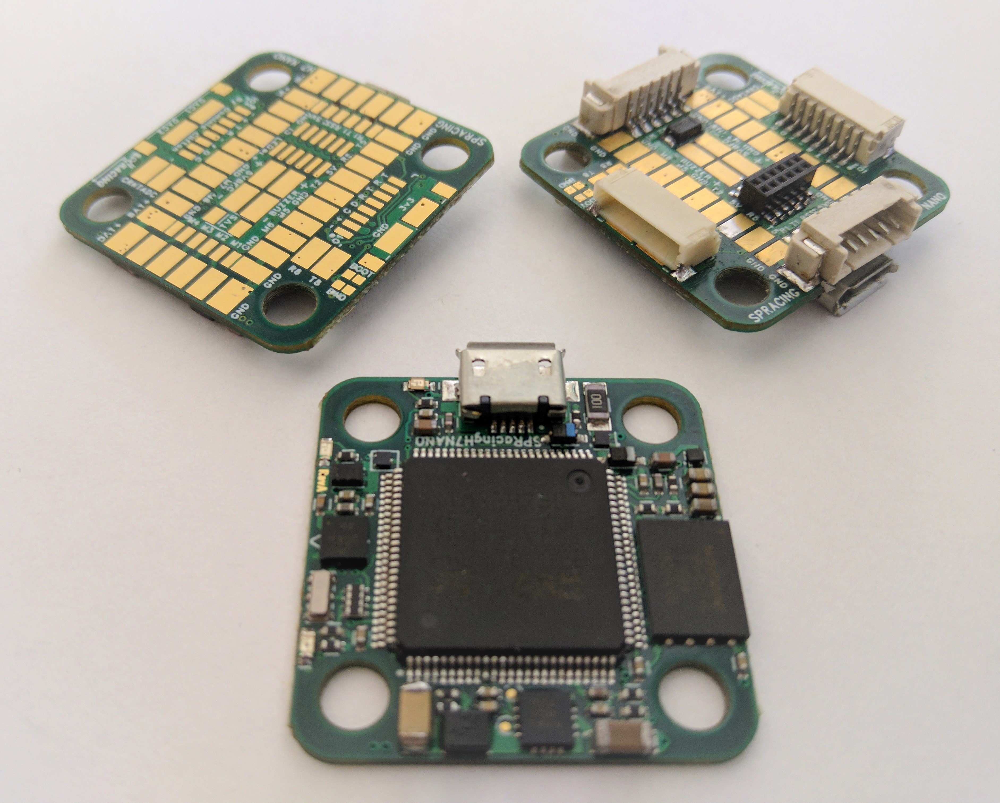
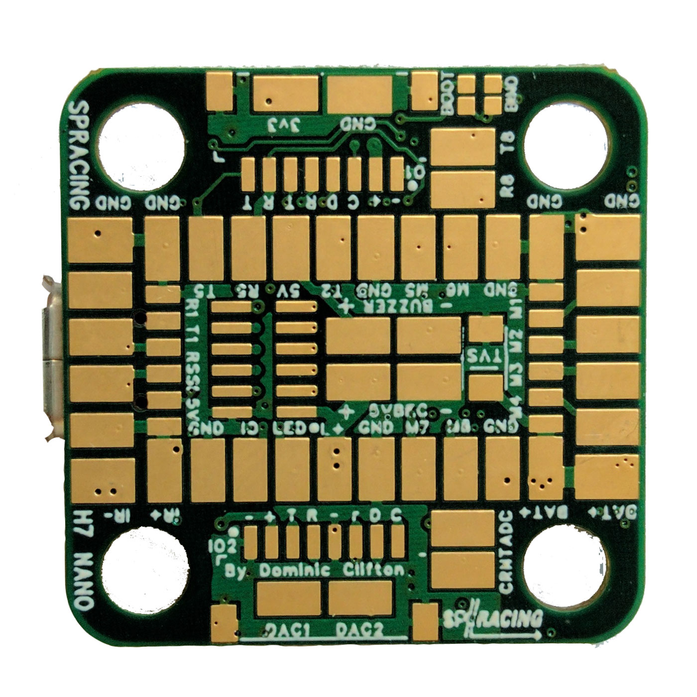
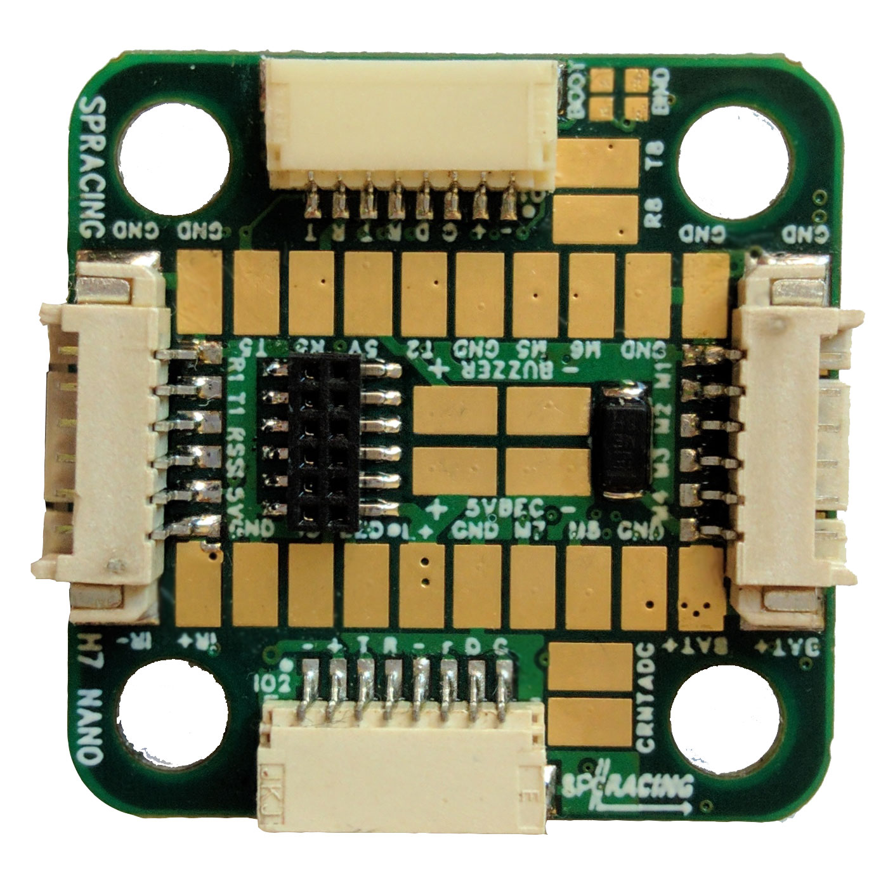

# SP Racing H7 NANO

Seriously Pro 的 SPRacingH7NANO 飞行控制器采用 400 MHz H7 CPU，运行速度是上一代 F7 板卡的两倍。高频控制环是获得出色飞行性能的基础，400 MHz H7 提供了所需的处理能力。

SPRacingH7NANO 采用 20 x 20 mm 安装孔距，集成 5 V BEC 和 128 MB Blackbox 日志存储，并支持外置 OSD，例如可通过 RunCam 相机，或 TBS Unify Evo OSD/VTX 等 Crossfire/CRSF VTX 实现。

完整信息请参阅：

http://seriouslypro.com/spracingh7nano

直接从 SeriouslyPro / SP Racing 或官方零售商处购买板卡，有助于支持软件开发。

购买链接：https://shop.seriouslypro.com/sp-racing-h7-nano

## 背景

SPRacingH7NANO FC 是第二款随 Betaflight 发布、基于 STM32H750 的飞控。与之前的 SPRacingH7EXTREME 一样，它使用外部存储（EXST）构建系统；该系统允许引导加载程序从外部 Flash 加载飞控固件。

有关 EXST 系统的更多信息，请参阅 EXST 文档。

## 硬件特性

SPRacingH7NANO 提供两个版本：NANO-S（仅焊盘）和 NANO-E（带 4 合 1 ESC、RX 及 IO 连接器）。

### SPRacingH7NANO FC 板卡

- STM32H750 CPU，400 MHz，含 FPU
- 通过 QuadSPI 连接的 128 MB（1 Gbit）NAND Flash
- 低噪声 ICM20602 加速度计/陀螺仪，配有专用滤波，且通过 SPI 连接
- 1.0 mm 厚、四层铜箔沉金 PCB
- 支持 2-6S 输入的 5 V/1 A 开关式 BEC
- TVS 保护二极管（NANO-E 已安装；NANO-S 可选配）
- 竞赛应答器电路（LED 和代码需另行获取）
- 蜂鸣器电路
- RSSI 模拟输入
- 8 路电机输出（NANO-S：8 路均在焊盘上；NANO-E：4 路位于 4 合 1 连接器，另 4 路位于焊盘）
- 1 组双 SPI + GPIO 分线至堆叠连接器（仅 NANO-E）
- 6 个串行端口（5 个 TX+RX，1 个仅 TX 的双向端口）
- 3 个 LED，分别指示 5 V、3 V 和状态（绿、蓝、红）
- 26.5 x 26.5 mm PCB，采用 20 mm 安装孔距
- 直径 4 mm 的安装孔，适配软安装胶圈和 M3 螺栓
- 用于配置和 ESC 编程的 Micro USB 接口
- 支持从外部 Flash 启动
- 随附 4 个软安装胶圈
- 可选配 2 根 8 芯 JST-SH IO 线缆（仅 NANO-E）
- 可选配 2 根 6 芯 PicoBlade IO 线缆（仅 NANO-E）

- 1 个 LED 灯带焊盘
- 2 个 DAC 输出焊盘（仅 NANO-S）
- 2 个 ADC 输入焊盘（用于 4 合 1 ESC 电流传感器输出等）
- 2 个 UART8 RX/TX 焊盘
- 2 个 5 V/GND 供电焊盘
- 2 个蜂鸣器焊盘
- 2 个 TVS 二极管焊盘
- 1 排电机 1-4 和电池线焊盘（仅 NANO-S）
- 1 排 RX 连接焊盘（UART1 RX+TX、RSSI、5 V、GND、IR；仅 NANO-S）
- 2 排附加 IO 焊盘（UART2、UART5、IR、LED 灯带等）
- 2 个 8 针 JST-SH 插座，提供 GND/5 V/I2C/UART4/UART5（IO 端口，例如连接外置 GPS 模块）
- 2 个 8 针 JST-SH 插座，提供 GND/5 V/SWD/UART3（IO 端口，例如用于调试）
- 1 个用于 RX 的 6 针 PicoBlade 插座（仅 NANO-E）
- 1 个用于 4 合 1 ESC 的 6 针 PicoBlade 插座（仅 NANO-E）
- 1 组 BOOT 焊盘
- 1 组 BIND 焊盘
- Cleanflight 和 Betaflight 标志，等你自己去发现
- SP Racing 标志
- 另有 1 个隐藏彩蛋

## 连接图

连接图请参阅：

http://seriouslypro.com/spracingh7nano#diagrams

## 手册

手册下载链接：

http://seriouslypro.com/files/SPRacingH7NANO-Manual-latest.pdf
