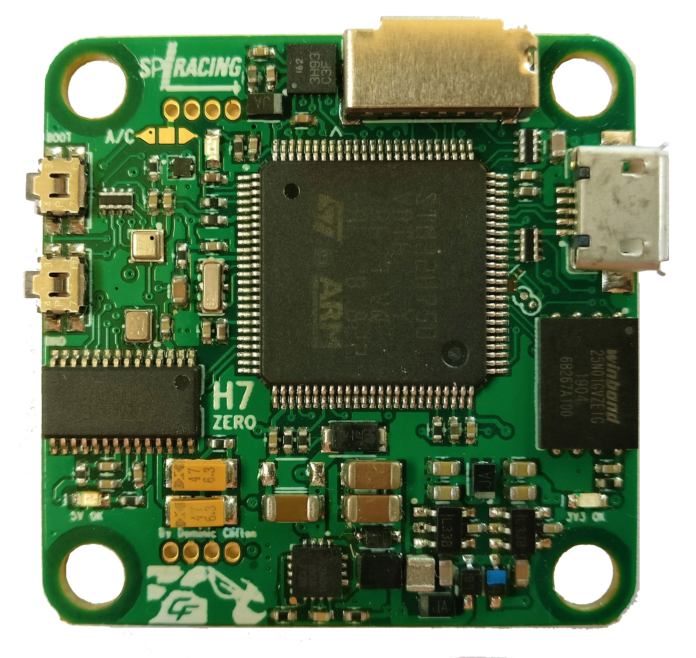
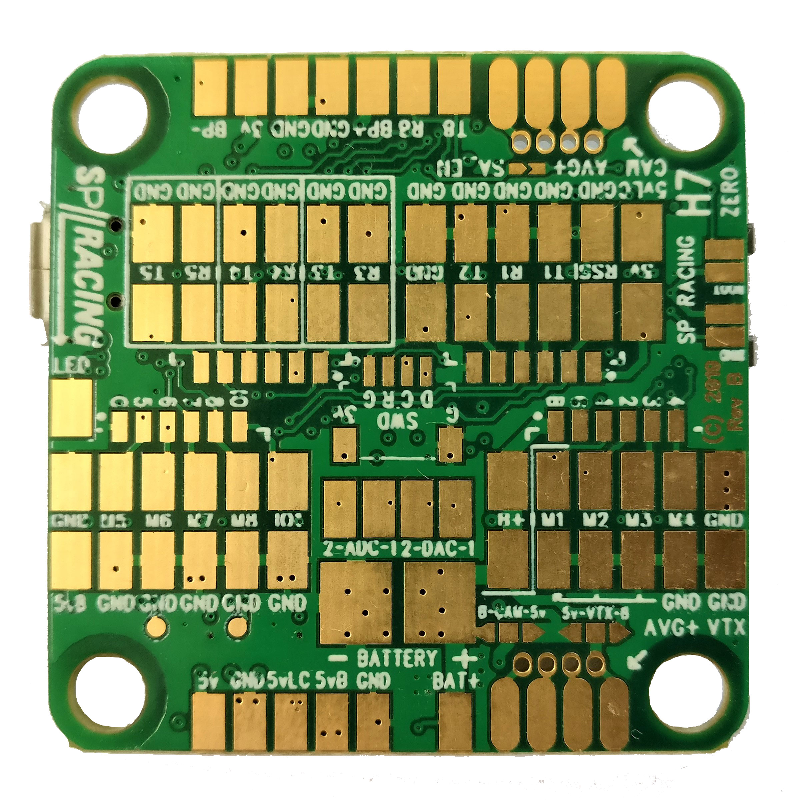

# SP Racing H7 ZERO

Seriously Pro SPRacingH7ZERO 飞控采用 400 MHz H7 CPU，运行速度是上一代 F7 板卡的两倍。高速控制回路是获得优秀飞行表现的基础，400 MHz H7 可提供所需的处理能力。

SPRacingH7ZERO 集成 OSD、单陀螺仪、BMP388 气压计和支持 2S 至 6S 的 BEC。

便于焊接：PCB 的整个一侧均为焊盘。

完整资料：http://seriouslypro.com/spracingh7zero

直接从 SeriouslyPro / SP Racing 或官方经销商购买板卡，有助于支持软件开发。

购买地址：https://shop.seriouslypro.com/sp-racing-h7-zero

## 背景

SPRacingH7ZERO FC 是随 Betaflight 出货的第三款基于 STM32H750 的 FC。与 SPRacingH7NANO 和 SPRacingH7EXTREME 一样，它使用外部存储（EXST）构建系统，由 Bootloader 从外部 Flash 加载飞控固件。

有关 EXST 系统的更多信息，请参阅 EXST 文档。

## 设计目标

- 便于连接两块 4 合 1 ESC，提供 8 路电机输出
- 不提供麦克风、音频混合器、应答器电路、电流传感器或双陀螺仪等高端硬件特性，相关功能请参阅 SPRacingH7EXTREME
- 比 SPRacingH7EXTREME 更经济
- 不集成 PDB
- 单面 PCB

## 硬件特性

- STM32H750 CPU，400 MHz，含 FPU
- 通过 QuadSPI 连接的 128 MB、1 Gbit NAND Flash
- 低噪声 ICM20602 加速度计/陀螺仪，SPI 连接
- BMP388 气压计，I2C 加中断
- OSD，支持自定义布局、配置文件和配置菜单系统
- MicroSD 卡插槽，SD/SDHC，最高 32 GB，通过 4 位 SDIO 连接
- 2S 至 6S、5 V / 1 A BEC 开关稳压器
- TVS 保护二极管
- 专用于传感器和 SD 卡的 500 mA 稳压器，带额外滤波电容
- 第二个 500 mA 稳压器，用于 CPU 和其他外设
- 蜂鸣器电路
- 8 路电机输出，位于同一排并提供信号地
- RSSI 模拟输入
- 6 个串口，5 个 TX+RX、1 个仅 TX 的双向端口
- 5 V、3 V 与 STATUS 三个 LED，绿色、蓝色、红色
- 37 x 37 mm PCB，安装孔距 30.5 mm
- 4 mm 安装孔，适用软安装胶套与 M3 螺栓
- Micro USB 插座，用于配置和 ESC 编程
- 可从 SD 卡或外部 Flash 启动
- 随附 4 个软安装胶套
- 可选随附两条音频/视频线，相机输入、VTX 输出
- 1 个顶装侧按式 BOOT 按钮
- 1 个顶装侧按式 VTX/Settings 按钮
- 两个 5 V/电池电压选择器，用于相机和 VTX 输出
- Cleanflight、Betaflight 和 SP Racing 标志
- 额外彩蛋

## 连接图

连接图：http://seriouslypro.com/spracingh7zero#diagrams

## 手册

手册下载：http://seriouslypro.com/files/SPRacingH7ZERO-Manual-latest.pdf
