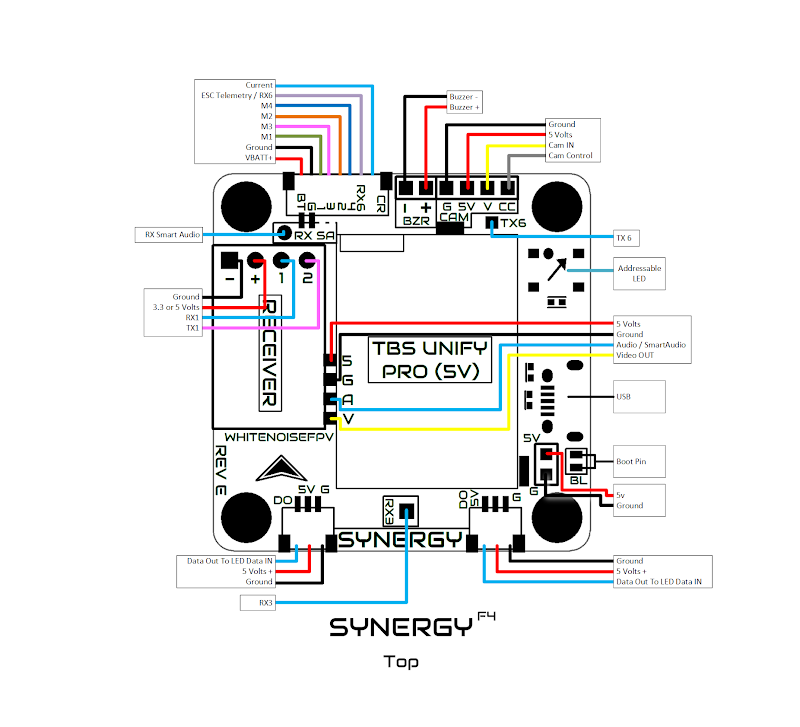
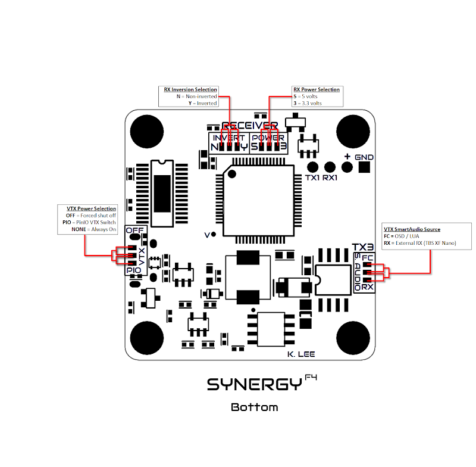
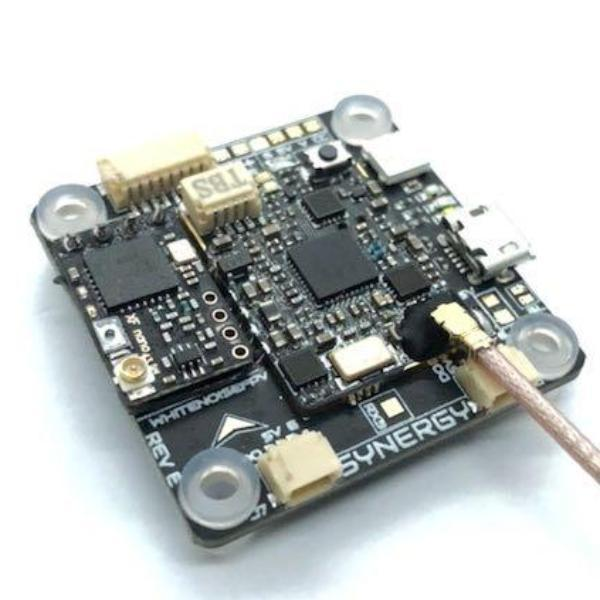

### 规格

- 处理器：STM32F405（F4）
- 陀螺仪：MPU6000
- 控制环频率：8 kHz/8 kHz
- 输入电压：2-6S（最高 28 V）
- 稳压器：带滤波的 5 V/3 A 输出
- 接收机：供电电压可选 3.3 V 或 5 V；输入可选反相或非反相
- 连接器：1 个 8 针 JST-SH 主连接器；2 个 3 针 JST-SH 可寻址 LED 连接器（镜像输出）
- 遥测：电流传感器与 ESC 遥测输入
- Blackbox：128 Mbit Flash（16 MB）
- 电机：4 路 PWM 电机输出，支持 DShot 和 Multishot 协议
- 安装孔：M3 规格、30.5 x 30.5 mm 孔距，支持软安装
- 尺寸：37 x 37 mm
- 重量：7.5 g
- 相机供电：带滤波的 5 V 输出

### 功能

- 支持直接安装 Unify Pro（5 V）、Unify Nano 和 Unify Pro Nano32（Nano VTX 使用随附转接板）
- 支持直接安装 TBS Crossfire Nano RX、TBS Crossfire Nano Diversity RX、FrSky XM+ 和 FrSky R9M Mini（R9M Mini 转接板由 Tiny's LEDs 随附）
- 预留接收机直装排针孔
- 内置单线相机控制（仅模拟相机）
- 内置 Betaflight OSD
- 蜂鸣器：提供 5 V 蜂鸣器专用焊盘，最大输出电流为 100 mA
- 板载可寻址 LED
- 内置 Tiny's LEDs RealPit VTX 电源开关，模式可选 ON、OFF 或 Remote
- 可通过 USB 为接收机供电，VTX 保持关闭
- SmartAudio：信号源可选内部（由飞控控制）或外部（由接收机提供）

### UART 信息

- UART1：接收机（FrSky、Spektrum、Crossfire 等）
- UART3：SmartAudio；若将 SmartAudio 信号源设为飞控顶面标记为 RX SA 的 `external` 焊盘，也可用于其他输出
- UART6：ESC 遥测输入（如适用）

### 顶面

### 底面

### 图片

`*** 飞控不含接收机或 VTX；图片仅供参考。`

### 安装

- 视频：https://www.facebook.com/kevinslee106/videos/10156338569116234

### 获取方式

- WhitenoiseFPV：https://whitenoisefpv.com/products/synergyf4
- Tiny's LEDs：https://tinysleds.com/products/synergy-f4-flight-controller
