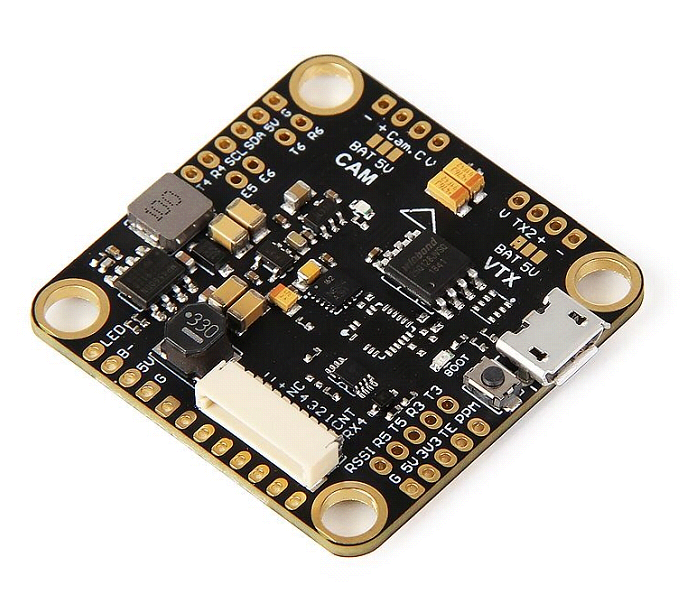
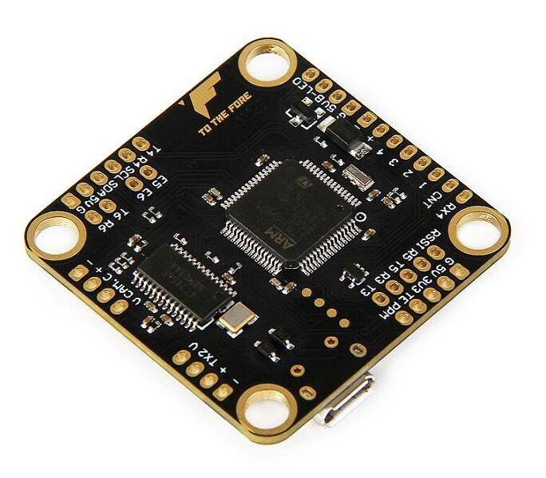

# TMOTOR F4

## 描述

TMOTOR F4 的设计重点是在保持高效率的同时，尽可能提供 UART 和电机输出。通过审慎的引脚映射，仅用 2 个定时器即可驱动 6–8 路 DShot 电机；同时引出 STM32F405 提供的全部 6 路 UART。该板可与主流 4 合 1 ESC 即插即用连接。

## MCU、传感器与功能

### 硬件

- MCU：STM32F405
- IMU：ICM-20602 或 MPU-6000
- 6 路 DShot 电机输出；将 UART6 重新映射为 M7 和 M8 后可达到 8 路，且仅使用 2 个定时器
- BMP280（SPI）
- 6 个硬件 UART：UART5 配有可控 SBUS 反相器；USART1 配有用于 FPORT/SPORT 的双向反相器
- 板载稳压器支持最高 6S
- Dataflash Blackbox
- 外部 I2C 端口
- JST-SH 10 针 4 合 1 ESC 插座

## 设计者与维护者

T-Motor FPV（https://www.facebook.com/rctigermotor/）

