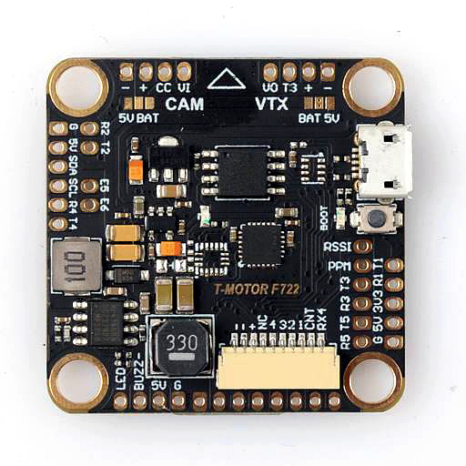
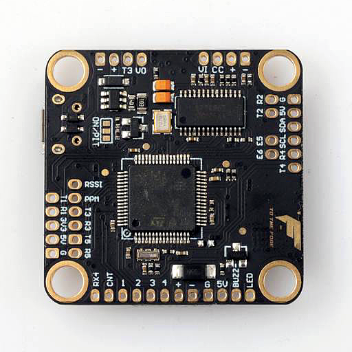

# TMOTOR F7

## 说明

TMOTOR F7 是 TMOTOR F4 的升级版，解决了前四路电机不重新映射就无法使用双向 DShot 的问题。

可与主流 4 合 1 ESC 即插即用连接。

## MCU、传感器与特性

### 硬件

- MCU：STM32F722
- IMU：BMI270、ICM-42688-P、MPU-6000 或 MPU-6500
- 6 路 DShot 电机输出
- BMP280（SPI）
- 5 个硬件 UART
- 板载稳压器，最高支持 6S
- Dataflash Blackbox
- 外部 I2C 接口
- JST-SH 10 针 4 合 1 ESC 插头

## 设计者与维护者

T-Motor FPV (https://www.facebook.com/rctigermotor/)

