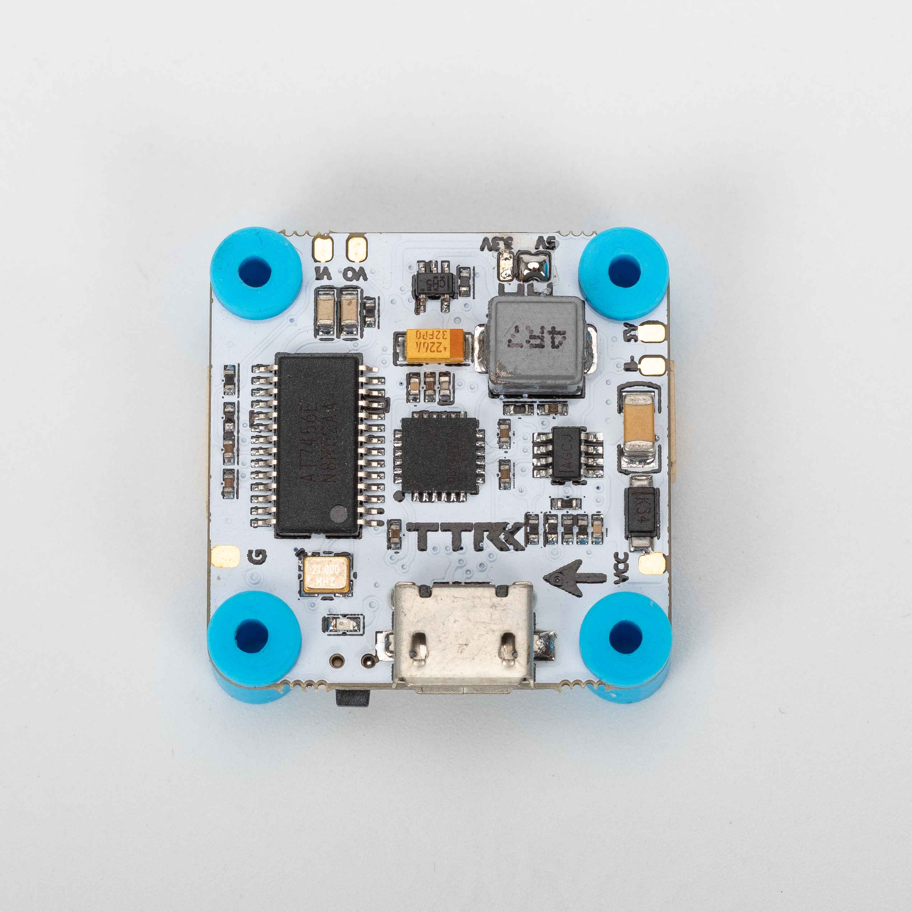
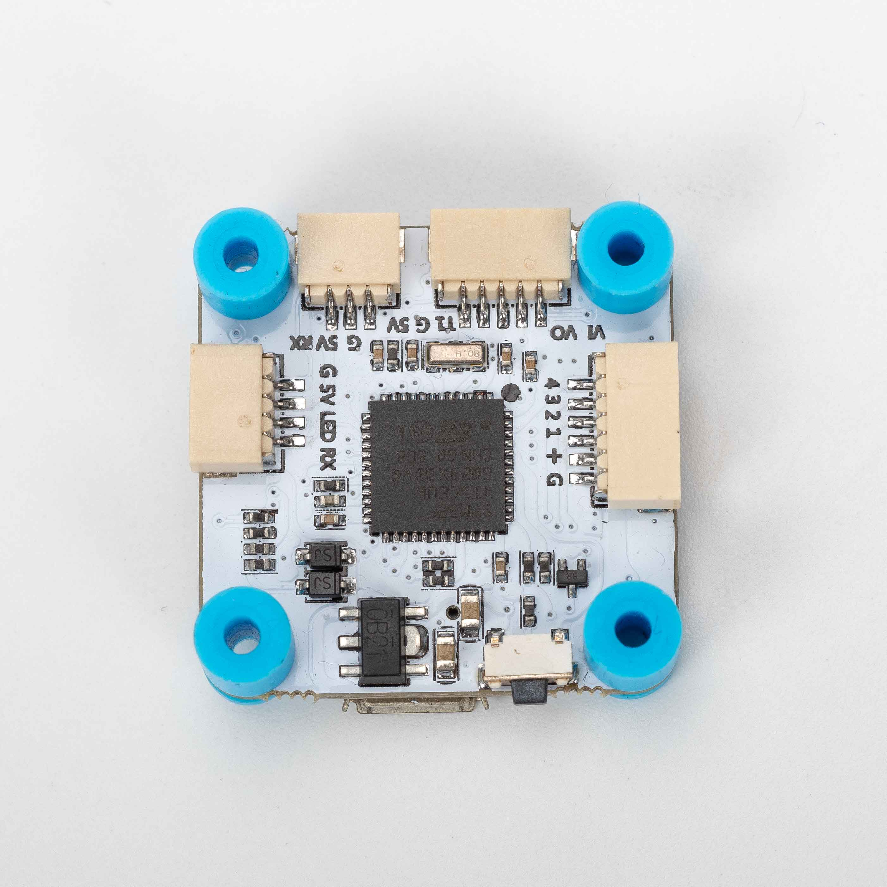

# TRANSTEC F411 系列

## 说明

TransTEC F411 专为易用性设计。

TRANSTECF411 提供三个版本：30 x 30（普通版）、20 x 20（普通版）和 20 x 20（HD 版）。

## MCU、传感器与特性

### 硬件

- MCU：STM32F411
- IMU：MPU-6000
- 4 路 DShot 电机输出
- 2 个硬件 UART
- 板载稳压器：30 x 30 版最高支持 6S，20 x 20 版最高支持 4S
- 5 V / 3 A BEC
- JST-SH 6 针 4 合 1 ESC 插头
- 用于相机与 VTX 的 JST-SH 5 针插头，普通版
- 用于 DJI FPV 系统的 GH-1.25 6 针 HD 插头，HD 版

### 特性

- 便于连接外设，例如相机、VTX 和接收机
- 内置 SBUS 反相器
- 橡胶减振圈
- 支持 VTX 电源开关

## 设计者与维护者

TransTEC Hobby (https://www.transtechobby.com)
TransTEC Facebook (https://www.facebook.com/TransTechobby/)
TransTEC Instagram (https://www.instagram.com/transtechobby/)

