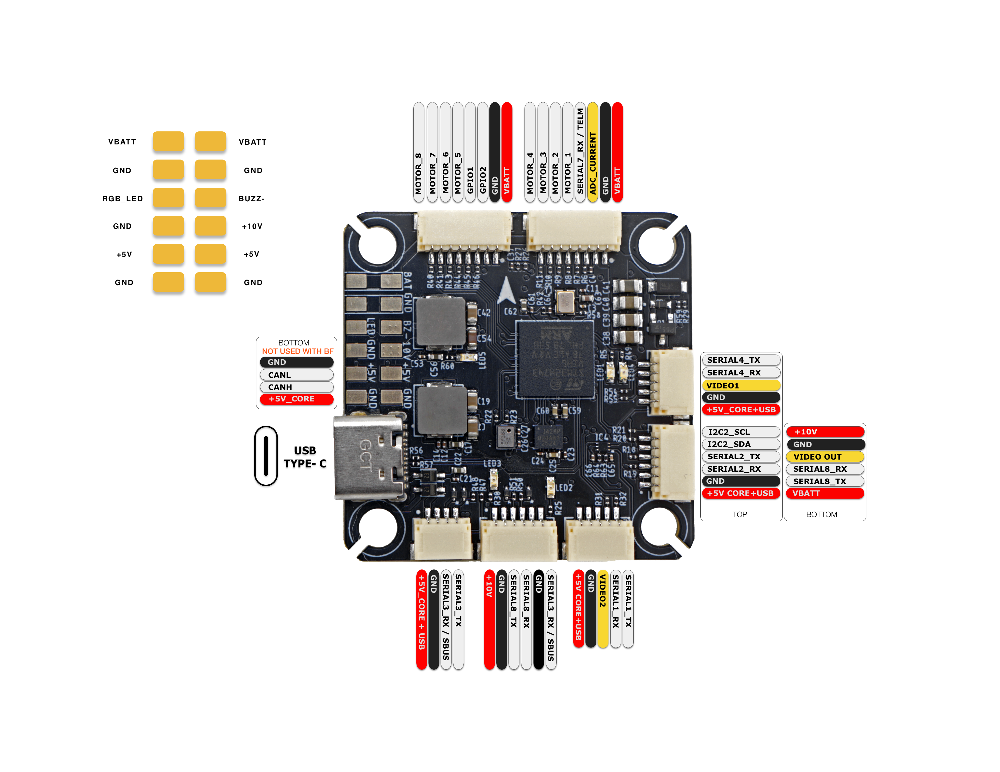

import Tabs from '@theme/Tabs'
import TabItem from '@theme/TabItem'
import SpecGrid from '@site/src/components/SpecGrid'

# AEDROX H7

<Tabs>

<TabItem value="specifications" label="规格" default>

<SpecGrid>

</SpecGrid>

## 其他功能

- SD 卡槽: 否
- 板载接收机: 否
- 硬件反相器: 否
- 蓝牙: 否
- WiFi: 否
- 板载 RGB LED: 1 个焊盘
- 相机切换: 是

## 信息

:::info

[AEDROX 网站](https://aedrox.com)

:::

## 输入/输出

- USB 接口:
  USB Type-C
- 电机输出:
  8 路
- UART:
  6 路
- I2C:
  是
- SWD:
  是
- SPI:
  否
- 3.3V 输出:
  是
- 4.5V (VBUS) 输出:
  否
- 5V 输出:
  2.3A
- 10V 输出:
  2.3A（由 GPIO 控制）
- 电流传感器:
  是
- 模拟 RSSI 输入:
  否
- LED 灯带输出:
  是
- 蜂鸣器输出:
  是
- GPIO:
  2 路

## 接口

### 电机 1-4

| 引脚编号 | 名称     | 标签   | 备注     |
| -------- | -------- | ------ | -------- |
| 1        | 电池电压 | VBATT  |          |
| 2        | 地线     | GND    |          |
| 3        | 电流     | CUR    | ADC 电流 |
| 4        | 遥测     | RX7    | ESC 遥测 |
| 5        | 信号 1   | Motor1 |          |
| 6        | 信号 2   | Motor2 |          |
| 7        | 信号 3   | Motor3 |          |
| 8        | 信号 4   | Motor4 |          |

### 电机 5-8

| 引脚编号 | 名称     | 标签   | 备注  |
| -------- | -------- | ------ | ----- |
| 1        | 电池电压 | VBATT  |       |
| 2        | 地线     | GND    |       |
| 3        | GPIO 2   | GPIO2  | PINIO |
| 4        | GPIO 1   | GPIO1  | PINIO |
| 5        | 信号 5   | Motor5 |       |
| 6        | 信号 6   | Motor6 |       |
| 7        | 信号 7   | Motor7 |       |
| 8        | 信号 8   | Motor8 |       |

### GPS/罗盘

| 引脚编号 | 名称    | 标签 | 备注 |
| -------- | ------- | ---- | ---- |
| 1        | 5V      | +5V  |      |
| 2        | 地线    | GND  |      |
| 3        | UART 2  | RX2  |      |
| 4        | UART 2  | TX2  |      |
| 5        | I2C SDA | SDA  |      |
| 6        | I2C SCL | SCL  |      |

### CAM1

| 引脚编号 | 名称   | 标签   | 备注 |
| -------- | ------ | ------ | ---- |
| 1        | 5V     | +5V    |      |
| 2        | 地线   | GND    |      |
| 3        | 视频 1 | Video1 |      |
| 4        | UART 4 | RX4    |      |
| 5        | UART 4 | TX4    |      |

### CAM2

| 引脚编号 | 名称   | 标签   | 备注 |
| -------- | ------ | ------ | ---- |
| 1        | 5V     | +5V    |      |
| 2        | 地线   | GND    |      |
| 3        | 视频 2 | Video2 |      |
| 4        | UART 1 | RX1    |      |
| 5        | UART 1 | TX1    |      |

### HD VTX

| 引脚编号 | 名称   | 标签 | 备注 |
| -------- | ------ | ---- | ---- |
| 1        | 10V    | +10V |      |
| 2        | 地线   | GND  |      |
| 3        | UART 8 | TX8  |      |
| 4        | UART 8 | RX8  |      |
| 5        | 地线   | GND  |      |
| 6        | UART 3 | RX3  |      |

### 接收机

| 引脚编号 | 名称   | 标签 | 备注 |
| -------- | ------ | ---- | ---- |
| 1        | 5V     | +5V  |      |
| 2        | 地线   | GND  |      |
| 3        | UART 3 | RX3  |      |
| 4        | UART 3 | TX3  |      |

### 模拟图传发射器（VTX）

| 引脚编号 | 名称     | 标签     | 备注 |
| -------- | -------- | -------- | ---- |
| 1        | 10V      | +10V     |      |
| 2        | 地线     | GND      |      |
| 3        | 视频输出 | 视频输出 |      |
| 4        | UART 8   | RX8      |      |
| 5        | UART 8   | TX8      |      |
| 6        | 电池电压 | VBATT    |      |

### 调试

| 引脚编号 | 名称  | 标签 | 备注     |
| -------- | ----- | ---- | -------- |
| 1        | 3.3V  | 3V3  | 底面焊盘 |
| 2        | SWDIO | IO   | 底面焊盘 |
| 3        | SWCLK | CK   | 底面焊盘 |

</TabItem>

<TabItem value="wiring" label="接线图">

</TabItem>

<TabItem value="photos" label="图片">

</TabItem>

<TabItem value="notes" label="说明">

## OSD 支持

模拟 OSD 与高清 OSD 共用 SERIAL8。

## VTX 电源控制

PINIO3 控制标记为“10V”的 VTX BEC 输出。该电源同时引至高清 VTX 接口、模拟 VTX 接口和一个焊盘。将此 GPIO 设为低电平会关闭这些接口和焊盘的供电。

## 相机切换

PINIO4 控制相机切换。将此 GPIO 设为高电平时输出 CAM1 视频流，设为低电平时输出 CAM2 视频流。

</TabItem>

</Tabs>
