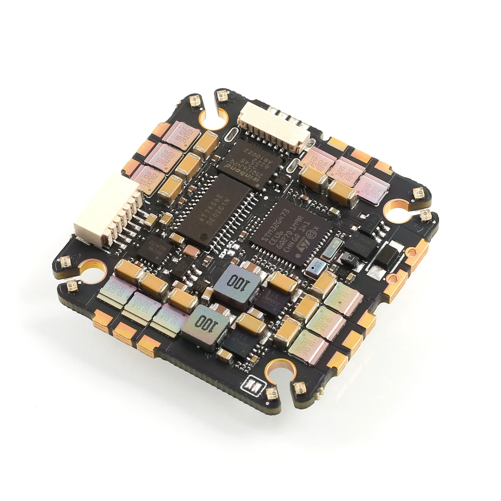
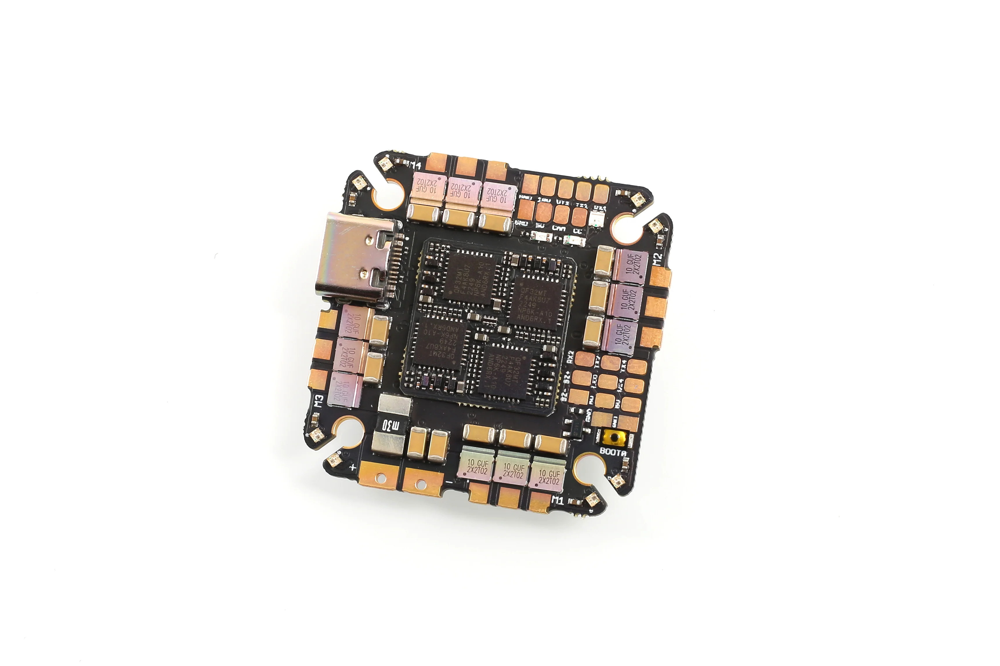
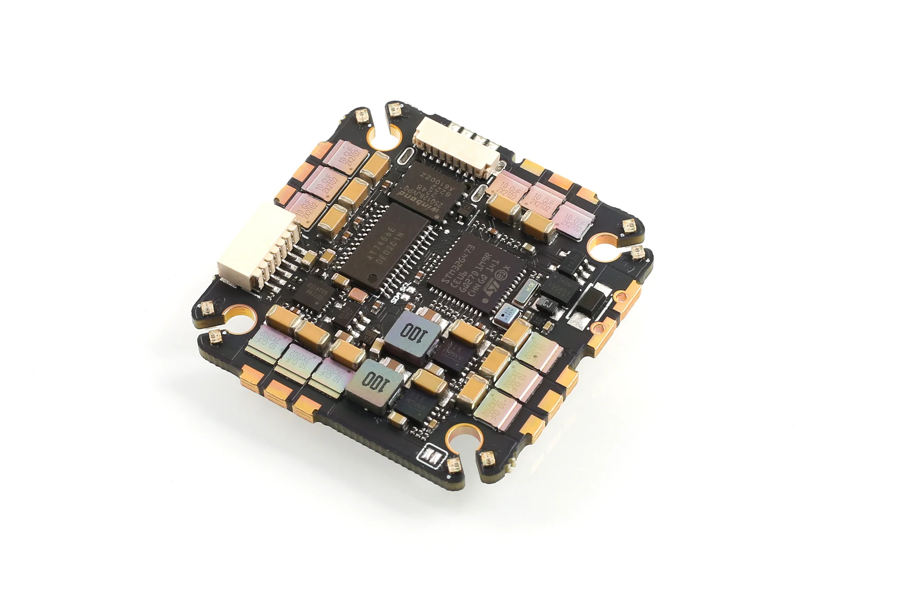

import Tabs from '@theme/Tabs'
import TabItem from '@theme/TabItem'
import SpecGrid from '@site/src/components/SpecGrid'

# Airbot Fenix G4 35A AIO

<Tabs>

<TabItem value="specifications" label="规格" default>

<SpecGrid>

</SpecGrid>

## 其他特性

- SD 卡插槽：无
- 板载接收机：无
- 硬件反相器：有
- Bluetooth：无
- WiFi：无
- 板载 RGB LED：16 个

## ESC 规格

- ESC MCU：QF32MTF4AK8U7
- ESC 固件：AM32
- ESC target：F4A_AIO_F421
- 持续电流：35 A
- 峰值电流：45 A

## 信息

:::info

[Airbot 官方网站](https://store.myairbot.com)

:::

## 输入/输出

- USB 接口：USB Type-C
- ESC 输出：4 路
- UART：4 个
- I2C：有
- SWD：有
- SPI：无
- 3.3 V 输出：无
- 4.5 V（VBUS）输出：有
- 5 V 输出：2 A
- 10 V 输出：2 A
- 电流传感器：有
- 模拟 RSSI 输入：无
- LED 灯带输出：有
- 蜂鸣器输出：有

## 焊盘

### UART

| 名称   | 标签    | 备注                    |
| ------ | ------- | ----------------------- |
| UART 1 | TX1/RX1 | VTX                     |
| UART 2 | RX2/TX2 | 可选 SBUS/F.Port 反相器 |
| UART 4 | TX4/RX4 |                         |

### 电源

| 名称     | 标签 | 数量 | 备注 |
| -------- | ---- | ---- | ---- |
| 5V       | 5V   | 3x   |      |
| 10V      | 10V  | 1x   |      |
| 电池电压 | VBAT | 1 个 |      |

### 模拟视频

| 名称     | 标签 | 备注 |
| -------- | ---- | ---- |
| 视频输入 | CAM  |      |
| 相机控制 | CC   |      |
| 视频输出 | VTX  |      |

### 蜂鸣器

| 名称     | 标签 | 备注 |
| -------- | ---- | ---- |
| 蜂鸣器 + | BZ+  |      |
| 蜂鸣器 - | BZ-  |      |

### RGB LED

| 名称 | 标签   | 数量 | 备注                   |
| ---- | ------ | ---- | ---------------------- |
| LED  | LED    | 1x   |                        |
|      | LED_EN | 1 个 | 短接焊盘以启用板载 LED |

### USB 分接

| 名称     | 标签 | 备注 |
| -------- | ---- | ---- |
| 地       | GND  |      |
| USB 电源 | VBUS |      |
| 数据 -   | DN   |      |
| 数据 +   | DP   |      |

### I2C

| 名称 | 标签 | 备注                 |
| ---- | ---- | -------------------- |
| 时钟 | SCL  | 位于板卡中部的小焊盘 |
| 数据 | SDA  |                      |

## 连接器

### 数字 VTX

| 引脚 | 名称     | 标签 | 备注 |
| ---- | -------- | ---- | ---- |
| 1    | 10V      | 10V  |      |
| 2    | Ground   | GND  |      |
| 3    | UART1 TX | TX1  |      |
| 4    | UART1 RX | RX1  |      |
| 5    | Ground   | GND  |      |
| 6    | SBUS     | TX2  |      |

</TabItem>

<TabItem value="wiring" label="接线图">

[AIRBOTG4AIO 接线图](./AIRBOTG4AIO-images/AIRBOTG4AIO-diagram.pdf)

</TabItem>

<TabItem value="photos" label="照片">

</TabItem>

<TabItem value="notes" label="备注">

:::info

**VTX 连接器**

该 AIO 配有一个兼容数字和模拟 VTX 的多用途连接器：

- 使用连接器上的两个 GND 引脚时，TX2 引脚将作为 SBUS 的反相 RX 引脚，连接器按标准引脚定义作为普通数字 VTX 连接器使用。
- 仅使用第一个 GND 引脚时，TX2 引脚将改为输出模拟视频，此时连接器可用于模拟 VTX。

:::

**板载 LED**

该飞控板载 28 个 RGB LED，与 LED 信号连接并联，并由板载稳压器供电。短接 LED_EN 焊盘后，信号线会连接到这些 LED，飞控即可完整控制它们。

</TabItem>

</Tabs>
