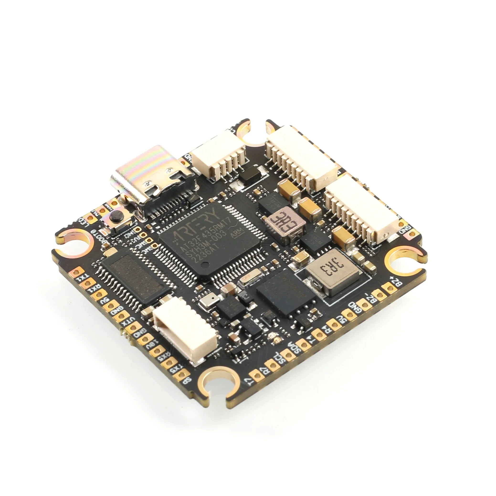
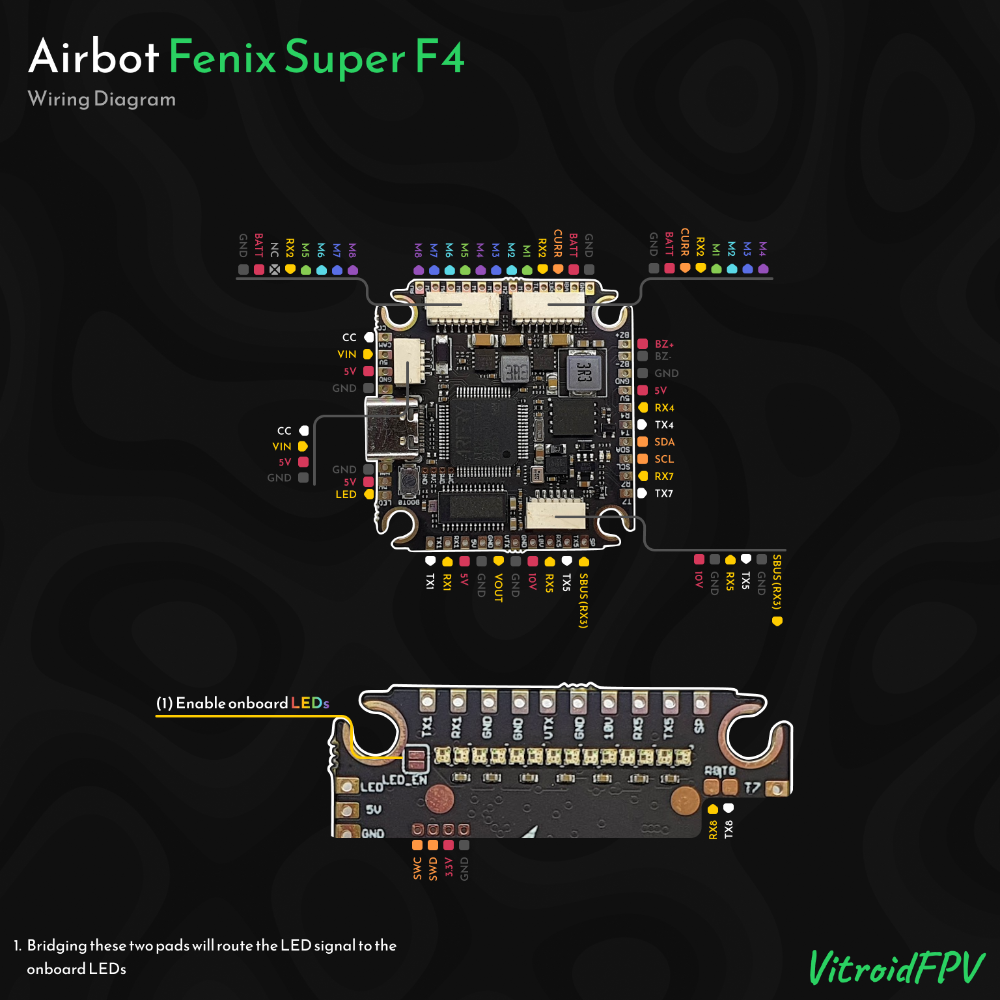
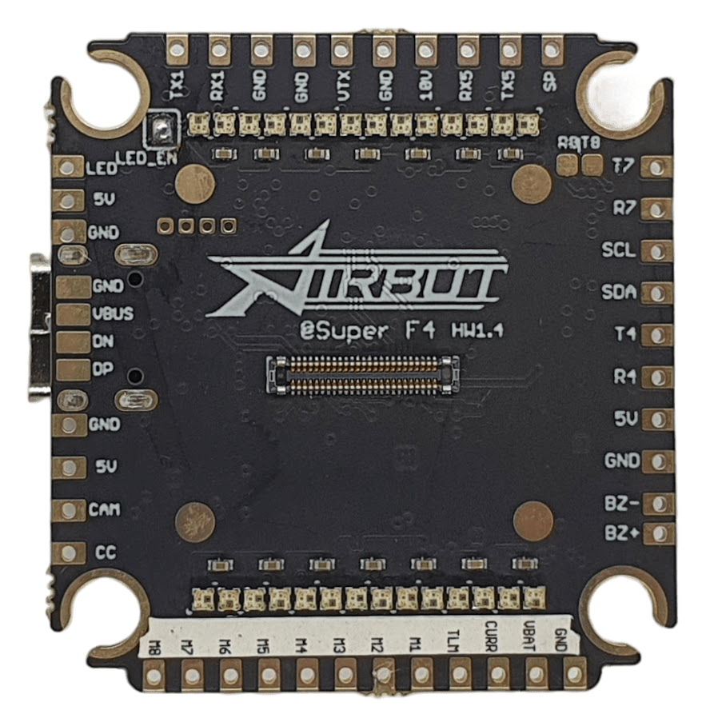
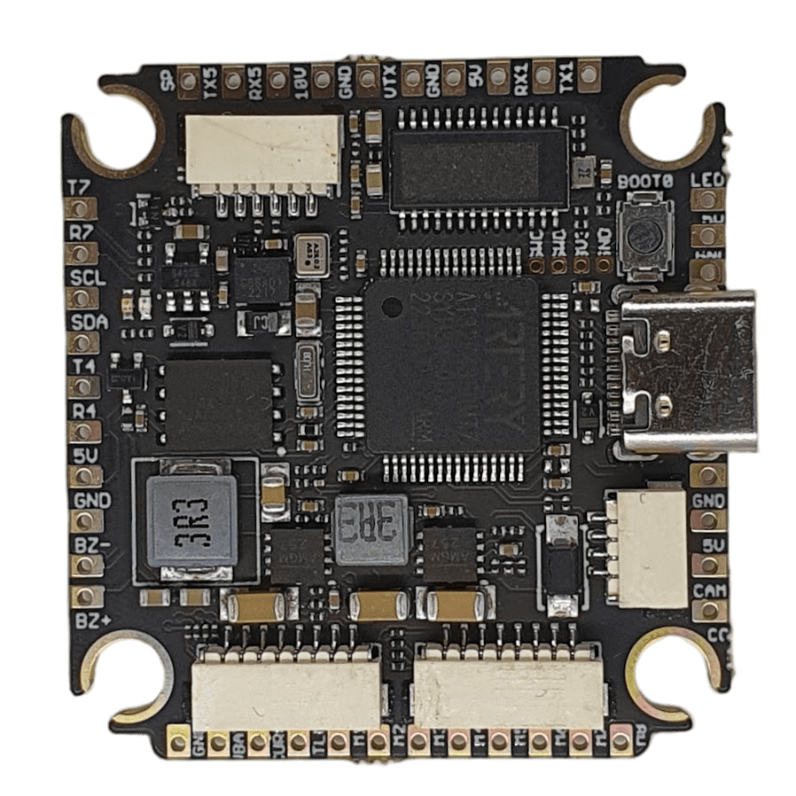

import Tabs from '@theme/Tabs'
import TabItem from '@theme/TabItem'
import SpecGrid from '@site/src/components/SpecGrid'

# Airbot Fenix Super F4

<Tabs>

<TabItem value="specifications" label="规格" default>

<SpecGrid>

</SpecGrid>

## 其他特性

- SD 卡插槽：无
- 板载接收机：无
- 硬件反相器：有
- Bluetooth：无
- WiFi：无
- 板载 RGB LED：28 个

## 信息

:::info

[Airbot 官方网站](https://store.myairbot.com)

:::

## 输入/输出

- USB 接口：USB Type-C
- 电机输出：8 路
- UART：8 个
- I2C：有
- SWD：有
- SPI：无（开发版本提供）
- 3.3 V 输出：有
- 4.5 V（VBUS）输出：有
- 5 V 输出：3 A
- 10 V 输出：3 A
- 电流传感器：有
- 模拟 RSSI 输入：无
- LED 灯带输出：有
- 蜂鸣器输出：有

## 焊盘

### UART

| 名称   | 标签    | 备注              |
| ------ | ------- | ----------------- |
| UART 1 | TX1/RX1 |                   |
| UART 2 | RX2     | ESC 遥测          |
| UART 3 | TX3/RX3 | 反相，SBUS/F.Port |
| UART 4 | TX4/RX4 |                   |
| UART 5 | TX5/RX5 |                   |
| UART 7 | TX7/RX7 |                   |
| UART 8 | TX8/RX8 | 另一侧的较小焊盘  |

### 电源

| 名称     | 标签 | 数量 | 备注           |
| -------- | ---- | ---- | -------------- |
| 3.3 V    |      | 1 个 | SWD 引脚定义中 |
| 5 V      | 5V   | 3 个 |                |
| 10 V     | 10V  | 1 个 |                |
| 电池电压 | VBAT | 1 个 |                |

### ESC 信号

| 名称     | 标签 | 备注 |
| -------- | ---- | ---- |
| 电流     | CURR |      |
| Signal 1 | M1   |      |
| Signal 2 | M2   |      |
| Signal 3 | M3   |      |
| Signal 4 | M4   |      |
| Signal 5 | M5   |      |
| Signal 6 | M6   |      |
| Signal 7 | M7   |      |
| Signal 8 | M8   |      |

### 模拟视频

| 名称     | 标签 | 备注 |
| -------- | ---- | ---- |
| 视频输入 | CAM  |      |
| 相机控制 | CC   |      |
| 视频输出 | VTX  |      |

### 蜂鸣器

| 名称     | 标签 | 备注 |
| -------- | ---- | ---- |
| 蜂鸣器 + | BZ+  |      |
| 蜂鸣器 - | BZ-  |      |

### RGB LED

| 名称 | 标签   | 数量 | 备注                   |
| ---- | ------ | ---- | ---------------------- |
| LED  | LED    | 1x   |                        |
|      | LED_EN | 1 个 | 短接焊盘以启用板载 LED |

### USB 分接

| 名称     | 标签 | 备注 |
| -------- | ---- | ---- |
| 地       | GND  |      |
| USB 电源 | VBUS |      |
| 数据 -   | DN   |      |
| 数据 +   | DP   |      |

### I2C

| 名称  | 标签 | 备注 |
| ----- | ---- | ---- |
| Clock | SCL  |      |
| Data  | SDA  |      |

### SWD

| 名称   | 标签 | 备注 |
| ------ | ---- | ---- |
| SWC    |      |      |
| SWD    |      |      |
| 3.3V   |      |      |
| Ground |      |      |

## 连接器

### ESC 1-4

| 引脚 | 名称            | 标签 | 备注 |
| ---- | --------------- | ---- | ---- |
| 1    | Ground          | GND  |      |
| 2    | Battery Voltage | VBAT |      |
| 3    | Current         | CURR |      |
| 4    | Telemetry       | RX2  |      |
| 5    | Signal 1        | M1   |      |
| 6    | Signal 2        | M2   |      |
| 7    | Signal 3        | M3   |      |
| 8    | Signal 4        | M4   |      |

### ESC 5-8

| 引脚 | 名称            | 标签 | 备注 |
| ---- | --------------- | ---- | ---- |
| 1    | Ground          | GND  |      |
| 2    | Battery Voltage | VBAT |      |
| 3    | Telemetry       | RX2  |      |
| 4    | Signal 5        | M5   |      |
| 5    | Signal 6        | M6   |      |
| 6    | Signal 7        | M7   |      |
| 7    | Signal 8        | M8   |      |

### 相机

| 引脚 | 名称           | 标签 | 备注 |
| ---- | -------------- | ---- | ---- |
| 1    | Ground         | GND  |      |
| 2    | 5V             | 5V   |      |
| 3    | Video In       | CAM  |      |
| 4    | Camera Control | CC   |      |

### 数字 VTX

| 引脚 | 名称     | 标签 | 备注 |
| ---- | -------- | ---- | ---- |
| 1    | 10V      | 10V  |      |
| 2    | Ground   | GND  |      |
| 3    | UART5 TX | TX5  |      |
| 4    | UART5 RX | RX5  |      |
| 5    | Ground   | GND  |      |
| 6    | SBUS     | RX3  |      |

</TabItem>

<TabItem value="wiring" label="接线图">

</TabItem>

<TabItem value="photos" label="照片">

</TabItem>

<TabItem value="notes" label="备注">

:::caution

**AT32F435 MCU**

AT32F435 MCU 仅支持 Betaflight 4.5 及更高版本。旧版 Betaflight 没有对应的 target，无法在此平台运行。

:::

**板载 LED**

该飞控板载 28 个 RGB LED，与 LED 信号连接并联，并由板载稳压器供电。短接 LED_EN 焊盘后，信号线会连接到这些 LED，飞控即可完整控制它们。

</TabItem>

</Tabs>
