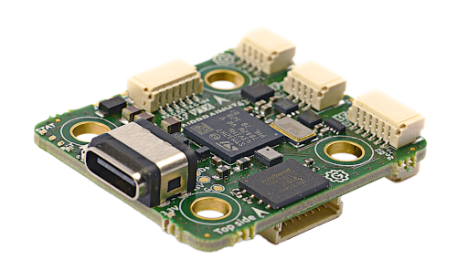
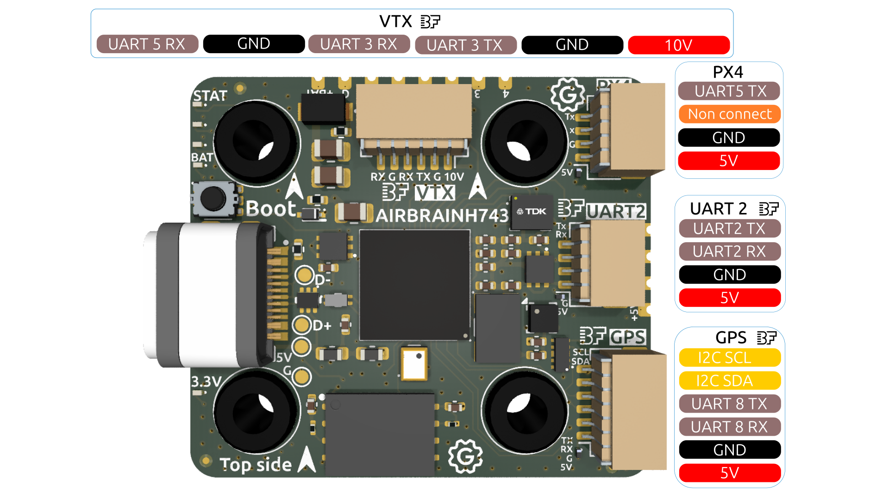
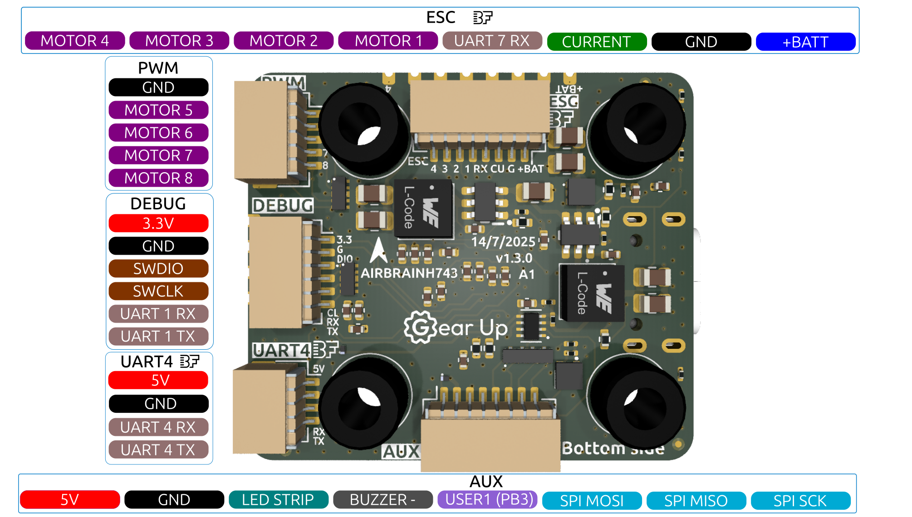
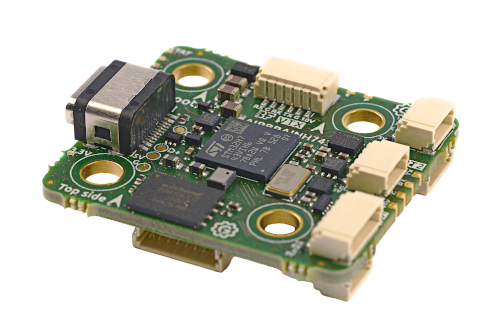
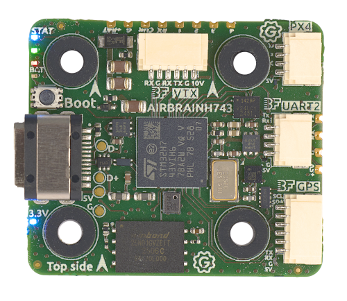
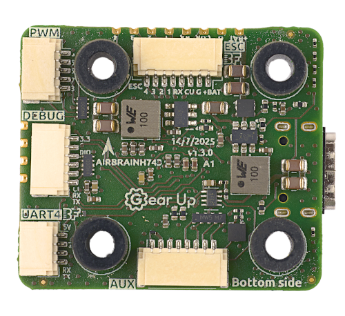

import Tabs from '@theme/Tabs'
import TabItem from '@theme/TabItem'
import SpecGrid from '@site/src/components/SpecGrid'

# Gear Up AirBrain H743

<Tabs>

<TabItem value="specifications" label="规格" default>

<SpecGrid>

</SpecGrid>

## 其他特性

- 支持 3-10S LiPo
- 磁力计（罗盘）：LIS2MDL
- 硬件反相器：有
- 板载 RGB LED：由 Betaflight 控制，红、绿、蓝各 1 个
- 2 个电源 LED
- 内置电压监测
- 欧洲制造 🇪🇺
- SD 卡插槽：无
- 板载接收机：无
- Bluetooth：无
- WiFi：无

## 信息

:::info

[Gear Up Website](https://takeyourgear.com/pages/products/airbrain)

:::

:::info

[在欧洲购买](https://droneshop.nl/gearup-airbrain-h743-fc)
:::

:::info

[国际购买](https://www.rotorama.de/product/AirBrain-H743)

:::

:::info

Gear Up AirBrain H743 在欧洲制造，符合 NDAA 要求

:::

## 输入/输出

- USB 接口：USB Type-C
- 电机输出：8 路
- UART：7 个
- I2C：有
- SWD：有
- SPI：有
- 3.3 V 输出：有，最大 0.5 A
- 5 V（VBUS）输出：有；通过 USB 供电时，仅 UART2 连接器获得 5 V
- 5 V 输出：有，最大 2 A
- 10 V 输出：有，最大 2.5 A
- 电流传感器：有
- 模拟 RSSI 输入：无
- LED 灯带输出：有
- 蜂鸣器输出：有

## 连接器

### ESC（电机 1-4）

JST-SH 连接器的引脚配置如下：

| 引脚 | 名称               | 标签 | 备注                 |
| :--- | :----------------- | :--- | :------------------- |
| 1    | V+ (VBAT)          | +BAT | Power input (10-42V) |
| 2    | GND                | G    | Ground               |
| 3    | Current            | CU   | Current (PC5)        |
| 4    | UART 7 (Telemetry) | RX   | UART 7 RX            |
| 5    | Signal 1           | 1    | Motor 1              |
| 6    | Signal 2           | 2    | Motor 2              |
| 7    | Signal 3           | 3    | Motor 3              |
| 8    | Signal 4           | 4    | Motor 4              |

### UART

#### UART 2

4 针 JST-SH 连接器的引脚配置如下：

| 引脚 | 名称      | 标签 | 备注         |
| :--- | :-------- | :--- | :----------- |
| 1    | V+ (5V)   | 5V   | Power output |
| 2    | GND       | G    | Ground       |
| 3    | UART 2 RX | RX   | UART 2 RX    |
| 4    | UART 2 TX | TX   | UART 2 TX    |

通过 USB 连接时，UART2 连接器上的“5V”也会供电。其他 5 V 输出仅在通过电池供电时工作。

#### UART 4

4 针 JST-SH 连接器的引脚配置如下：

| 引脚 | 名称      | 标签 | 备注         |
| :--- | :-------- | :--- | :----------- |
| 1    | V+ (5V)   | 5V   | Power output |
| 2    | GND       | G    | Ground       |
| 3    | UART 4 RX | RX   | UART 4 RX    |
| 4    | UART 4 TX | TX   | UART 4 TX    |

### 图传

JST-SH 连接器当前的引脚配置如下：

| 引脚 | 名称      | 标签 | 备注         |
| :--- | :-------- | :--- | :----------- |
| 1    | V+ (10V)  | 10V  | Power output |
| 2    | GND       | G    | Ground       |
| 3    | UART 3 TX | TX   | UART 3 TX    |
| 4    | UART 3 RX | RX   | UART 3 RX    |
| 5    | GND       | G    | Ground       |
| 6    | UART 5 RX | RX   | UART 5 RX    |

### GPS

6 针 JST-SH 连接器的引脚配置如下：

| 引脚 | 名称      | 标签 | 备注         |
| :--- | :-------- | :--- | :----------- |
| 1    | V+ (5V)   | 5V   | Power output |
| 2    | GND       | G    | Ground       |
| 3    | UART 8 RX | RX   | UART 8 RX    |
| 4    | UART 8 TX | TX   | UART 8 TX    |
| 5    | I2C SDA   | SDA  | I2C SDA      |
| 6    | I2C SCL   | SCL  | I2C SCL      |

### 电机 5-8

JST-SH 连接器当前的引脚配置如下：

| 引脚 | 名称     | 标签 | 备注    |
| :--- | :------- | :--- | :------ |
| 1    | GND      | G    | Ground  |
| 2    | Signal 5 | 5    | Motor 5 |
| 3    | Signal 6 | 6    | Motor 6 |
| 4    | Signal 7 | 7    | Motor 7 |
| 5    | Signal 8 | 8    | Motor 8 |

### 辅助接口

JST-SH 连接器当前的引脚配置如下：

| 引脚 | 名称      | 标签 | 备注                    |
| :--- | :-------- | :--- | :---------------------- |
| 1    | V+ (5V)   | 5V   | Power output            |
| 2    | GND       | G    | Ground                  |
| 3    | LED STRIP |      | LED STRIP               |
| 4    | BUZZER -  |      | BUZZER - (Buzzer minus) |
| 5    | USER1     |      | USER1 (PB3)             |
| 6    | SPI MOSI  |      | SPI MOSI (PE6)          |
| 7    | SPI MISO  |      | SPI MISO (PE5)          |
| 8    | SPI SCK   |      | SPI SCK (PE12)          |

### 调试

JST-SH 连接器当前的引脚配置如下：

| 引脚 | 名称      | 标签 | 备注                                        |
| :--- | :-------- | :--- | :------------------------------------------ |
| 1    | V+ (3.3V) | 3.3  | Power output                                |
| 2    | GND       | G    | Ground                                      |
| 3    | SWDIO     | DIO  | SWDIO                                       |
| 4    | SWCLK     | CLK  | SWCLK                                       |
| 5    | UART 1 RX | RX   | UART 1 RX (do not use for other than debug) |
| 6    | UART 1 TX | TX   | UART 1 TX (do not use for other then debug) |

### PX 4

JST-SH 连接器当前的引脚配置如下：

| 引脚 | 名称        | 标签 | 备注         |
| :--- | :---------- | :--- | :----------- |
| 1    | V+ (5V)     | 5V   | Power output |
| 2    | GND         | G    | Ground       |
| 3    | Non connect | NC   | Non connect  |
| 4    | UART 5 TX   | TX   | UART 5 TX    |

## 焊盘

### ESC

ESC JST-SH 连接器旁边提供了并联焊盘。

| 引脚 | 名称               | 标签 | 备注                 |
| :--- | :----------------- | :--- | :------------------- |
| 1    | V+ (VBAT)          | +BAT | Power input (10-42V) |
| 2    | GND                | G    | Ground               |
| 3    | Current            | CU   | Current (PC5)        |
| 4    | UART 7 (Telemetry) | RX   | UART 7 RX            |
| 5    | Signal 1           | 1    | Motor 1              |
| 6    | Signal 2           | 2    | Motor 2              |
| 7    | Signal 3           | 3    | Motor 3              |
| 8    | Signal 4           | 4    | Motor 4              |

### UART 2

UART2 在 JST-SH 连接器旁边提供了并联焊盘。

| 引脚 | 名称      | 标签 | 备注         |
| :--- | :-------- | :--- | :----------- |
| 1    | V+ (5V)   | 5V   | Power output |
| 2    | GND       | G    | Ground       |
| 3    | UART 2 RX | RX   | UART 2 RX    |
| 4    | UART 2 TX | TX   | UART 2 TX    |

</TabItem>

<TabItem value="wiring" label="接线图">

</TabItem>

<TabItem value="photos" label="照片">

</TabItem>

<TabItem value="datasheet" label="数据表">

:::info

[Gear Up AirBrain H743 数据表](https://raw.githubusercontent.com/GearUp-Company/AirBrainH743/main/datasheet/Datasheet_AirBrain.pdf)

:::

</TabItem>

<TabItem value="buy" label="购买">
:::info

[在欧洲购买](https://droneshop.nl/gearup-airbrain-h743-fc)
:::

:::info

[国际购买](https://www.rotorama.de/product/AirBrain-H743)

:::

</TabItem>

</Tabs>
