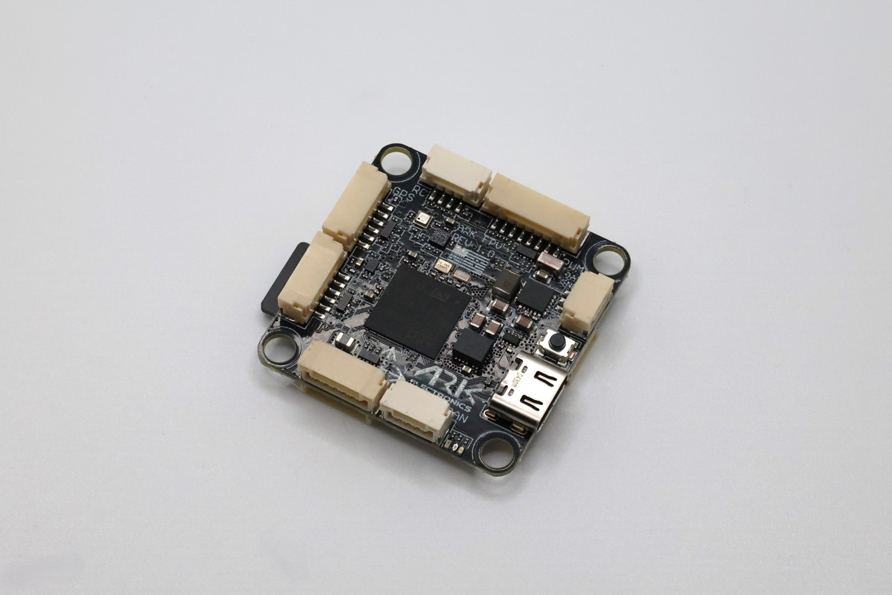
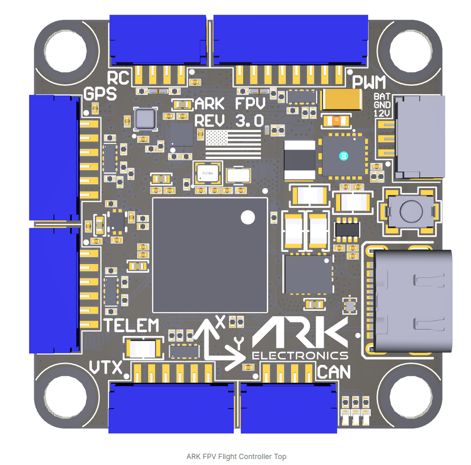
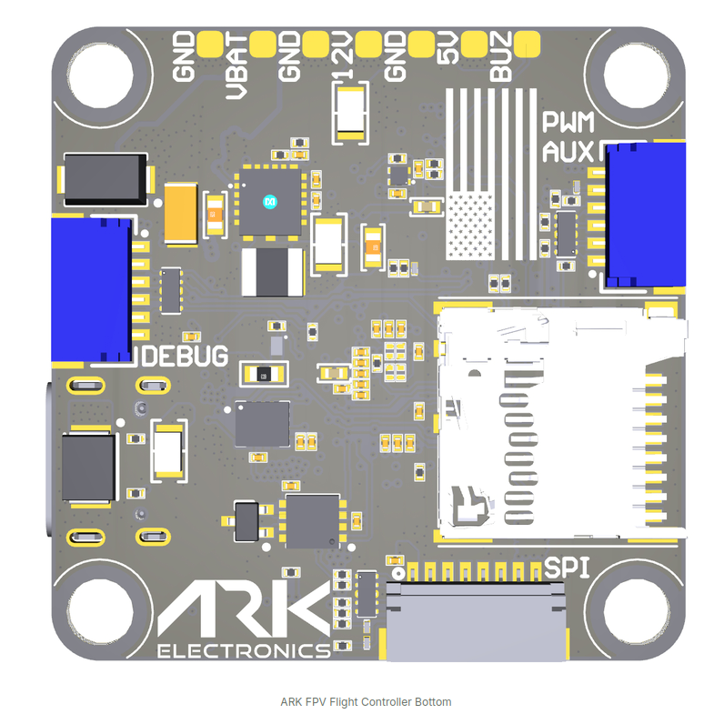
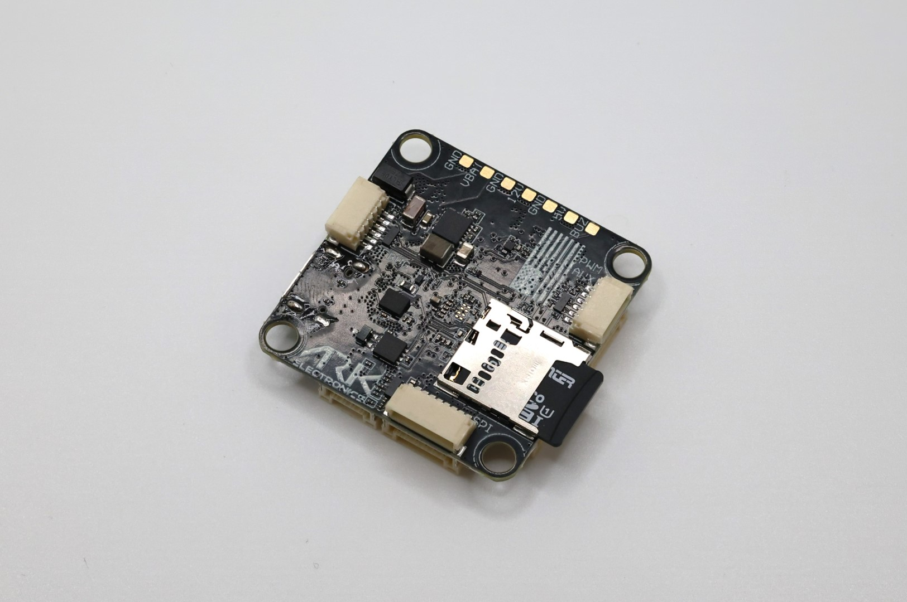

import Tabs from '@theme/Tabs'
import TabItem from '@theme/TabItem'
import SpecGrid from '@site/src/components/SpecGrid'

# ARK FPV Flight Controller

<Tabs>

<TabItem value="specifications" label="规格" default>

<SpecGrid>

</SpecGrid>

## 其他特性

- SD 卡插槽：有
- 板载接收机：无
- 硬件反相器：无
- Bluetooth：无
- WiFi：无
- 板载 RGB LED：有

## 信息

:::info

[ARK FPV Website](https://docs.arkelectron.com/flight-controller/ark-fpv)

:::

:::info

[ARK FPV Store](https://arkelectron.com/product/ark-fpv-flight-controller/)

:::

:::info

ARK FPV 在美国制造，符合 NDAA 要求

:::

## 输入/输出

- USB 接口：USB Type-C
- 电机输出：8 路
- UART：7 个
- I2C：有
- SWD：有
- SPI：有
- 3.3 V 输出：有
- 4.5 V（VBUS）输出：无
- 5 V 输出：2 A
- 12 V 输出：2 A
- 电流传感器：有
- 模拟 RSSI 输入：无
- LED 灯带输出：有
- 蜂鸣器输出：有

## 连接器

### UART

| 名称    | 标签   | 备注                                   |
| ------- | ------ | -------------------------------------- |
| SERIAL0 | USB    |                                        |
| SERIAL1 | UART7  | DisplayPort 高清 VTX                   |
| SERIAL2 | UART5  | ESC 遥测                               |
| SERIAL3 | USART1 | GPS1                                   |
| SERIAL4 | USART2 | 用户接口、高清 VTX 的 SBUS 引脚，仅 RX |
| SERIAL5 | UART4  | ESC 遥测，仅 RX                        |
| SERIAL6 | USART6 | RC 输入                                |
| SERIAL7 | OTG2   | SLCAN                                  |

### PWM UART4 - 8 针 JST-GH

| 引脚编号 | 信号名称     | 电压     |
| -------- | ------------ | -------- |
| 1        | VBAT IN      | 5.5V–54V |
| 2        | CURR_IN_EXT  | 3.3V     |
| 3        | UART4_RX_EXT | 3.3V     |
| 4        | FMU_CH1_EXT  | 3.3V     |
| 5        | FMU_CH2_EXT  | 3.3V     |
| 6        | FMU_CH3_EXT  | 3.3V     |
| 7        | FMU_CH4_EXT  | 3.3V     |
| 8        | GND          | GND      |

### RC - 4 针 JST-GH

| 引脚编号 | 信号名称             | 电压 |
| -------- | -------------------- | ---- |
| 1        | 5.0V                 | 5.0V |
| 2        | USART6_RX_IN_EXT     | 3.3V |
| 3        | USART6_TX_OUTPUT_EXT | 3.3V |
| 4        | GND                  | GND  |

### PWM 扩展 - 6 针 JST-SH

| 引脚编号 | 信号名称    | 电压 |
| -------- | ----------- | ---- |
| 1        | FMU_CH5_EXT | 3.3V |
| 2        | FMU_CH6_EXT | 3.3V |
| 3        | FMU_CH7_EXT | 3.3V |
| 4        | FMU_CH8_EXT | 3.3V |
| 5        | FMU_CH9_EXT | 3.3V |
| 6        | GND         | GND  |

### POWER AUX - 3 针 JST-GH

| 引脚编号 | 信号名称    | 电压     |
| -------- | ----------- | -------- |
| 1        | 12.0V       | 12.0V    |
| 2        | GND         | GND      |
| 3        | VBAT IN/OUT | 5.5V-54V |

### CAN - 4 针 JST-GH

| 引脚编号 | 信号名称 | 电压 |
| -------- | -------- | ---- |
| 1        | 5.0V     | 5.0V |
| 2        | CAN1_P   | 5.0V |
| 3        | CAN1_N   | 5.0V |
| 4        | GND      | GND  |

### GPS - 6 针 JST-GH

| 引脚编号 | 信号名称           | 电压 |
| -------- | ------------------ | ---- |
| 1        | 5.0V               | 5.0V |
| 2        | USART1_TX_GPS1_EXT | 3.3V |
| 3        | USART1_RX_GPS1_EXT | 3.3V |
| 4        | I2C1_SCL_GPS1_EXT  | 3.3V |
| 5        | I2C1_SDA_GPS1_EXT  | 3.3V |
| 6        | GND                | GND  |

### TELEM - 6 针 JST-GH

| 引脚编号 | 信号名称             | 电压 |
| -------- | -------------------- | ---- |
| 1        | 5.0V                 | 5.0V |
| 2        | UART7_TX_TELEM1_EXT  | 3.3V |
| 3        | UART7_RX_TELEM1_EXT  | 3.3V |
| 4        | UART7_CTS_TELEM1_EXT | 3.3V |
| 5        | UART7_RTS_TELEM1_EXT | 3.3V |
| 6        | GND                  | GND  |

### VTX - 6 针 JST-GH

| 引脚编号 | 信号名称             | 电压  |
| -------- | -------------------- | ----- |
| 1        | 12.0V                | 12.0V |
| 2        | GND                  | GND   |
| 3        | UART5_TX_TELEM2_EXT  | 3.3V  |
| 4        | UART5_RX_TELEM2_EXT  | 3.3V  |
| 5        | USART2_RX_TELEM3_EXT | 3.3V  |
| 6        | GND                  | GND   |

### SPI（OSD 或 IMU）- 8 针 JST-SH

| 引脚编号 | 信号名称        | 电压 |
| -------- | --------------- | ---- |
| 1        | 5.0V            | 5.0V |
| 2        | SPI6_SCK_EXT    | 3.3V |
| 3        | SPI6_MISO_EXT   | 3.3V |
| 4        | SPI6_MOSI_EXT   | 3.3V |
| 5        | SPI6_nCS1_EXT   | 3.3V |
| 6        | SPI6_DRDY1_EXT  | 3.3V |
| 7        | SPI6_nRESET_EXT | 3.3V |
| 8        | GND             | GND  |

### 飞控调试 - 6 针 JST-SH

| 引脚编号 | 信号名称        | 电压 |
| -------- | --------------- | ---- |
| 1        | 3V3_FMU         | 3.3V |
| 2        | USART3_TX_DEBUG | 3.3V |
| 3        | USART3_RX_DEBUG | 3.3V |
| 4        | FMU_SWDIO       | 3.3V |
| 5        | FMU_SWCLK       | 3.3V |
| 6        | GND             | GND  |

</TabItem>

<TabItem value="connectors" label="连接器">

</TabItem>

<TabItem value="photos" label="照片">

</TabItem>

</Tabs>
