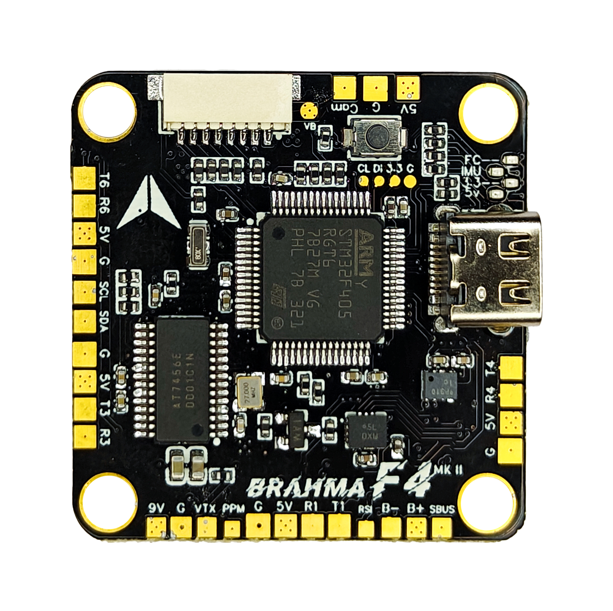
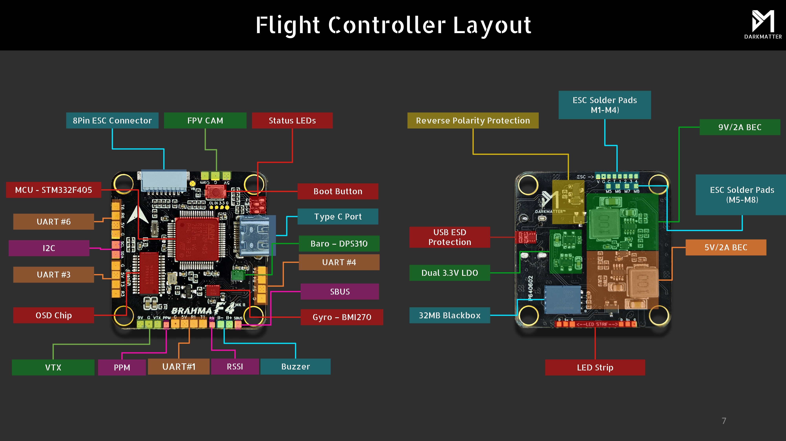
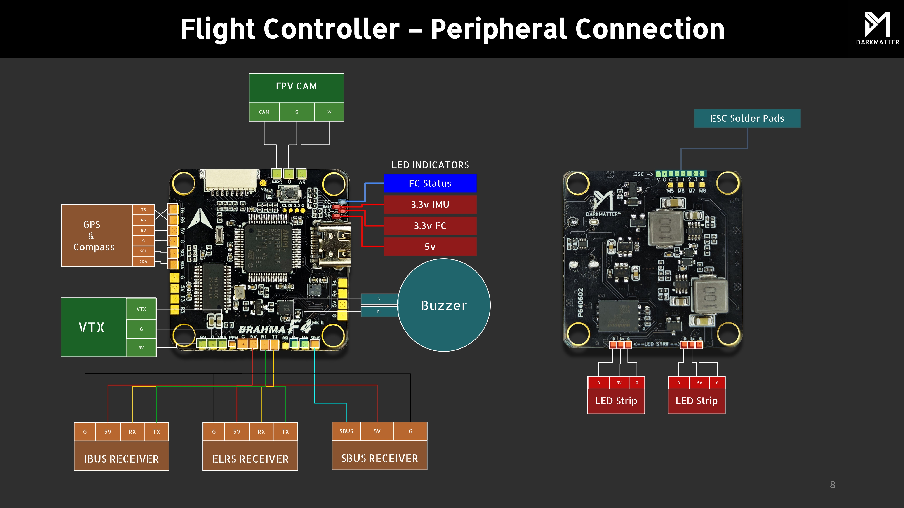
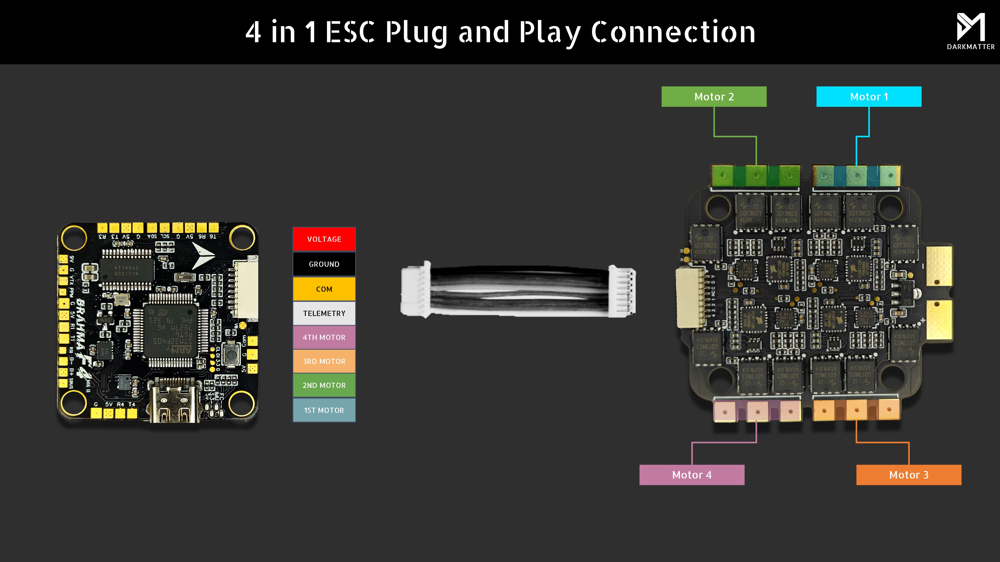
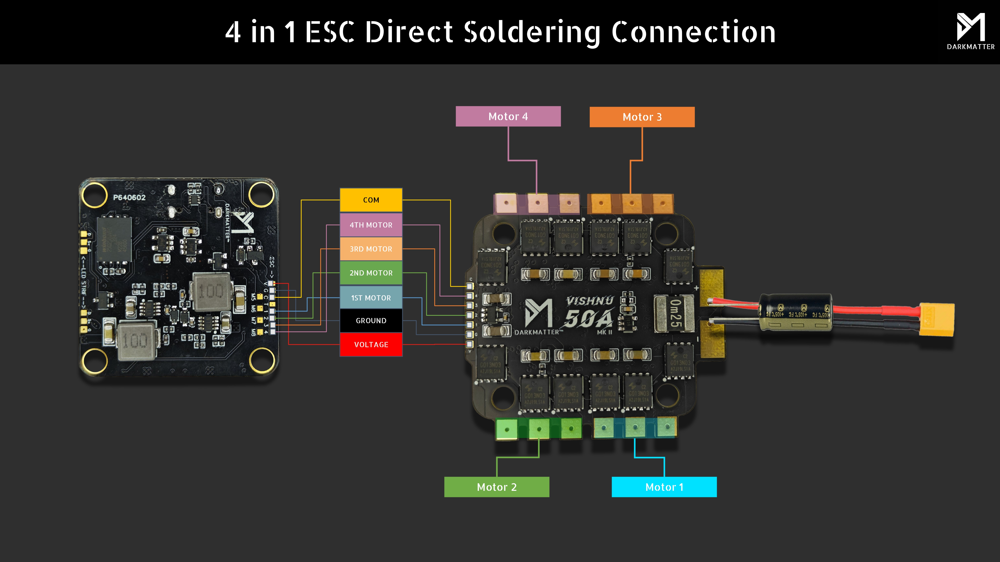
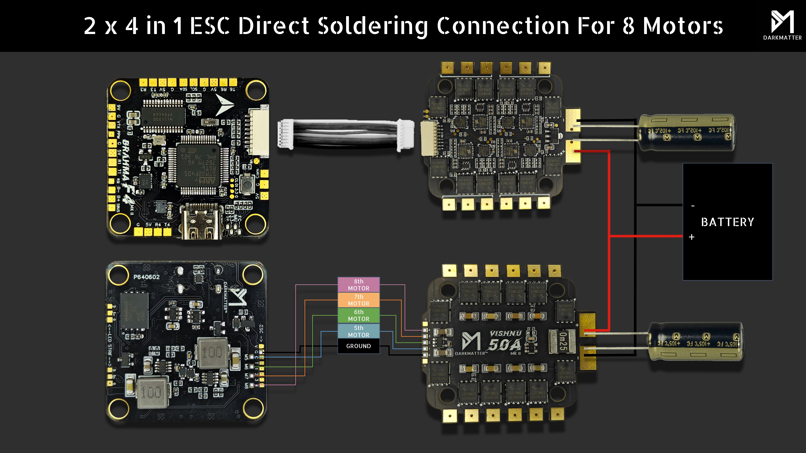
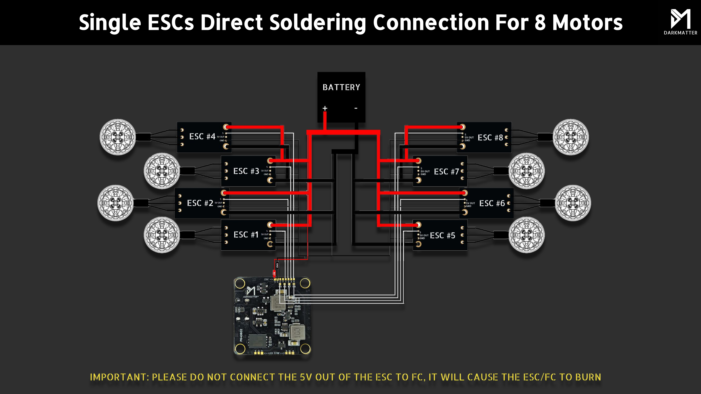
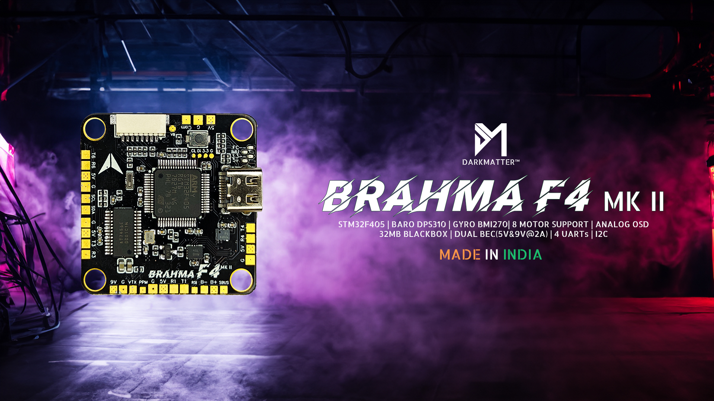
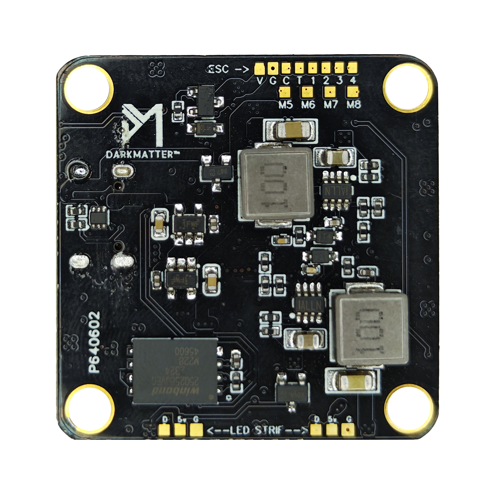

import Tabs from '@theme/Tabs'
import TabItem from '@theme/TabItem'
import SpecGrid from '@site/src/components/SpecGrid'

# Darkmatter Brahma F4 MK II

<Tabs>

<TabItem value="specifications" label="规格" default>

<SpecGrid>

</SpecGrid>

## 其他特性

- SD 卡插槽：无
- 板载接收机：无
- 硬件反相器：有
- Bluetooth：无
- WiFi：无
- 板载 RGB LED：无

## 信息

:::info

[Darkmatter 官方网站](https://thedarkmatter.in/)

:::

## 输入/输出

- USB 接口：USB Type-C
- 电机输出：8 路
- UART：4 个
- I2C：有
- SWD：有
- SPI：有
- 3.3 V 输出：有
- 4.5 V（VBUS）输出：无
- 5 V 输出：2 A
- 9 V 输出：2 A
- 电流传感器：无
- 模拟 RSSI 输入：有
- LED 灯带输出：有
- 蜂鸣器输出：有

## 焊盘

### UART

| 名称   | 标签    | 备注     |
| ------ | ------- | -------- |
| UART 1 | TX1/RX1 | SBUS     |
| UART 2 | RX2     |          |
| UART 3 | RX3     | ESC 遥测 |
| UART 4 | TX4/RX4 |          |

### 电源

| 名称     | 标签 | 数量 | 备注           |
| -------- | ---- | ---- | -------------- |
| 3.3 V    |      | 1 个 | SWD 引脚定义中 |
| 5 V      | 5V   | 5 个 |                |
| 9 V      | 9V   | 1 个 |                |
| 电池电压 | VBAT | 1 个 |                |

### ESC 信号

| 名称   | 标签 | 备注 |
| ------ | ---- | ---- |
| VBAT+  | V    |      |
| 地     | G    |      |
| 电流   | C    |      |
| 遥测   | T    |      |
| 信号 1 | 1    |      |
| 信号 2 | 2    |      |
| 信号 3 | 3    |      |
| 信号 4 | 4    |      |
| 信号 5 | M5   |      |
| 信号 6 | M6   |      |
| 信号 7 | M7   |      |
| 信号 8 | M8   |      |

## 连接器

### ESC 1-4

| 引脚 | 名称            | 标签 | 备注 |
| ---- | --------------- | ---- | ---- |
| 1    | Battery Voltage | V    |      |
| 2    | Ground          | G    |      |
| 3    | Current         | C    |      |
| 4    | Telemetry       | T    |      |
| 5    | Signal 1        | M1   |      |
| 6    | Signal 2        | M2   |      |
| 7    | Signal 3        | M3   |      |
| 8    | Signal 4        | M4   |      |

</TabItem>

<TabItem value="wiring" label="接线图">

</TabItem>

<TabItem value="photos" label="照片">

</TabItem>

<TabItem value="notes" label="备注">

:::danger

使用集成 BEC 的独立 ESC 时，切勿将 ESC 的 5V OUT 接到 FC，否则可能烧毁 FC 或 ESC。

:::

</TabItem>

</Tabs>
