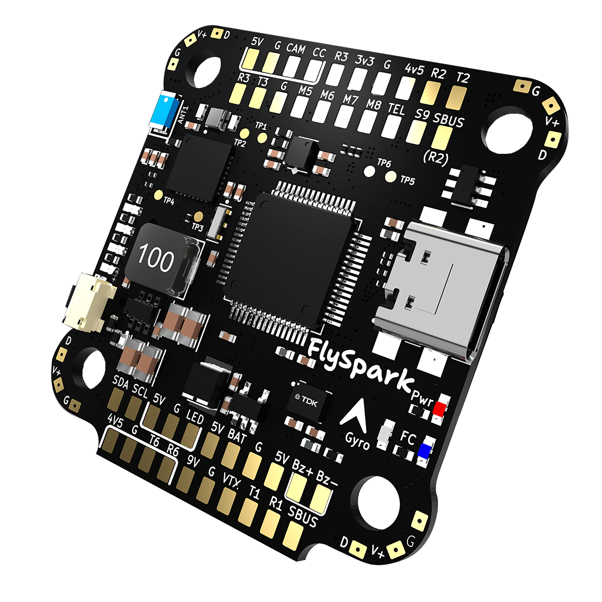
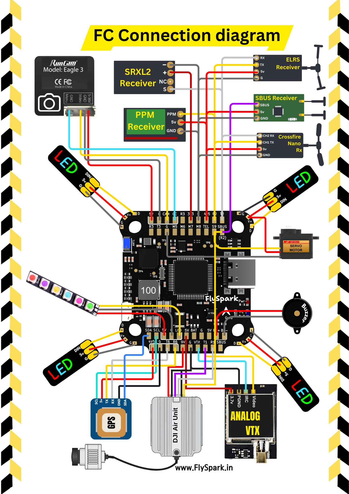
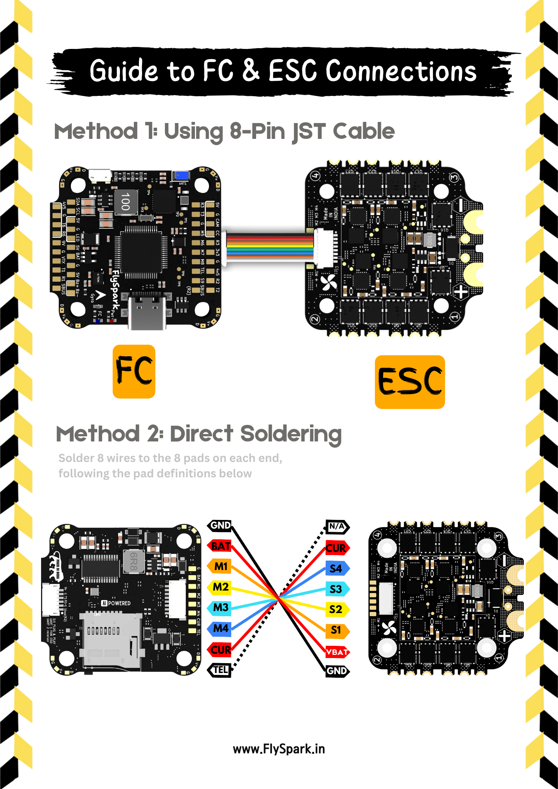
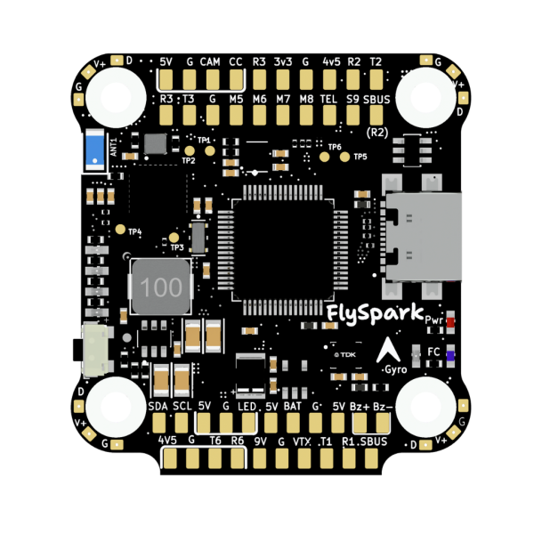

import Tabs from '@theme/Tabs'
import TabItem from '@theme/TabItem'
import SpecGrid from '@site/src/components/SpecGrid'

# FlySpark F4 V1

<Tabs>

<TabItem value="specifications" label="规格" default>

<SpecGrid>

</SpecGrid>

## 其他特性

- SD 卡插槽：有
- 板载接收机：无
- 硬件反相器：有
- Bluetooth：有
- WiFi：无
- 板载 RGB LED：无

## 信息

:::info

[FlySpark 官方网站](https://flyspark.in/)

:::

## 输入/输出

- USB 接口：USB Type-C
- 电机输出：8 路
- UART：4 个
- I2C：有
- SWD：有（SWD - TP5，SWC - TP6）
- SPI：无
- 3.3 V 输出：有
- 4.5 V（VBUS）输出：有
- 5 V 输出：3 A
- 9 V 输出：3 A
- 电流传感器：有
- 模拟 RSSI 输入：有
- LED 灯带输出：有
- 蜂鸣器输出：有

## 焊盘

### UART

| 名称   | 标签  | 备注     |
| ------ | ----- | -------- |
| UART 1 | T1/R1 |          |
| UART 2 | T2/R2 | SBUS     |
| UART 3 | T3/R3 |          |
| UART 5 | TEL   | ESC 遥测 |
| UART 6 | T6/R6 |          |

### 电源

| 名称     | 标签 | 数量 | 备注 |
| -------- | ---- | ---- | ---- |
| 3.3 V    |      | 1 个 |      |
| 5 V      | 5V   | 8 个 |      |
| 9 V      | 9V   | 1 个 |      |
| 电池电压 | BAT  | 1 个 |      |

### ESC 信号

| 名称     | 标签 | 备注 |
| -------- | ---- | ---- |
| 电池电压 | BAT  |      |
| 地       | GND  |      |
| 遥测     | TEL  |      |
| 信号 1   | M1   |      |
| 信号 2   | M2   |      |
| 信号 3   | M3   |      |
| 信号 4   | M4   |      |
| 信号 5   | M5   |      |
| 信号 6   | M6   |      |
| 信号 7   | M7   |      |
| 信号 8   | M8   |      |

## 连接器

### ESC 1-4

| 引脚 | 名称            | 标签 | 备注 |
| ---- | --------------- | ---- | ---- |
| 1    | Telemetry       | TEL  |      |
| 2    | Current         | CUR  |      |
| 3    | Signal 4        | M4   |      |
| 4    | Signal 3        | M3   |      |
| 5    | Signal 2        | M2   |      |
| 6    | Signal 1        | M1   |      |
| 7    | Battery Voltage | BAT  |      |
| 8    | GND             | G    |      |

### 数字 VTX

| 引脚 | 名称     | 标签      | 备注 |
| ---- | -------- | --------- | ---- |
| 1    | 9V       | 9V        |      |
| 2    | Ground   | G         |      |
| 3    | UART1 TX | T1        |      |
| 4    | UART1 RX | R1        |      |
| 5    | Ground   | G         |      |
| 6    | SBUS     | Sbus (R2) |      |

</TabItem>

<TabItem value="wiring" label="接线图">

</TabItem>

<TabItem value="photos" label="照片">

</TabItem>

<TabItem value="notes" label="备注">

:::info

可通过 FlySpark 应用使用 Bluetooth 进行无线配置。

:::

</TabItem>

</Tabs>
