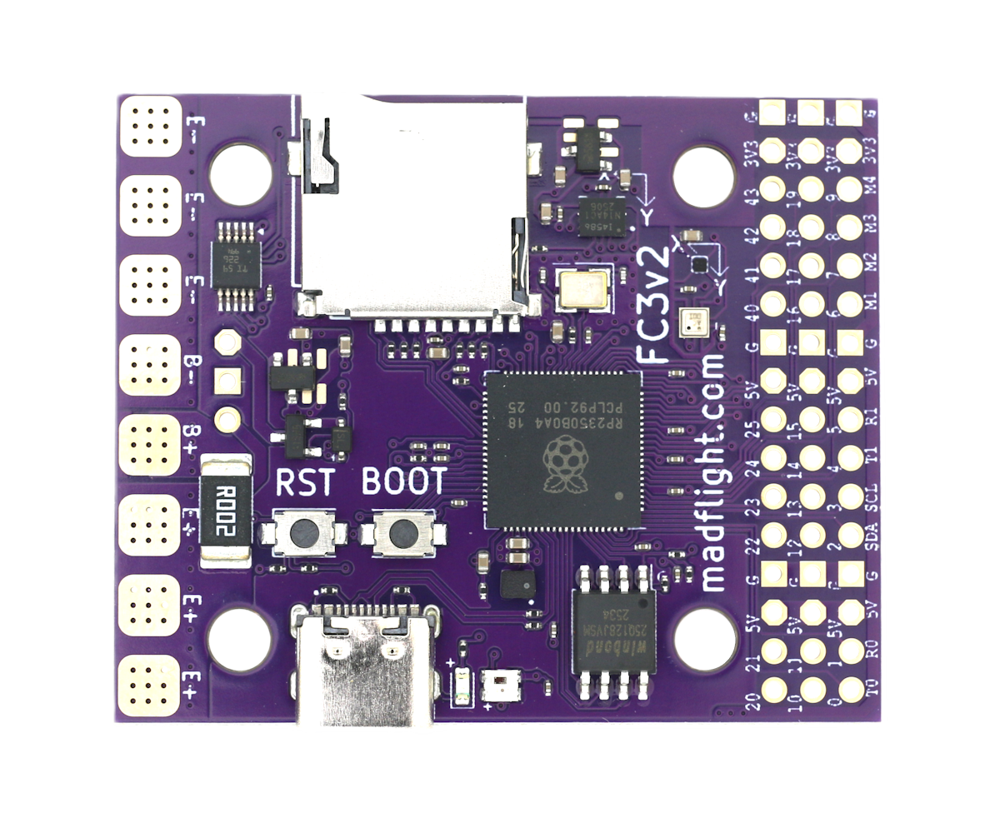
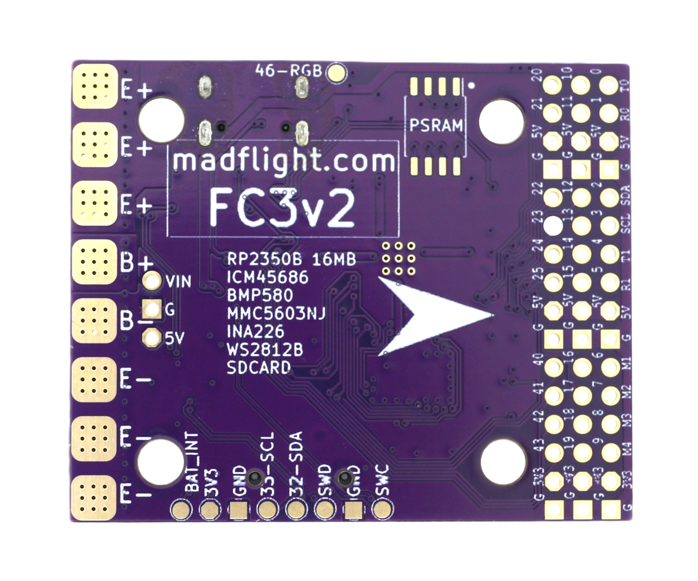

import Tabs from '@theme/Tabs'
import TabItem from '@theme/TabItem'
import SpecGrid from '@site/src/components/SpecGrid'

# Madflight FC3 RP2350B

<Tabs>

<TabItem value="specifications" label="规格" default>

<SpecGrid>

</SpecGrid>

## 其他特性

- SD 卡插槽：有
- 板载接收机：无
- 硬件反相器：无
- Bluetooth：无
- WiFi：无
- 板载 RGB LED：有

## 信息

:::info

[madflight FC3 官方网站](https://madflight.com/Board-FC3-BF/)

:::

:::info

[madflight FC3 商店](https://www.tindie.com/products/madflight/flight-controller-raspberry-pi-rp2350b/)

:::

## 输入/输出

- USB 接口：USB Type-C
- 电机输出：8 路
- UART：4 个（2 个硬件 UART、2 个 PIO UART）
- I2C：有
- SWD：有
- SPI：有
- 3.3 V 输出：有
- 4.5 V（VBUS）输出：无
- 5 V 输出：2 A
- 12 V 输出：无
- 电流传感器：有
- 模拟 RSSI 输入：有
- LED 灯带输出：有
- 蜂鸣器输出：有

## 焊盘

### UART

| 名称     | 备注                |
| -------- | ------------------- |
| USB VCP  |                     |
| UART0    | RC 输入             |
| UART1    | GPS                 |
| PIOUART0 | 用户、ESC 遥测、VTX |
| PIOUART1 | 用户、ESC 遥测、VTX |

## 连接器

### 2.54 mm 排针 - 第一排

| 引脚编号 | GPIO | 信号名称 |
| -------- | ---- | -------- |
| 1        | 0    | UART0_TX |
| 2        | 1    | UART0_RX |
| 3        | 5.0V |          |
| 4        | GND  |          |
| 5        | 2    | I2C1_SDA |
| 6        | 3    | I2C1_SCL |
| 7        | 4    | UART1_TX |
| 8        | 5    | UART1_RX |
| 9        | 5.0V |          |
| 10       | GND  |          |
| 11       | 6    | MOTOR1   |
| 12       | 7    | MOTOR2   |
| 13       | 8    | MOTOR3   |
| 14       | 9    | MOTOR4   |
| 15       | 3.3V |          |
| 16       | GND  |          |

### 2.54 mm 排针 - 第二排

| 引脚编号 | GPIO | 信号名称    |
| -------- | ---- | ----------- |
| 1        | 10   | PIOUART0_TX |
| 2        | 11   | PIOUART0_RX |
| 3        | 5.0V |             |
| 4        | GND  |             |
| 5        | 12   | LED1_PIN    |
| 6        | 13   | LED2_PIN    |
| 7        | 14   | PIOUART1_TX |
| 8        | 15   | PIOUART1_RX |
| 9        | 5.0V |             |
| 10       | GND  |             |
| 11       | 16   | MOTOR5      |
| 12       | 17   | MOTOR6      |
| 13       | 18   | MOTOR7      |
| 14       | 19   | MOTOR8      |
| 15       | 3.3V |             |
| 16       | GND  |             |

### 2.54 mm 排针 - 第三排

| 引脚编号 | GPIO | 信号名称          |
| -------- | ---- | ----------------- |
| 1        | 20   | unused            |
| 2        | 21   | unused            |
| 3        | 5.0V |                   |
| 4        | GND  |                   |
| 5        | 22   | PINIO1_PIN        |
| 6        | 23   | PINIO2_PIN        |
| 7        | 24   | PINIO3_PIN        |
| 8        | 25   | PINIO4_PIN        |
| 9        | 5.0V |                   |
| 10       | GND  |                   |
| 11       | 40   | ADC_RSSI_PIN      |
| 12       | 41   | ADC_CURR_PIN      |
| 13       | 42   | ADC_EXTERNAL1_PIN |
| 14       | 43   | unused            |
| 15       | 3.3V |                   |
| 16       | GND  |                   |

</TabItem>

<TabItem value="photos" label="照片">

</TabItem>

</Tabs>
