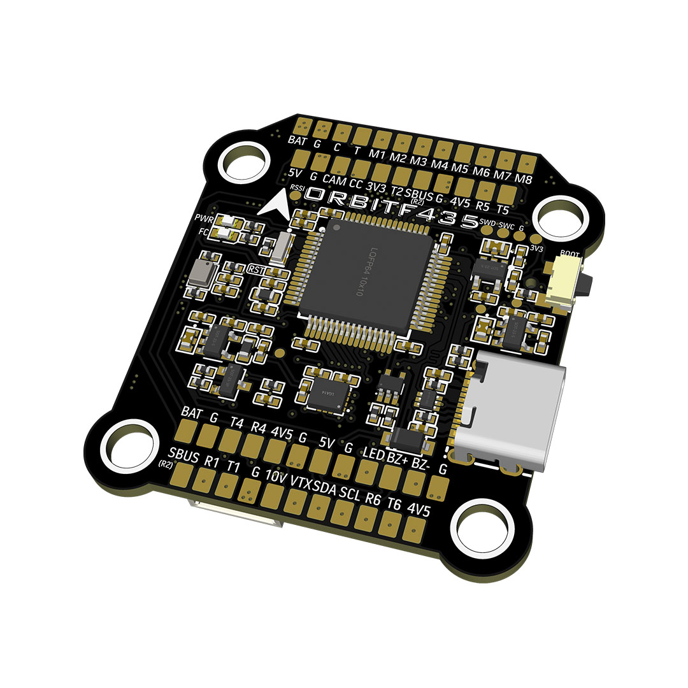
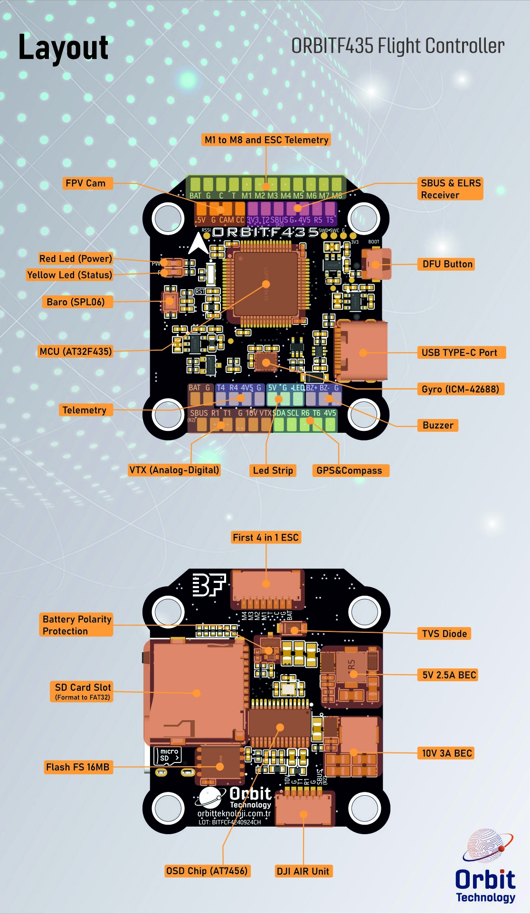
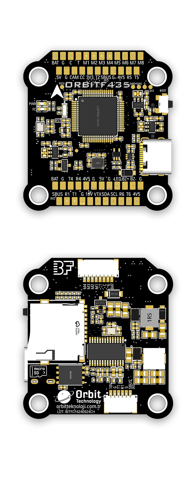

import Tabs from '@theme/Tabs'
import TabItem from '@theme/TabItem'
import SpecGrid from '@site/src/components/SpecGrid'

# Orbit F435

<Tabs>

<TabItem value="specifications" label="规格" default>

<SpecGrid>

</SpecGrid>

## 其他特性

- SD 卡插槽：最高 4 GB
- 硬件反相器：有
- 电源输入：2S-6S LiPo（使用 2S 时输出电压会低于 10 V）
- 电源输出：3.3 V/500 mA、4.5-5 V/2.5 A、10 V/3 A
- RSSI 输入：RSSI 输入焊盘
- I2C：用于外置磁力计（GPS 模块）和气压计模块
- ESC：8 路 PWM 电机输出
- 蜂鸣器：Buz+（5 V）和 Buz- 焊盘用于 5 V 蜂鸣器

## 信息

:::info

[Orbit 官方网站](https://orbitteknoloji.com.tr/)

:::

## 输入/输出

- USB 接口：USB Type-C
- 电机输出：8 路
- UART：6 个
- I2C：有
- SWD：有
- SPI：无
- 3.3 V 输出：有
- 4.5 V（VBUS）输出：有
- 5 V 输出：2.5 A
- 10 V 输出：3 A
- 电流传感器：无
- 模拟 RSSI 输入：有
- LED 灯带输出：有
- 蜂鸣器输出：有

## 焊盘

### UART

| 名称   | 标签  | 备注          |
| ------ | ----- | ------------- |
| UART 1 | T1/R1 | 数字 VTX 遥测 |
| UART 2 | T2/R2 | 反相 - SBUS   |
| UART 3 | R3    | ESC 遥测      |
| UART 4 | T4/R4 |               |
| UART 5 | T5/R5 |               |
| UART 6 | T6/R6 | GPS           |

### 接收机（SBUS + ELRS）

| Name      | Label     | Notes                                         |
| --------- | --------- | --------------------------------------------- |
| SBUS      | SBUS (R2) | SBUS/F.port (serialrx_inverted should be OFF) |
| USART2_TX | T2        |                                               |
| USART2_RX | R2        |                                               |
| 4V5       | 4V5       |                                               |
| GND       | G         |                                               |
| 3V3       | 3V3       |                                               |
| RSSI      | RS        | Analog Channel for RSSI                       |

### 电源

| Name    | Label | Count | Notes      |
| ------- | ----- | ----- | ---------- |
| 3.3V    | 3V3   | 1x    | 500mA max. |
| 4.5V    | 4V5   | 3x    | 2.5A max.  |
| 5V      | 5V    | 2x    | 2.5A max.  |
| 10V     | 10V   | 1x    | 3A max.    |
| Battery | BAT   | 2x    | 2-6S Input |

### ESC 信号

| Name      | Label | Notes         |
| --------- | ----- | ------------- |
| Battery   | BAT   | 2-6S Input    |
| GND       | G     |               |
| Current   | C     |               |
| USART3_RX | T     | ESC Telemetry |
| Signal 1  | M1    |               |
| Signal 2  | M2    |               |
| Signal 3  | M3    |               |
| Signal 4  | M4    |               |
| Signal 5  | M5    |               |
| Signal 6  | M6    |               |
| Signal 7  | M7    |               |
| Signal 8  | M8    |               |

### 模拟视频

| Name           | Label | Notes          |
| -------------- | ----- | -------------- |
| Video In       | CAM   | Camera Input   |
| Camera Control | CC    | Camera Control |
| Video Out      | VTX   | OSD output     |

### 蜂鸣器

| Name     | Label | Notes |
| -------- | ----- | ----- |
| Buzzer + | BZ+   |       |
| Buzzer - | BZ-   |       |

### LED 灯带输出（WS2882）

| Name | Label | Count | Notes                       |
| ---- | ----- | ----- | --------------------------- |
| LED  | LED   | 1x    | Strip LED output for WS2882 |

### I2C

| Name  | Label | Notes |
| ----- | ----- | ----- |
| Clock | SCL   |       |
| Data  | SDA   |       |

### SWD

| Name | Label | Notes |
| ---- | ----- | ----- |
| SWC  | SWC   |       |
| SWD  | SWD   |       |
| GND  | G     |       |
| 3.3V | 3V3   |       |

## 连接器

### ESC 1-4（JST-SH 8 针）

| Pin # | Name      | Label | Notes |
| ----- | --------- | ----- | ----- |
| 1     | Battery   | BAT   |       |
| 2     | Ground    | G     |       |
| 3     | Current   | C     |       |
| 4     | Telemetry | T     |       |
| 5     | Signal 1  | M1    |       |
| 6     | Signal 2  | M2    |       |
| 7     | Signal 3  | M3    |       |
| 8     | Signal 4  | M4    |       |

### 数字 VTX（JST-SH 6 针）

| Pin # | Name      | Label     | Notes |
| ----- | --------- | --------- | ----- |
| 1     | 10V       | 10V       |       |
| 2     | GND       | G         |       |
| 3     | USART1_TX | T1        |       |
| 4     | USART2_RX | R1        |       |
| 5     | GND       | G         |       |
| 6     | SBUS      | SBUS (R2) |       |

</TabItem>
<TabItem value="wiring" label="接线图">

</TabItem>

<TabItem value="photos" label="照片">
  
</TabItem>

<TabItem value="notes" label="备注">

:::info

**SBUS 反相器**

SBUS 焊盘经反相电路连接至 USART2_RX（R2），可通过 Betaflight CLI 命令切换开关。要将 R2 用作 SBUS 接收机输入，请确保 `serialrx_inverted` 设为 OFF：

> set serialrx_inverted=OFF

> save

:::

:::danger

When using individual ESCs with integrated BECs, please do not connect the 5V OUT of the ESC to the FC, it will cause the FC/ESC to burn.

:::

</TabItem>

</Tabs>
