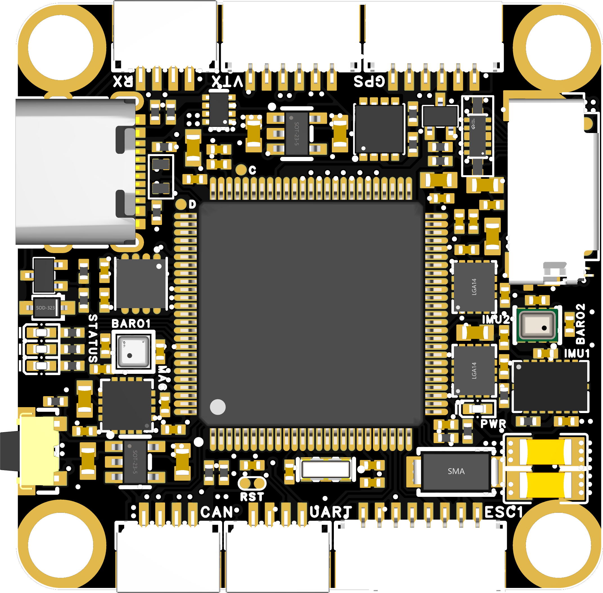
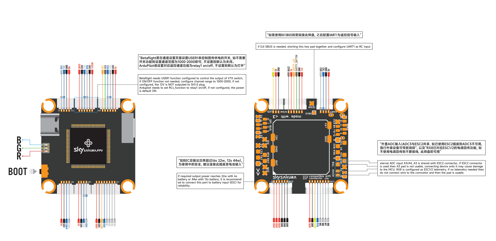
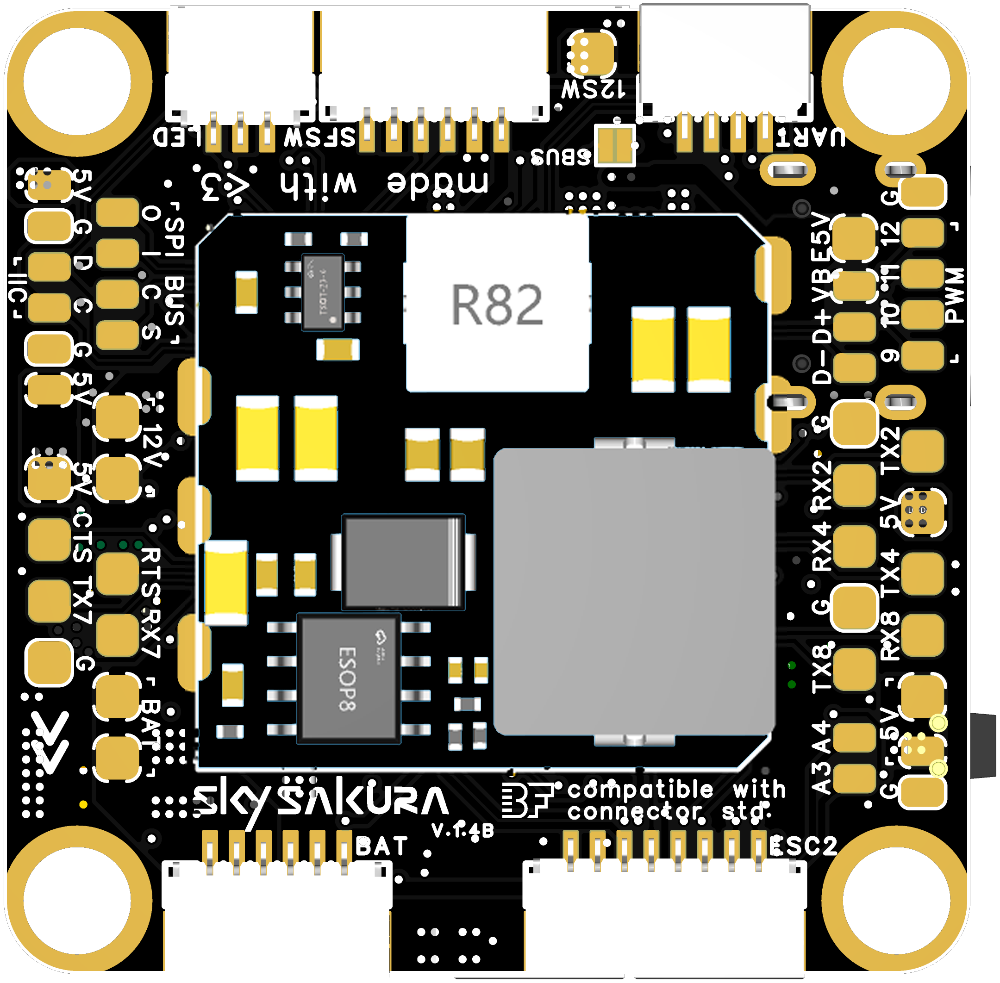
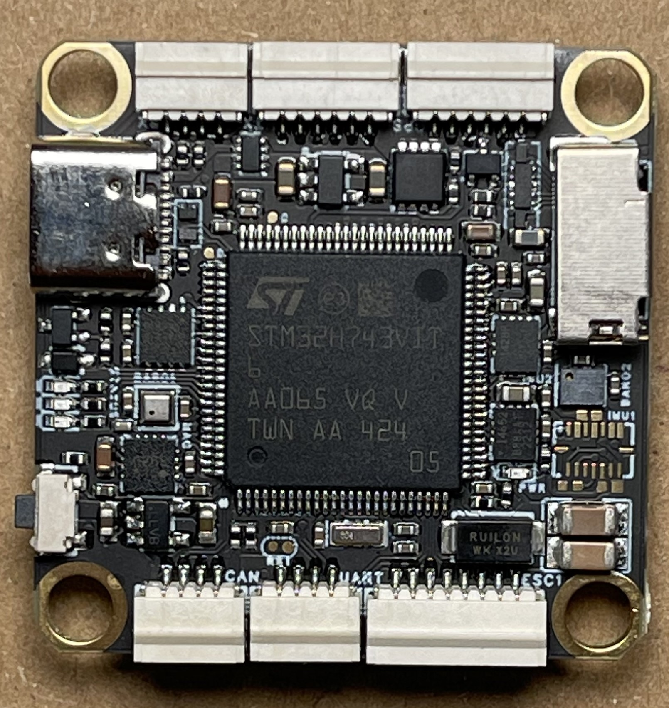
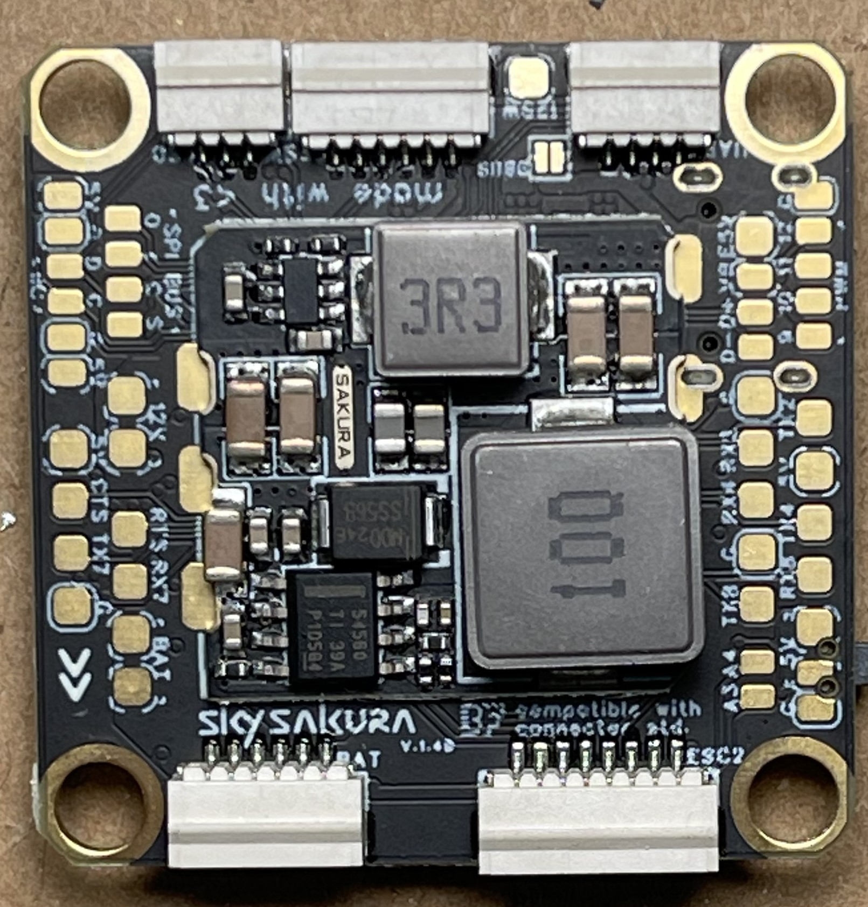
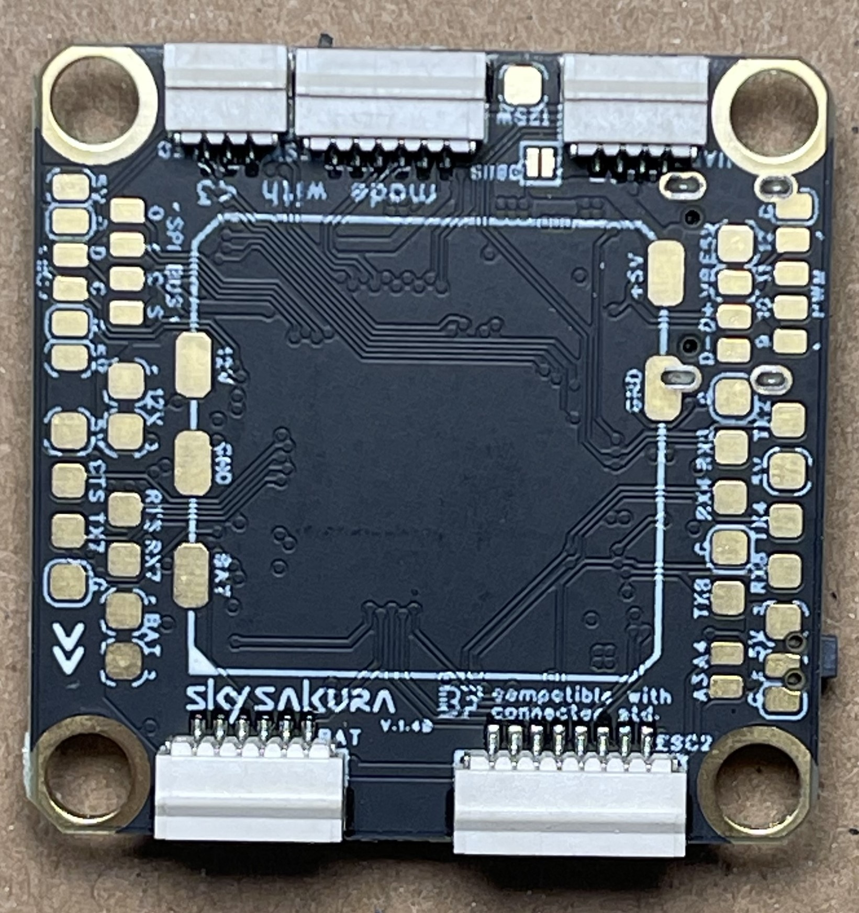
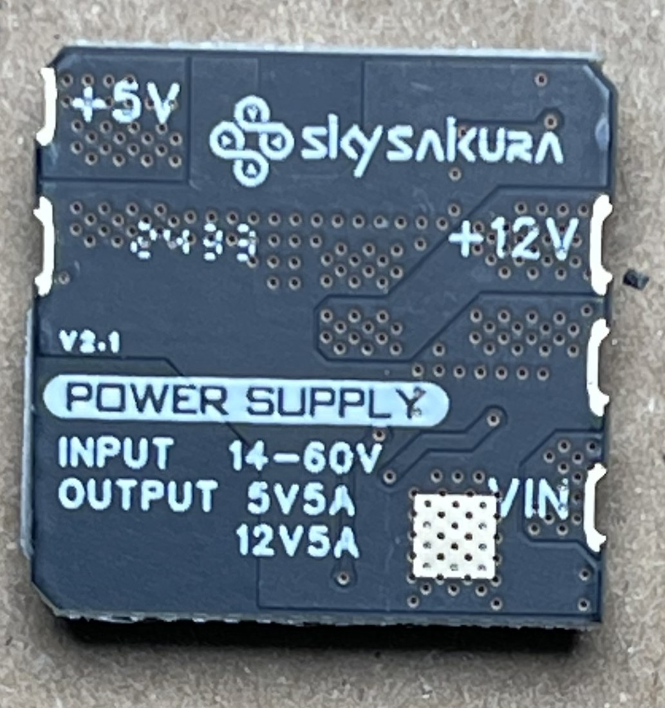
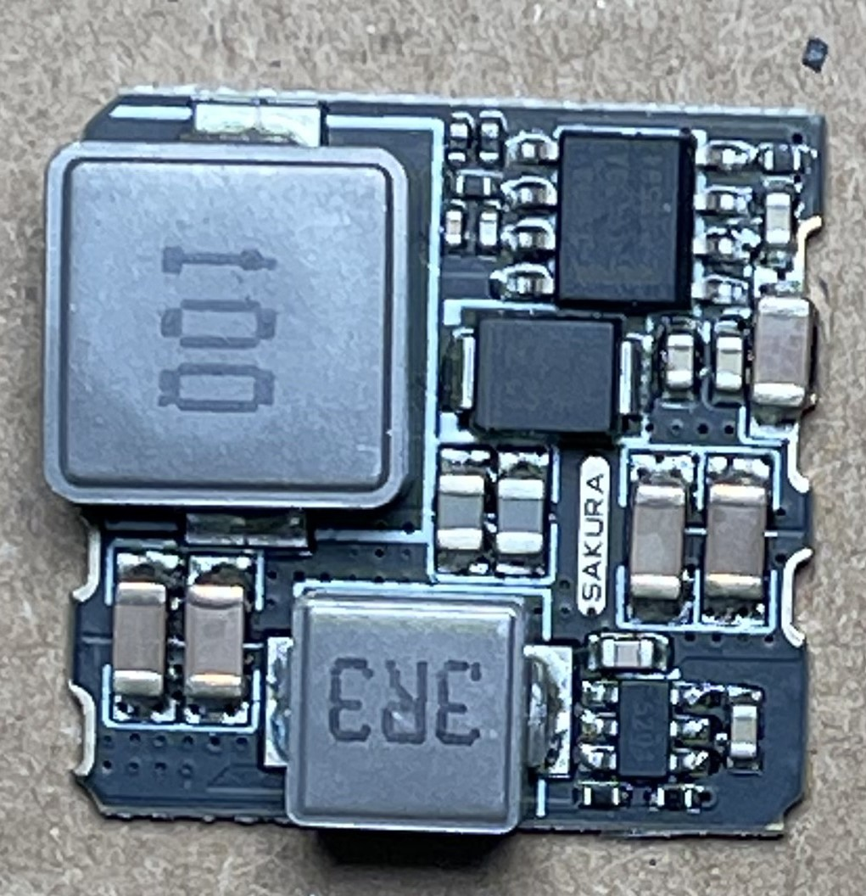

import Tabs from '@theme/Tabs'
import TabItem from '@theme/TabItem'
import SpecGrid from '@site/src/components/SpecGrid'

# SKYSAKURA H743

<Tabs>

<TabItem value="specifications" label="规格" default>

<SpecGrid>

</SpecGrid>

## 其他特性

- SD 卡插槽：有
- 板载接收机：无
- 硬件反相器：无
- Bluetooth：无
- WiFi：无
- 板载 RGB LED：3 个

## 信息

:::info

[SkySakura 官方网站](https://skysakura.com)

:::

## 输入/输出

- USB 接口：USB Type-C
- 电机输出：12 路
- UART：7 个
- I2C：有
- SWD：无
- SPI：有
- 3.3 V 输出：无
- 4.5 V（VBUS）输出：有
- 5 V 输出：5 A
- 12 V 输出：5 A
- 电流传感器：有
- 模拟 RSSI 输入：有
- LED 灯带输出：有
- 蜂鸣器输出：有

## 焊盘

### UART

| 名称   | 标签    | 备注        |
| ------ | ------- | ----------- |
| UART 1 | TX1/RX1 | MSP         |
| UART 2 | TX2/RX2 |             |
| UART 3 | TX3/RX3 | GPS         |
| UART 4 | TX4/RX4 | RX          |
| UART 6 | TX6/RX6 | DISPLAYPORT |
| UART 7 | TX7/RX7 |             |
| UART 8 | TX8/RX8 | ESC         |

### 电源

| Name            | Label | Count | Notes                                                                                                            |
| --------------- | ----- | ----- | ---------------------------------------------------------------------------------------------------------------- |
| VBAT5V          | 5V    | 3x    | Only available when battery power used, 1 in LED connector, 2 on pads                                            |
| 5V              | 5V    | 12x   |                                                                                                                  |
| 12V             | 12V   | 5x    | 2 regular output on pads, 1 switched output on pad, 1 switched output on pad, 1 regular output on SFSW connector |
| Battery Voltage | VBAT  | 2x    |                                                                                                                  |

### ESC 信号

| Name      | Label | Notes |
| --------- | ----- | ----- |
| Current   | CURR  |       |
| Signal 1  | M1    |       |
| Signal 2  | M2    |       |
| Signal 3  | M3    |       |
| Signal 4  | M4    |       |
| Signal 5  | M5    |       |
| Signal 6  | M6    |       |
| Signal 7  | M7    |       |
| Signal 8  | M8    |       |
| Signal 9  | PWM9  |       |
| Signal 10 | PWM10 |       |
| Signal 11 | PWM11 |       |
| Signal 12 | PWM12 |       |

## 连接器

### ESC 1-4

| Pin # | Name            | Label | Notes |
| ----- | --------------- | ----- | ----- |
| 1     | Battery Voltage | VBAT  |       |
| 2     | Ground          | GND   |       |
| 3     | Current         | CURR  |       |
| 4     | Telemetry       | RX8   |       |
| 5     | Signal 1        | M1    |       |
| 6     | Signal 2        | M2    |       |
| 7     | Signal 3        | M3    |       |
| 8     | Signal 4        | M4    |       |

### ESC 5-8

| Pin # | Name            | Label | Notes |
| ----- | --------------- | ----- | ----- |
| 1     | Battery Voltage | VBAT  |       |
| 2     | Ground          | GND   |       |
| 3     | Current         | CURR  |       |
| 4     | Telemetry       | RX8   |       |
| 5     | Signal 5        | M5    |       |
| 6     | Signal 6        | M6    |       |
| 7     | Signal 7        | M7    |       |
| 8     | Signal 8        | M8    |       |

### UART

| Pin # | Name   | Label | Notes |
| ----- | ------ | ----- | ----- |
| 1     | 5V     | 5V    |       |
| 2     | Ground | GND   |       |
| 3     | TX     | TX    |       |
| 4     | RX     | RX    |       |

### GPS

| Pin # | Name   | Label | Notes |
| ----- | ------ | ----- | ----- |
| 1     | 5V     | 5V    |       |
| 2     | Ground | GND   |       |
| 3     | TX6    | TX6   |       |
| 4     | RX6    | RX6   |       |
| 5     | SDA    | SDA   |       |
| 6     | SCL    | SCL   |       |

### SFSW

| Pin # | Name           | Label | Notes |
| ----- | -------------- | ----- | ----- |
| 1     | 12V            | 12V   |       |
| 2     | Ground         | GND   |       |
| 3     | NOT USED IN BF | BUT   |       |
| 4     | NOT USED IN BF | LED   |       |
| 5     | 5V             | 5V    |       |
| 6     | BUZZ-          | BUZZ- |       |

### BATT

| Pin # | Name            | Label | Notes |
| ----- | --------------- | ----- | ----- |
| 1     | Battery Voltage | VBAT  |       |
| 2     | Battery Voltage | VBAT  |       |
| 3     | Battery Voltage | VBAT  |       |
| 4     | Ground          | GND   |       |
| 5     | Ground          | GND   |       |
| 6     | Ground          | GND   |       |

### CAN

| Pin # | Name           | Label | Notes |
| ----- | -------------- | ----- | ----- |
| 1     | 5V             | 5V    |       |
| 2     | GND            | GND   |       |
| 3     | NOT USED IN BF | CAN-H |       |
| 4     | NOT USED IN BF | CAN-L |       |

</TabItem>

<TabItem value="wiring" label="接线图">

</TabItem>

<TabItem value="photos" label="照片">

</TabItem>

<TabItem value="notes" label="Notes">

:::info

**DJI SBUS support**

SBUS is supported on VTX connector for DJI air unit.
Bridge SBUS pad then use UART4 as serial receiver.

:::

:::caution

12V and 5V bec maximum allowed output is 60W total. Operation above 22w(6s) or 44w(12s) requires BATT connection.

:::

</TabItem>

</Tabs>
