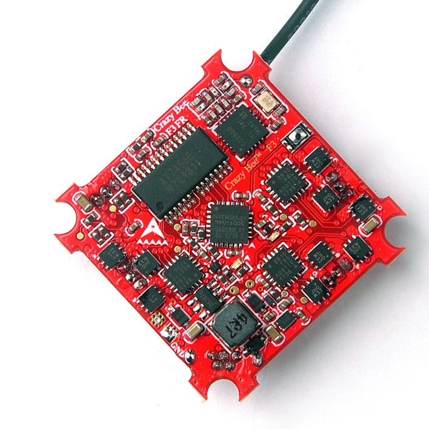
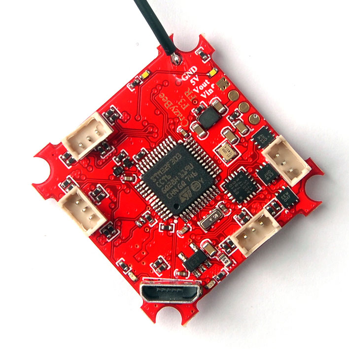

# CrazyBee F3 FR

## 说明

CrazyBee F3 是一块面向 1S Whoop 无刷竞速机的高度集成飞控。它可能是全球首批在 Tiny Whoop 尺寸内集成接收机、四合一 ESC、OSD 和电流表的无刷飞控之一。

## MCU、传感器与功能

### 硬件与特性

- MCU：STM32F303CCT6
- IMU：MPU6000（SPI）
- IMU 中断：支持
- VCP：支持
- OSD：Betaflight OSD
- 电池电压传感器：支持
- 集成稳压器：支持，升压型，5 V / 800 mA
- 集成电流传感器：最大 14 A，更换电阻后可改为 28 A
- 集成兼容 FrSky 的接收机：可切换 FrSky_D（D8）和 FrSky_X（D16）模式
- 按键：1 个（接收机对频按键）
- 集成 4 路 BlHeli_S ESC：每路最大 5 A
- ESC 连接器：3 针，PicoBlade，1.25 mm 间距
- 蜂鸣器输出：2 针焊盘
- 4 个接收机状态 LED：2 个红色、2 个白色

## 资源映射

| 标签             | 引脚 | 定时器     | DMA | 默认值 | 说明               |
| ---------------- | ---- | ---------- | --- | ------ | ------------------ |
| MPU6000_INT_EXTI | PC13 |            |     |        |                    |
| MPU6000_CS_PIN   | PA4  |            |     |        | SPI1               |
| MPU6000_SCK_PIN  | PA5  |            |     |        | SPI1               |
| MPU6000_MISO_PIN | PA6  |            |     |        | SPI1               |
| MPU6000_MOSI_PIN | PA7  |            |     |        | SPI1               |
| OSD_CS_PIN       | PB1  |            |     |        | SPI1               |
| OSD_SCK_PIN      | PA5  |            |     |        | SPI1               |
| OSD_MISO_PIN     | PA6  |            |     |        | SPI1               |
| OSD_MOSI_PIN     | PA7  |            |     |        | SPI1               |
| RX_CS_PIN        | PB12 |            |     |        | SPI2               |
| RX_SCK_PIN       | PB13 |            |     |        | SPI2               |
| RX_MISO_PIN      | PB14 |            |     |        | SPI2               |
| RX_MOSI_PIN      | PB15 |            |     |        | SPI2               |
| RX_GDO0_PIN      | PA8  |            |     |        |                    |
| RX_BIND_PIN      | PA9  |            |     |        |                    |
| RX_LED_PIN       | PA10 |            |     |        |                    |
| PWM1             | PB8  | TIM8, CH2  |     |        |                    |
| PWM2             | PB9  | TIM8, CH3  |     |        |                    |
| PWM3             | PA3  | TIM2, CH4  |     |        |                    |
| PWM4             | PA2  | TIM15, CH1 |     |        |                    |
| VBAT_ADC_PIN     | PA0  |            |     |        | ADC1               |
| RSSI_ADC_PIN     | PA1  |            |     |        | ADC1               |
| BEEPER           | PC15 |            |     |        |                    |
| UART3 TX         | PB10 |            |     |        | 将尽快补充引脚定义 |
| UART3 RX         | PB11 |            |     |        | 将尽快补充引脚定义 |

## 制造商和经销商

https://www.banggood.com/Racerstar-Crazybee-F3-Flight-Controller-4-IN-1-5A-1S-Blheli_S-ESC-Compatible-FrSky-D8-Receiver-p-1262972.html

## 设计者

## 维护者

## 常见问题和已知问题 {#faq--known-issues}

- 板卡规格声称支持 DSHOT600，但由于使用 L 型（BB1 24 MHz）ESC，实际上仅可靠支持 DSHOT300。虽然不少用户的 DSHOT600 也能运行，但 DSHOT600 下 ESC 控制信号的质量尚未经过测试。讨论见：https://www.rcgroups.com/forums/showthread.php?3036325-Racerstar-Crazybee-F3-Ultimate-Micro-AIO-FC%21-1S-5A-BlheliS-FrSky-Flysky-OSD/page3 。
- 出厂默认陀螺仪 / PID 配置为 8 kHz / 2 kHz。有报告称此配置可能不稳定，建议使用 4 kHz / 4 kHz。

出厂预装 Betaflight 3.3.0 版本的专有信息：

- DSHOT 蜂鸣器功能不可用。
- 启用乌龟模式（“Flip over after Crash”）后，只有将失控保护超时设为 1 秒（10 \* 0.1 秒）或更高，FC 才能解锁。若超时设得更低，电机可能会短暂尝试启动后停止，随后四轴飞行器无法解锁。据称 BF 3.4 已修复此问题。

FRSKY 版本：

- 要与 Taranis 对频，必须使用非欧盟版 OpenTX，才能使用接收机对频所需的 D8 设置。出厂默认 BF 接收机模式为 FRSKY_X，请按需要修改。
- FrSky X（8 / 16 通道）和 FrSky D（8 通道）均可可靠工作，包括与坠机翻转 / DShot 信标同时使用；前提是禁用 `TELEMETRY` 功能。即使禁用 `TELEMETRY`，仍会发送 RSSI 和电池电压等基础遥测信息。
- 在 FrSky D 上，`TELEMETRY` 功能会根据启用的传感器数量（BARO、GPS 等）偶发掉线，推测是时序超限所致。
- 在 FrSky X 上，`TELEMETRY` 功能会因遥测生成代码中的缺陷导致完全卡死。

## 其他资源

用户手册：http://img.banggood.com/file/products/20180209021414Crazybeef3.pdf
