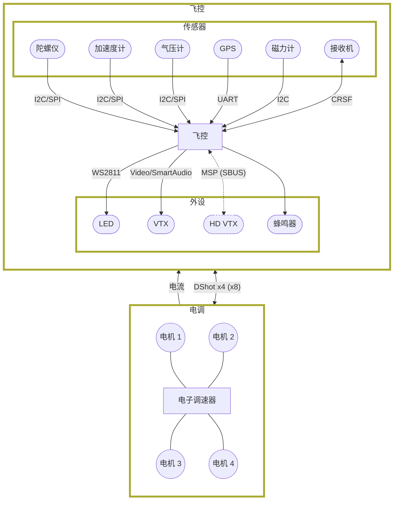
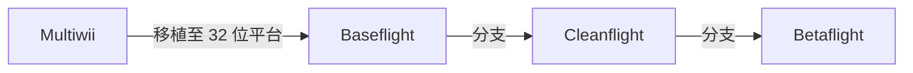

Betaflight 是面向多旋翼和固定翼飞行器的飞控软件（固件）。

如果你飞的是 FPV 穿越机，飞控上很可能运行着 Betaflight。飞控本质上是一台微型计算机：它读取陀螺仪、加速度计、GPS 等传感器数据，计算需要执行的动作，向电调（ESC）发送控制指令，驱动电机产生推力并让穿越机保持飞行。它还可以控制其他外设，例如 VTX、遥控链路遥测和 LED。

Betaflight 就是运行在飞控上、完成这些工作的软件。

## Betaflight 简史

最早的飞控软件是 Multiwii。它运行在类似 Arduino 的 8 位微控制器上；正如名称所示，它使用了任天堂 Wii 控制器上的陀螺仪板。这是一个重要的起点，但 8 位微控制器的性能有限。

随后，开发转向性能更强的微控制器，Baseflight 因此诞生。它是将 Multiwii 移植到 32 位微控制器上的飞控软件。

由于一些分歧，Baseflight 分支出了 Cleanflight。Cleanflight 在很长一段时间内都是主流选择。

为了进一步试验和开发更前沿的功能，Betaflight 从 Cleanflight 分支而来。名称由 [Grimreach 于 2015 年 7 月提出](https://www.rcgroups.com/forums/showthread.php?p=32240128)。部分旧支持内容仍会提到 Cleanflight，相关内容正在持续更新。此后 Betaflight 的普及度已超过 Cleanflight，成为功能丰富、开发活跃且最受欢迎的飞控软件之一。

## Betaflight 功能

Betaflight 持续加入新功能并改进现有能力。它主要面向高性能飞行，例如自由式和竞速穿越机；同时也支持固定翼、三轴、六轴、八轴等其他机型。近期开发重点还扩展到了更高级的 GPS 救机能力。

- **广泛的目标支持**：Betaflight 已成为飞控领域的事实标准，几乎所有飞控都有对应的 Betaflight target。
- **接收机协议支持**：支持 CRSF、Ghost、FPort、SBUS、Spektrum 等多种接收机协议。
- **电调协议支持**：支持多种 ESC 协议。DShot 是绝大多数装机使用的主流协议；如确有需要，也支持 OneShot、MultiShot，甚至 PWM。
- **精细调参**：无论是 TinyWhoop、5 英寸穿越机，还是 7 英寸以上的大尺寸机型，都可通过调参获得更好的飞行表现。调参和滤波预设可在数秒内提供可靠的起点。
- **RGB LED**：使用标准 WS2811 LED 灯带即可为穿越机添加灯光，也可显示电池低压告警、飞行模式、故障排查状态等飞行信息。
- **丰富的传感器支持**：陀螺仪用于 Acro 模式下的基础飞行控制；加速度计可实现自稳；磁力计提供地磁航向；气压计用于高度测量；GPS 可用于 GPS 救机和信息显示。
- **OSD**：Betaflight 支持几乎所有模拟和数字图传系统的屏幕叠加显示。可显示电池电压、电流、GPS 坐标、速度、飞行计时器、人工地平线等信息，也可通过 OSD 调整部分设置并查看飞行后统计数据。
