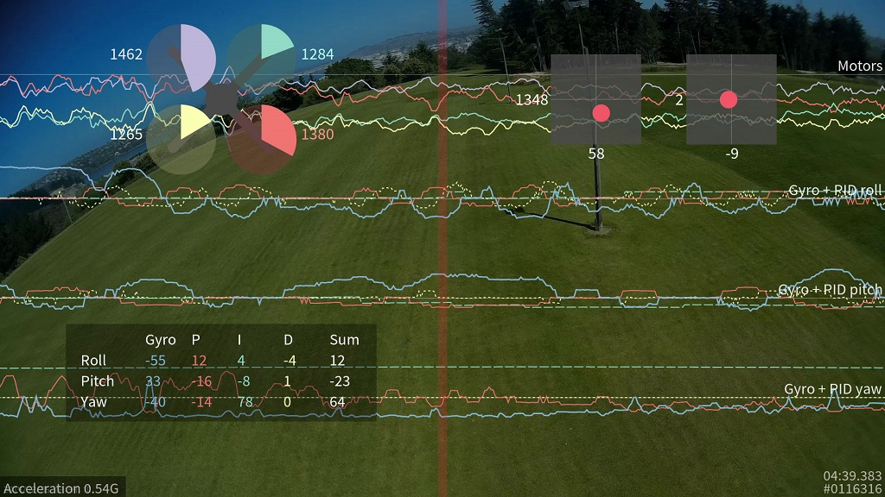
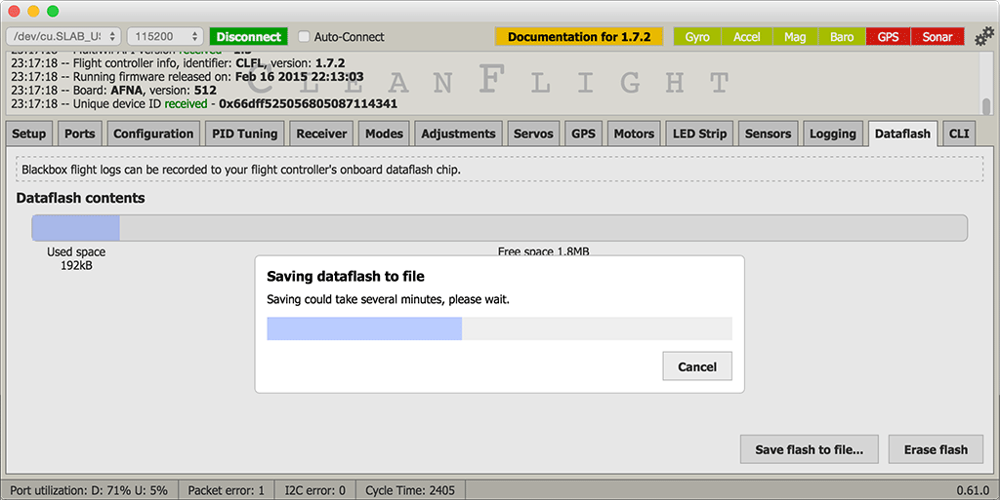

# Blackbox 飞行数据记录器



## 简介

此功能会在控制回路的每次迭代中，经由串行端口输出飞行数据。数据可记录到 OpenLog 等外部记录设备、部分飞行控制器配备的板载数据闪存芯片，或板载 SD 卡插槽中。

飞行结束后，可使用交互式日志查看器查看生成的日志：

https://github.com/betaflight/blackbox-log-viewer

也可使用 `blackbox_decode` 工具将日志转换为 CSV 文件以供分析，或使用 `blackbox_render` 将飞行日志渲染为视频。这些工具位于以下仓库：

https://github.com/betaflight/blackbox-tools

## 记录的数据

Blackbox 会在飞行控制回路的每次迭代中记录飞行数据，包括：当前时间（微秒）、各轴的 P、I、D 校正量、应用 Expo 曲线后的 RC 指令杆量、陀螺仪数据、经过已配置低通滤波的加速度计数据、气压计和声纳读数、三轴磁力计读数、原始 VBAT 与电流测量值、RSSI，以及发送给各电调的指令。所有数据均以原始精度存储，不做近似处理或损失精度，因此飞行日志应能识别出相当细微的问题。

只要获得新的 GPS 数据，Blackbox 就会记录该数据。CSV 解码器能够解码 GPS 数据，但视频渲染器目前尚不显示 GPS 信息（后续将会添加）。

## 支持的配置

飞行日志可记录的最大数据速率较为受限；任何增加负载的因素都可能使飞行日志丢帧并产生错误。

Blackbox 通常用于三轴和四轴飞行器。它同样适用于六轴和八轴飞行器，但后者需要记录更多电机数据，必须向飞行日志传输更多数据，因此丢帧会增加。基于浏览器的日志查看器支持六轴和八轴飞行器，而命令行工具 `blackbox_render` 目前仅支持三轴和四轴飞行器。

PID 回路频率决定可采集飞行数据的频率。现代 Betaflight 默认以 8 kHz 的 PID 回路运行（每次迭代 125 µs）。Blackbox 不会记录每一次回路迭代，而是以 PID 回路频率的一个分数进行记录。例如，1/4 约为 2 kHz 记录频率，1/8 约为 1 kHz。建议使用 2 kHz 进行细致的调参分析；1 kHz 足以满足一般用途，并可降低存储需求。若通过串行端口进行高频记录，可能需要将记录器波特率提高到 250000 以减少丢帧。详见下文的 Blackbox 配置章节。

## 设置日志记录

首先必须启用黑匣子功能。在 [Betaflight 地面站](https://app.betaflight.com) 的“配置”选项卡中，勾选页面底部的“BLACKBOX”功能，然后点击“保存并重启”。

接下来选择飞行日志的存储设备。可通过串行端口将日志数据传输到 [OpenLog 串行数据记录器][openlog serial data logger] 等外部记录设备，并写入 microSDHC 卡；也可存储到部分飞控配备的板载数据闪存芯片，或者保存至飞控的板载 SD 卡（SD/microSD）插槽。

### OpenLog 串行数据记录器

OpenLog 是一款小型记录设备，通过串行端口连接飞控，并将飞行日志写入 MicroSD 卡。

SparkFun 出厂的 OpenLog 预装标准“OpenLog 3”固件。原版 OpenLog 固件可以用于 Blackbox，但为减少丢帧，应刷写性能更高的 [OpenLog Blackbox 固件][openlog blackbox firmware]。OpenLog 固件的专用 Blackbox 版本还会确保 OpenLog 使用兼容 Betaflight 的设置，默认波特率为 115200。

可在 [GitHub 上的 Blackbox 固件](https://github.com/betaflight/blackbox-firmware)中找到 OpenLog 的 Blackbox 版固件及安装说明。

[openlog serial data logger]: https://www.sparkfun.com/products/9530
[openlog blackbox firmware]: https://github.com/betaflight/blackbox-firmware

#### microSDHC

microSDHC 卡的选择对系统性能非常重要。OpenLog 需要以极低延迟向卡进行大量小块写入，并非每张卡都擅长此类负载。SD 卡标称速度等级较高，并不保证实际性能更好。

##### 已知性能较差的 microSDHC 卡

- 通用 4GB Class 4 microSDHC 卡：缺帧率约为 1%，且集中在日志最有价值的片段中。
- Sandisk Ultra 32GB（不同于容量较小的 16GB 版本，该版本写入延迟较差）

##### 已知性能良好的 microSDHC 卡

- Transcend 16GB Class 10 UHS-I microSDHC（典型错误率 < 0.1%）
- Sandisk Extreme 16GB Class 10 UHS-I microSDHC（典型错误率 < 0.1%）
- Sandisk Ultra 16GB（理论性能仅为 Extreme 的一半，但仍然很好）

建议使用 [SD Association 的专用格式化工具][sd association's special formatting tool]格式化所用的卡，这能让 OpenLog 获得最佳的高速写入条件。必须使用 FAT 或 FAT32（推荐）格式化。

[sd association's special formatting tool]: https://www.sdcard.org/downloads/formatter_4/

### 为 OpenLog 选择串行端口

首先让 Blackbox 使用串行端口记录，而非板载数据闪存芯片。在 App 的 CLI 选项卡中输入 `set blackbox_device=SERIAL`，将记录设备切换为串口，然后保存。

还需要在 App 的“Ports”选项卡中告知 Betaflight OpenLog 所连接的串行端口，即 Blackbox 端口。

应使用硬件串行端口，例如 Naze32 上的 UART1 或板中央的双针 Tx/Rx 排针。SoftSerial 端口也可用于 Blackbox，但其最高仅为 19200 波特，必须大幅降低记录速率以作补偿，因此不建议使用 SoftSerial。

使用硬件串行端口时，Blackbox 在该端口上的波特率至少应设为 115200。在以 3.2 kHz 或 8 kHz 回路频率运行的现代硬件上，建议设为 250000 以减少丢帧。

Blackbox 所用串行端口不得与 MSP 以外的功能共用，例如 GPS 或遥测。若 MSP 与 Blackbox 使用同一端口，则飞控未解锁时 MSP 处于活动状态，飞控已解锁时 Blackbox 处于活动状态。这意味着飞控已解锁期间，无法使用 App 或其他依赖 MSP 的功能，例如 OSD 或蓝牙无线配置应用。

将所选串行端口的“TX”引脚连接至 OpenLog 的“RXI”引脚。不要将串行端口的 RX 引脚连接到 OpenLog，否则在飞控未解锁时，OpenLog 会干扰该串口上共享的其他功能。

#### Naze32 串行端口选择（旧硬件）

:::caution 旧硬件

Naze32 和 CC3D 均为已弃用的飞行控制器。本节仅适用于这两类飞控，与当前硬件无关。

:::

#### Naze32 串行端口选择

在 Naze32 上，板顶的 TX/RX 引脚连接至 UART1，并与 USB 接口共用。因此，要通过 USB 使用 App，必须在 UART1 上启用 MSP。若将 Blackbox 接至 Naze32 顶部的引脚，飞控解锁后 App 将停止工作。如果尚未安装会在飞控解锁时使用这些引脚的 OSD，且不使用 FrSky 遥测引脚，这种配置通常是合适的选择。

板侧的 RC3 引脚是 UART2 的 Tx 引脚。若在 UART2 上配置 Blackbox，飞控解锁时 UART1 仍可使用 MSP，因此 App 可与 Blackbox 记录同时工作。注意：在 `PARALLEL_PWM` 模式下，UART2 使用 RC3 和 RC4 引脚作为 Tx 和 Rx，会使飞控只剩 6 个输入通道。在 `Ports` 选项卡启用 UART2 时，Betaflight 会自动移动逻辑通道映射；因此，连接到 Naze32 第 3 至第 6 引脚的接收机引脚也必须整体后移两个位置。

OpenLog 可接受 3.3V 至 12V 的供电电压。若使用标准 5V BEC 为 Naze32 供电，可使用空闲电机排针的 +5V 和 GND 引脚为 OpenLog 供电。

#### 其他飞控硬件

Naze32 以外的飞控可能提供更易用的硬件串口；此时请查阅相应文档确定记录器接线方式。关键条件如下：

- 必须使用硬件串口，而不是 SoftSerial。
- 除 MSP 外，不能与其他功能（GPS、遥测）共用。
- 若同一 UART 上使用 MSP，飞控解锁后 MSP 将停止工作。

#### OpenLog 配置

在插有 microSD 卡的情况下为 OpenLog 上电，等待约 10 秒后断电，再将 microSD 卡插入计算机。卡中应有一个“CONFIG.TXT”文件；用文本编辑器打开它。文件中会显示 OpenLog 的配置波特率（出厂通常为 115200 或 9600）。将其设为与 App“Ports”选项卡中为 Blackbox 设置的速率相同，通常为 115200 或 250000。

保存文件并将卡装回 OpenLog，此后它将使用这些设置。

如果 OpenLog 没有写入 CONFIG.TXT 文件，请创建一个 CONFIG.TXT 文件，写入以下内容并存至 MicroSD 卡根目录：

```text
115200
baud
```

若使用原版 OpenLog 固件，请改用以下配置：

```text
115200,26,0,0,1,0,1
baud,escape,esc#,mode,verb,echo,ignoreRX
```

#### OpenLog 保护

可用黑色电工胶带或热缩管包裹 OpenLog，使其与碳纤维等导电机架绝缘，但这样会无法看到状态 LED。建议改用透明热缩管。


### 板载数据闪存存储

部分飞控配备板载 SPI NOR 数据闪存芯片，可代替 OpenLog 存储飞行日志。

完整版 Naze32 和 CC3D 配有板载“m25p16”2 MB 数据闪存存储芯片。这是一颗带有 8 个粗引脚的小芯片，位于 Naze32 方向箭头的根部。“Acro”版 Naze32 不带此芯片。

SPRacingF3 配备容量更大的 8 MB 板载数据闪存芯片，因此可获得更长的记录时间。

还支持以下芯片：

- Micron/ST M25P16 - 16 Mbit / 2 MByte（[数据手册](http://www.micron.com/~/media/Documents/Products/Data%20Sheet/NOR%20Flash/Serial%20NOR/M25P/M25P16.pdf)）
- Micron/ST N25Q064 - 64 Mbit / 8 MByte（[数据手册](http://www.micron.com/~/media/documents/products/data-sheet/nor-flash/serial-nor/n25q/n25q_64a_3v_65nm.pdf)）
- Winbond W25Q64 - 64 Mbit / 8 MByte（[数据手册](http://www.winbond.com/resource-files/w25q64fv_revl1_100713.pdf)）
- Macronix MX25L64 - 64 Mbit / 8 MByte（[数据手册](http://media.digikey.com/pdf/Data%20Sheets/Macronix/MX25L6406E.pdf)）
- Micron/ST N25Q128 - 128 Mbit / 16 MByte（[数据手册](http://www.micron.com/~/media/Documents/Products/Data%20Sheet/NOR%20Flash/Serial%20NOR/N25Q/n25q_128mb_3v_65nm.pdf)）
- Winbond W25Q128 - 128 Mbit / 16 MByte（[数据手册](http://www.winbond.com/resource-files/w25q128fv_revhh1_100913_website1.pdf)）

#### 启用记录到数据闪存

在 App 的 CLI 选项卡中输入 `set blackbox_device=SPIFLASH`，将记录设备切换为板载数据闪存芯片，然后保存。

### 板载 SD 卡插槽

部分飞控的电路板配备 SD 或 Micro SD 卡插槽。使用合适的卡可进行非常高速的记录（1 kHz 或更高，即 loop time 为 1000 或更低）。

可使用标准容量（SDSC）或高容量（SDHC）卡，且必须格式化为 FAT16 或 FAT32 文件系统，对应 1 至 32GB 的卡容量范围。不支持扩展容量卡（SDXC）。

首次插入新卡并启动 Betaflight 时，飞控会花数秒扫描磁盘可用空间，并将可用空间汇集为名为“FREESPAC.E”的文件。飞行期间，Betaflight 会从此文件切出块来创建新的日志文件。不得在计算机上编辑此文件，例如在程序中打开后保存修改，否则可能导致该文件碎片化。也不要在卡上运行任何碎片整理工具。

如果需要为非 Blackbox 文件腾出卡上空间，可删除 FREESPAC.E 文件；Betaflight 下次启动时会利用剩余可用空间重新创建该文件。

FREESPAC.E 文件当前最大容量为 4GB。记录满 4GB 日志后，FREESPAC.E 将几乎为空，无法继续记录日志。此时应删除 FREESPAC.E 文件以及卡上保留的日志以释放空间，或直接重新格式化该卡。Betaflight 下次启动时会新建 FREESPAC.E 文件。

#### 启用记录到 SD 卡

在 App 的 CLI 选项卡中输入 `set blackbox_device=SDCARD`，将记录设备切换为板载 SD 卡，然后保存。

## 配置 Blackbox

`blackbox_sample_rate` 设置控制 Blackbox 采样率，定义需要记录的 PID 回路迭代比例。有效值为 `1/1`、`1/2`、`1/4`、`1/8` 和 `1/16`，默认值为 `1/4`。

对于大多数飞行器，默认的 `1/4` 是良好的起点。若使用速度较慢的 MicroSD 卡，请将记录速率降低至 `1/8` 或 `1/16`，以减少 `blackbox_decode` 报出的损坏日志帧数量。

可在 [Betaflight App](https://app.betaflight.com) 的 CLI 选项卡中，使用如下 `set` 命令更改记录速率：

```text
set blackbox_sample_rate = 1/8
```

若使用 SoftSerial 记录，几乎一定需要使用 `1/16` 等较低采样率。即使处于最低记录速率，SoftSerial 的有限波特率仍使其不适用于短 loop time，因此不建议用它记录 Blackbox。

若记录到板载数据闪存芯片而非 OpenLog，请注意存储空间有限。按默认 `1/4` 记录速率，通常只够记录数分钟飞行。将速率降为 `1/8` 或最低可用的 `1/16` 会延长记录时间，但会牺牲日志细节；在 `1/16` 下可以发现明显问题，但无法识别振动或 PID 调参伪影等细微问题。

## 使用

飞行器解锁后，Blackbox 会立即开始记录数据；飞行器上锁后停止。

若飞行器装有蜂鸣器，可使用 Betaflight 的解锁提示音使 Blackbox 日志与飞行视频同步。Betaflight 的解锁提示音模式为“一长一短”。第一声长提示音开始的时刻会在飞行数据日志中显示为蓝线，可据此与录制音轨同步。

飞行器上锁后，应等待数秒，让 Blackbox 完成数据保存。

### 使用 - OpenLog

每次 OpenLog 重新上电时，都会新建一个日志文件。若不重新上电而多次解锁和上锁，即记录多次飞行，这些日志会合并到同一个文件中。命令行工具会要求选择其中要显示或解码的飞行记录。

OpenLog 通电时，请勿插入或拔出 SD 卡。

### 使用 - 数据闪存芯片

飞行结束后，可使用 [Betaflight App](https://app.betaflight.com) 将数据闪存的内容下载到计算机。进入“dataflash”选项卡，点击“save flash to file...”按钮。保存日志可能需要 2 至 3 分钟。



下载日志后，请点击“erase flash”按钮擦除芯片，以备再次使用。

若数据闪存已满时尝试开始记录新一次飞行，Blackbox 记录将被禁用，不会写入任何数据。

### 使用 - 板载 SD 卡插槽

必须在飞控上电前插入 SD 卡。虽然可在飞控通电时移除 SD 卡，但必须在上锁后等待 5 秒，以便 Betaflight 完成日志保存，否则文件系统可能损坏。

飞行器每次解锁时，Betaflight 都会在“LOG”目录新建一个日志文件。若使用 Blackbox 记录开关并在整个飞行期间保持暂停，生成的空日志文件会在上锁后删除。

要读取日志，必须取出 SD 卡并插入计算机的读卡器；Betaflight 不支持直接通过 App 读取这些日志。

### 使用 - 记录开关

若记录到板载闪存芯片，通常应在不需要时禁用 Blackbox 记录以节省存储空间。可在 App 的“Modes”选项卡中，为某个 AUX 通道添加 Blackbox 飞行模式。添加该模式后，Blackbox 仅会在该模式激活时记录飞行数据。

即使记录已暂停，也始终会在飞行器解锁时写入日志头。飞行中可自由暂停和恢复记录。

## 查看已记录的日志

飞行结束后，会得到一系列扩展名为 .TXT 的飞行日志文件。

可在网页浏览器中使用 Betaflight Blackbox Explorer 交互式查看这些 .TXT 飞行日志文件：

https://github.com/betaflight/blackbox-log-viewer

它允许在日志图形中滚动并细致检查数据，也可导出日志视频与他人分享。

可使用 `blackbox_decode` 解码日志，生成用于分析的 CSV（逗号分隔值）文件；也可使用 `blackbox_render` 将日志渲染为一系列 PNG 帧，再用其他软件包转换成视频。

这些工具及其使用说明位于以下仓库：

https://github.com/betaflight/blackbox-tools
