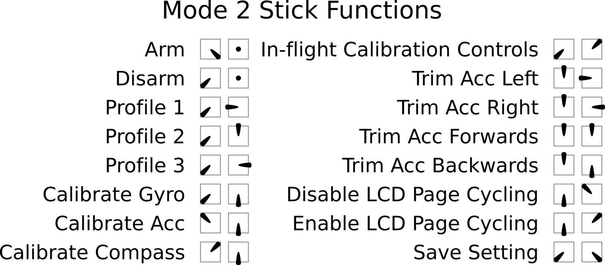

# 控制

## 解锁

解锁后，飞行器已可飞行，施加油门时电机会旋转。解锁时电机会低速旋转（可通过设置 `MOTOR_STOP` 关闭，但出于安全原因不建议这样做）。

默认通过摇杆位置执行解锁和解除解锁。（注意：使用开关解锁时，该功能会关闭。）

某些情况会禁用解锁。在这种情况下，板上的警告 LED 将闪烁一定次数，指示情况：

| 禁止解锁原因                     | LED 闪烁次数 |
| :------------------------------- | :----------- |
| Configurator 中 CLI 处于活动状态 | 2            |
| 失控保护模式处于活动状态         | 3            |
| 飞行器在失控保护模式下已着陆     | 3            |
| 超过最大解锁角度                 | 4            |
| 校准处于活动状态                 | 5            |
| 系统过载                         | 6            |

## 摇杆位置

三个摇杆位置是：

| 位置   | 约略通道输入 |
| :----- | :----------- |
| LOW    | 1000         |
| CENTER | 1500         |
| HIGH   | 2000         |

组合摇杆位置可激活不同的功能：

| 功能                          | Throttle | Yaw    | Pitch  | Roll   |
| :---------------------------- | :------- | :----- | :----- | :----- |
| ARM                           | LOW      | HIGH   | CENTER | CENTER |
| DISARM                        | LOW      | LOW    | CENTER | CENTER |
| Profile 1                     | LOW      | LOW    | CENTER | LOW    |
| Profile 2                     | LOW      | LOW    | HIGH   | CENTER |
| Profile 3                     | LOW      | LOW    | CENTER | HIGH   |
| Calibrate Gyro                | LOW      | LOW    | LOW    | CENTER |
| Calibrate Acc                 | HIGH     | LOW    | LOW    | CENTER |
| Calibrate Mag/Compass         | HIGH     | HIGH   | LOW    | CENTER |
| Inflight calibration controls | LOW      | LOW    | HIGH   | HIGH   |
| Trim Acc Left                 | HIGH     | CENTER | CENTER | LOW    |
| Trim Acc Right                | HIGH     | CENTER | CENTER | HIGH   |
| Trim Acc Forwards             | HIGH     | CENTER | HIGH   | CENTER |
| Trim Acc Backwards            | HIGH     | CENTER | LOW    | CENTER |
| Disable LCD Page Cycling      | LOW      | CENTER | HIGH   | LOW    |
| Enable LCD Page Cycling       | LOW      | CENTER | HIGH   | HIGH   |
| Save setting                  | LOW      | LOW    | LOW    | HIGH   |

### 历史

最初的摇杆命令来自 MultiWII，但原始代码不再有直接链接。

以下列出的原始文件可以在这里找到https://code.google.com/archive/p/multiwii/source/default/source

- `svn/branches/Hamburger/MultiWii-StickConfiguration-23_v0-5772156649.pdf`
- `multiwii/branches/Hamburger/MultiWii-StickConfiguration-23_v0-5772156649.odp`

## 偏航控制

当用操纵杆武装/上锁时，您的偏航操纵杆将移动到极值。为了防止你的手艺
避免在地面上解锁/上锁期间尝试偏航，您的偏航输入不会导致飞行器偏航
油门低（即低于 `min_check` 设置）。

对于三轴飞行器，您可能希望保留在地面上偏航的能力，以便您可以验证您的尾巴
起飞前舵机工作正常。您可以通过在 CLI 上将 `tri_unarmed_servo` 设置为 `ON` 来执行此操作（这是
默认）。如果您在解锁/上锁期间尾桨接触地面时遇到问题，您可以将其设置为
`0` 代替。检查此表以确定哪种设置适合您：

<table>
    <tr>
        <th colspan="5">Is yaw control of the tricopter allowed?</th>
    </tr>
    <tr>
        <th></th><th colspan="2">Disarmed</th><th colspan="2">Armed</th>
    </tr>
    <tr>
        <th></th><th>Throttle low</th><th>Throttle normal</th><th>Throttle low</th><th>Throttle normal</th>
    </tr>
    <tr>
        <td rowspan="2">tri_unarmed_servo = OFF</td><td>No</td><td>No</td><td>No</td><td>Yes</td>
    </tr>
    <tr>
        <td>No</td><td>No</td><td>No</td><td>Yes</td>
    </tr>
    <tr>
        <td rowspan="2">tri_unarmed_servo = ON</td><td>Yes</td><td>Yes</td><td>Yes</td><td>Yes</td>
    </tr>
    <tr>
        <td>Yes</td><td>Yes</td><td>Yes</td><td>Yes</td>
    </tr>
</table>

## 油门设置及其交互

`min_command`-启用电机停止后，当油门低于 min_check 或解除设置时，这是发送到 ESC 的命令。在禁用电机停止的情况下，这是仅在飞行器上锁时发送的命令。为了安全起见，必须将其设置为远低于电机旋转。

`min_check`-
使用开关武装模式时，将油门降低到 min_check 以下将导致电机以 min_throttle 旋转。当使用默认的操纵杆武装时，将油门降低到 min_check 以下将导致电机以 min_throttle 旋转并且偏航被禁用，以便您可以武装/上锁。启用电机停止后，将油门降低到 min_check 以下也会导致电机关闭，并且电调会发送 min_command。 Min_check 必须设置为油门行程 100% 可靠满足的水平。设置太低可能会导致飞行器无法上锁的危险情况。可以将其设置为低于 min_throttle，因为 FC 会自动将输出缩放到 esc 的输出

`min_throttle`-
通常设置为略高于所有电机的可靠旋转。有时，该值设置得稍高，以防止高级机动过程中的螺旋桨失速，有时则设置得相当高，以产生所需的结果。当配备电机停止功能时，您的电机将根据此命令旋转，因此从安全角度考虑，请记住这一点。

`max_check`-
高于此级别的油门位置将向 ESC 发送 max_command。

`max_throttle`-
这是飞控对电调的最大命令。

Joshua Bardwell 提供了解释这些术语的深入视频：

https://www.youtube.com/watch?v=WFU3VewGbbA

https://www.youtube.com/watch?v=YNRl0OTKRGA

## 死区

如果偏航、横滚或俯仰杆无法可靠地返回中心，或者无线电在中心点周围有很多抖动，则可以应用死区。整个死区值应用于中心点的*任一侧*，而不是上方值的一半和下方值的一半。死区值将对摇杆端点值产生影响，因为轴值将根据所应用的死区量而减少。

`deadband`-
适用于横滚、俯仰。

`yaw_deadband`
仅适用于偏航。
