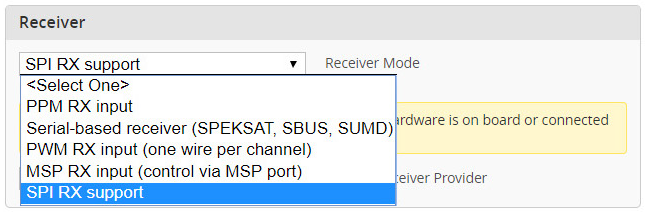
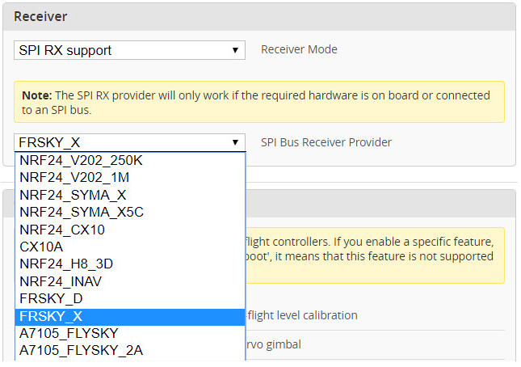
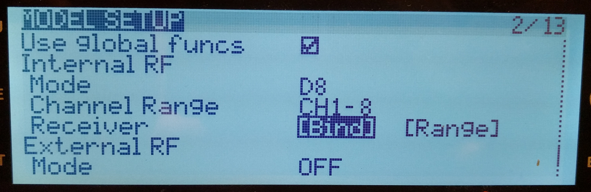
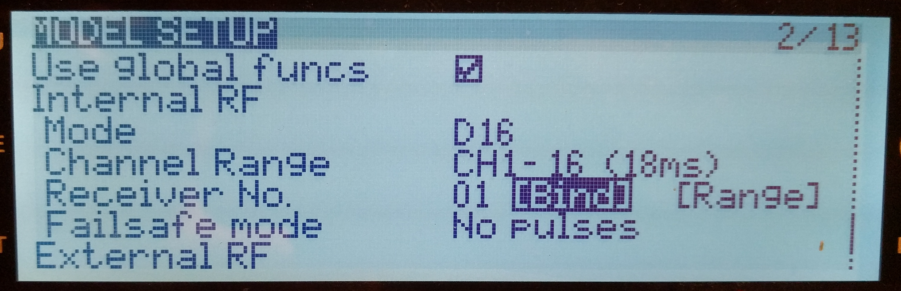

# FrSky SPI 接收机

## 基础

Betaflight 中的“SPI RX”是一个框架：无线芯片可直接连接到飞行控制器 MCU，并由固件控制。固件因此能控制无线芯片，并将接收信号转换为 RC 控制信号。

其优点包括：

- 接收机可直接集成在飞控板上，从而实现更小的装机；毕竟很少有人愿意使用没有接收机的飞控；
- 不占用飞控额外 UART，也不会因 UART 配置错误引发问题；
- 无需额外 MCU 控制无线芯片，因而可降低生产 / 销售成本；
- 接收机“固件”是飞控固件的一部分，修复和更新会随飞控固件更新一并应用，无需执行通常较繁琐的接收机固件更新。

但也存在缺点：

- 一块飞控只配备一种无线芯片，只能支持使用该芯片的 RC 协议；通常无法切换为其他协议。

## FrSky SPI 接收机

此驱动使用 Betaflight 的 SPI RX 框架，基于 CC2500 无线芯片支持 FrSky `2.4 GHz` RC 协议。它还支持带天线分集的 PA/LNA（功率放大器 / 低噪声放大器）芯片，为户外飞行提供足够的功率和灵敏度。

支持以下协议：

### FrSky D

- 8 通道 / `9 ms` 帧间隔；
- 在 OpenTX 中称为 `D8`；
- 集成 FrSky Hub 遥测。

### FrSky X

- 8 通道 / `9 ms` 帧间隔，**或** 16 通道 / `18 ms` 帧间隔；
- 在 OpenTX 中称为 `D16`；
- 集成 FrSky SmartPort 遥测，包括 OpenTX 中通过 SmartPort 使用 MSP / Lua 脚本。

### FrSky X LBT

- 兼容欧盟要求的 LBT 协议版本；
- 8 通道 / `9 ms` 帧间隔，**或** 16 通道 / `18 ms` 帧间隔；
- 在 OpenTX 中称为 `D16`；
- 集成 FrSky SmartPort 遥测，包括 OpenTX 中通过 SmartPort 使用 MSP / Lua 脚本。

## 配置

1. 在 Betaflight App 的 Configuration 选项卡中，找到 Receiver 区域，并在 Receiver mode 中选择 `SPI RX support`。

   

2. 在出现的 SPI Bus Receiver Provider 下拉菜单中，根据需要的协议选择 `FRSKY_D`、`FRSKY_X` 或 `FRSKY_X_LBT`。

   

3. 点击 Save & Reboot。重启后，RX LED 会缓慢闪烁，表示 FrSky 接收机处于活动状态。
4. 通过以下任一方式进入对频模式：

   - 按下飞控上的 Bind 按钮（如有且能触及）；
   - 进入 CLI 并输入 `bind_rx_spi` 后按 Enter。

5. 飞控会让 RX LED 常亮，表示对频模式已启用。现在在发射机上为所选 FrSky 协议进入对频模式（OpenTX 截图见下）。

   FrSky D 协议：

   

   FrSky X 和 X_LBT 协议：

   

6. 对频完成后，RX LED 会再次缓慢闪烁。CLI 不会显示提示，但可退出发射机对频模式后执行 `status`：若“Arming disable flags”中不再出现 `RXLOSS`，即表示对频成功。无需重启飞控。

## 提示与技巧

- 接收机对频信息存储在以下 CLI 参数中：`frsky_spi_tx_id`（内部 TX ID）、`frsky_spi_offset`（频率偏移）、`frsky_spi_bind_hop_data`（跳频序列）和 `frsky_x_rx_num`（RX 编号，仅 FrSky X）。这些参数会包含在 CLI `diff` / `dump` 输出中，并在固件更新后恢复，因此更新后不必再次对频；
- 将以上参数重置为默认值会“清除”对频信息；
- 可启用 CLI 参数 `frsky_spi_autobind`，使 FrSky SPI 接收机每次上电都尝试对频。这主要适用于应与附近任何已上电发射机对频的演示机型。

## 致谢

- 感谢 midelic 对 FrSky 协议进行逆向工程并重新实现；
- 感谢 Eric Freund (eric_fre@hotmail.com) 设计首个采用 FrSky SPI 接收机的飞控原型。

## 配备 FrSky SPI 接收机的板卡

- [Matek F411-ONE](http://www.mateksys.com/?portfolio=f411-one)；
- [CrazyBee F3 FR](/docs/wiki/boards/legacy/CRAZYBEEF3FR)；
- [CrazyBee F4 FR Pro](/docs/wiki/boards/archive/CRAZYBEEF4FRPRO)；
- [BetaFPV F4]
- 后续还会增加更多板卡。
