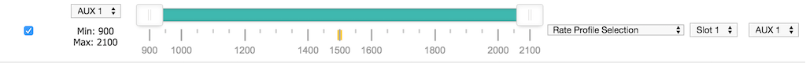
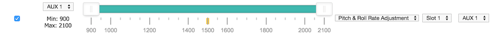
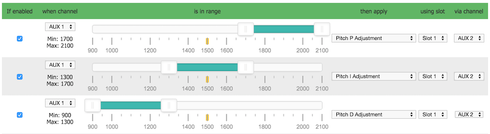
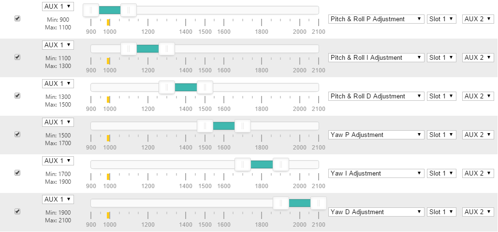
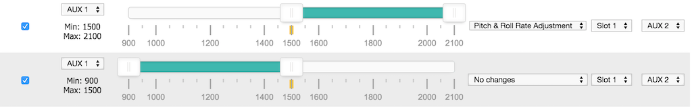
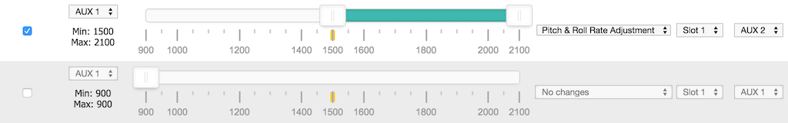
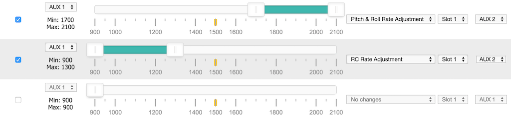
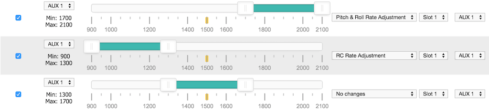

# 飞行中调整

Betaflight 支持在飞行器飞行期间，通过发射机的 AUX 通道调整多项设置。

## 警告

飞行中更改设置可能导致飞行器不稳定；操作不当可能造成坠机。

## 建议

- 始终在开阔场地内进行飞行中调整。
- 每次仅做小幅调整，并谨慎飞行以验证调整效果。
- 预留充足的飞行空间和时间，适应更改后飞行器行为的变化。
- 开启发射机和飞行器电源前，务必将调整通道的开关或电位器置于中位。
- 如条件允许，为专用调整开关配置发射机开关警告。
- 最适合此用途的是自回中三段瞬时开关，即松手后会自动回到中位的开关。

## 概述

调整功能有两种工作模式。第一种是递增/递减模式：通过 AUX 通道调整设置，通常配合三段开关使用。中位不作更改，其余两个位置分别使选定设置递增或递减。

另一种是绝对模式。该模式可将电位器（旋钮或滑块）直接映射到某项设置：电位器中位对应中心值，最小和最大位置对应在该中心值基础上的正负调整范围。

两种模式都需要两个通道才能完成调整。

| 通道     | 用途                                                                                                                                 |
| -------- | ------------------------------------------------------------------------------------------------------------------------------------ |
| 范围通道 | 用于启用某项调整。当该通道的值落入指定范围时，对应调整即被启用。这与模式配置类似：通道值处于设定的下限和上限之间时，指定模式会启用。 |
| 调整通道 | 用于控制指定设置的变化。                                                                                                             |

调整后的设置不会自动保存。请连接 Configurator，刷新后保存；也可在未解锁时使用摇杆组合保存。未保存即断电会丢弃这些调整。

未解锁时可使用以下摇杆组合保存设置：油门最低、偏航向左、俯仰向下、横滚向右。

### 递增/递减模式

最多可同时使用 4 个 RX 通道进行不同调整。

调整通道所执行的调整由范围通道控制。

可用调整项目见[调整功能表](#调整功能)。

示例场景：
最多可使用 4 个三段开关或电位器，同时调整 4 项不同设置。
也可使用一个 2/3/4/5/6/x 段开关，使一个三段开关一次调整一项设置。

可任意组合使用开关和电位器。例如可以使用一个 6 段开关。

#### 调整开关

调整开关关联到调整通道。开关可以是 ON-OFF-ON、POT 或瞬时 ON-OFF-ON；推荐使用后者。

开关回到中位后，数值不会继续增加或减少。

每次将开关拨至高位或低位后再回到中位，数值至少会改变一次。若希望更快地增加或减少，无需等待即可再次拨动。持续按住调整开关于高位或低位时，调整功能会以每秒两次的频率增加或减少目标值；飞控会相应发出更短或更长的蜂鸣声。该机制与键盘按键的连发延迟类似。

提示：在 OpenTX 发射机中，可将两个瞬时 OFF-ON 开关组合为一个通道。例如，可将发射机左侧的瞬时开关设为减小数值，右侧的瞬时开关设为增大数值。请在混控中自行尝试。

### 绝对模式

绝对模式下，调整通道是连接到电位器（旋钮或滑块）的 AUX 通道。相较递增/递减模式，此方式更易于掌握当前设置值。

请注意：若同一电位器作为调整通道用于多项调整，在电位器未居中时从第一项切换到第二项，第二项设置可能突然跳变。为避免此问题，若要使用同一电位器调整两项不同设置，建议用三段开关作为范围通道，并且不要将任一设置关联到其中位。

## 配置

使用 CLI 命令 `adjrange` 配置调整范围。

最多可定义 12 个调整范围。

使用以下命令显示当前范围：

`adjrange`

使用以下命令配置范围：

`adjrange <index> 0 <range channel> <range start> <range end> <adjustment function> <adjustment channel>`

| 参数                | 取值                                                                                                        | 含义                                          |
| ------------------- | ----------------------------------------------------------------------------------------------------------- | --------------------------------------------- |
| Index               | 0 - 29                                                                                                      | 要配置的调整范围索引。                        |
| 0                   | 0                                                                                                           | Betaflight 4.1 之前用作 slot 的字段。         |
| Range Channel       | 从 0 开始的索引，AUX1 = 0，AUX2 = 1                                                                         | 用于通过开关或电位器选择某项调整的 AUX 通道。 |
| Range Start         | 900 - 2100，步进为 25，例如 900、925、950...                                                                | 范围起始值。                                  |
| Range End           | 900 - 2100                                                                                                  | 范围结束值。                                  |
| Adjustment function |                                                                                                             | 见[调整功能表](#调整功能)。                   |
| Adjustment channel  | 从 0 开始的索引，AUX1 = 0，AUX2 = 1                                                                         | 由三段开关或电位器控制的通道。                |
| Center Value        | 非零时，此范围使用绝对模式；否则使用递增/递减模式。在绝对模式中，当调整通道处于中位时，此值将赋给对应设置。 |
| Scale Value         | 指定调整通道位于最小或最大位置时，分别从中心值减去或加上的数值。                                            |

范围起始值和结束值应与接收机输出的数值相匹配。

范围通道和调整通道可以是同一通道。这适用于希望由一个三段开关专门控制单一调整功能、且不受其他开关位置影响的场景。

当范围通道处于范围值之间时，调整功能会作用于调整通道。
调整通道位于高位或低位时才会执行调整。高位 = `mid_rc + 200`，低位 = `mid_rc - 200`；默认分别为 1700 和 1300。

### 调整功能

| 值  | 调整项                   | 说明                                                                 |
| --- | ------------------------ | -------------------------------------------------------------------- |
| 0   | 无                       |                                                                      |
| 1   | RC RATE                  | 步进或绝对设置。                                                     |
| 2   | RC_EXPO                  | 步进或绝对设置。                                                     |
| 3   | THROTTLE_EXPO            | 步进或绝对设置。                                                     |
| 4   | PITCH_ROLL_RATE          | 步进或绝对设置。                                                     |
| 5   | YAW_RATE                 | 步进或绝对设置。                                                     |
| 6   | PITCH_ROLL_P             | 步进或绝对设置。                                                     |
| 7   | PITCH_ROLL_I             | 步进或绝对设置。                                                     |
| 8   | PITCH_ROLL_D             | 步进或绝对设置。                                                     |
| 9   | YAW_P                    | 步进或绝对设置。                                                     |
| 10  | YAW_I                    | 步进或绝对设置。                                                     |
| 11  | YAW_D                    | 步进或绝对设置。                                                     |
| 12  | RATE_PROFILE             | 在 3 个或 6 个速率配置文件之间切换（使用 `rate_6pos_switch` 设置）。 |
| 13  | PITCH_RATE               | 步进或绝对设置。                                                     |
| 14  | ROLL_RATE                | 步进或绝对设置。                                                     |
| 15  | PITCH_P                  | 步进或绝对设置。                                                     |
| 16  | PITCH_I                  | 步进或绝对设置。                                                     |
| 17  | PITCH_D                  | 步进或绝对设置。                                                     |
| 18  | ROLL_P                   | 步进或绝对设置。                                                     |
| 19  | ROLL_I                   | 步进或绝对设置。                                                     |
| 20  | ROLL_D                   | 步进或绝对设置。                                                     |
| 21  | RC_RATE_YAW              | 步进或绝对设置。                                                     |
| 22  | PITCH_ROLL_F             | 步进或绝对设置。                                                     |
| 23  | FEEDFORWARD_TRANSITION   | 步进或绝对设置。                                                     |
| 24  | HORIZON_STRENGTH         | 选择地平线模式强度。                                                 |
| 25  | PID_AUDIO                | 选择要转换为音调的 PID 值。                                          |
| 26  | PITCH_F                  | 步进或绝对设置。                                                     |
| 27  | ROLL_F                   | 步进或绝对设置。                                                     |
| 28  | YAW_F                    | 步进或绝对设置。                                                     |
| 29  | OSD_PROFILE              | 在 3 个 OSD 配置文件之间切换。                                       |
| 30  | LED_PROFILE              | 在 RACE / BEACON / STATUS LED 灯带配置文件之间切换。                 |
| 31  | SLIDER_MASTER_MULTIPLIER | 调整用于 PID 调校的简化主倍率。详见下文。                            |

## 滑块主倍率 (ADJUSTMENT_SIMPLIFIED_MASTER_MULTIPLIER)

此飞行中调整功能允许您在飞行时使用滑块或电位器，缩放 PID 调校的简化主倍率。

- 进入调整范围时，系统会将滑块位置和当前倍率保存为基准。
- 移动滑块会根据相对于基准的缩放增量调整倍率。
- 数值限制在 20 至 200 之间，更新会立即生效，每次改变均会发出蜂鸣提示。

**标签（OSD/Configurator 显示）：** `SLIDER MASTER MULTIPLIER`
**表格标识符：** `SLIDER_MASTER_MULTIPLIER`

它们都指向同一个设置，只是适用场景不同：标签显示在 OSD 和 Configurator 界面中；表格标识符出现在上方的调整功能表中；实现所用的枚举或函数则用于固件源代码和 CLI。

**技术细节：**

- 调整功能为 ADJUSTMENT_SIMPLIFIED_MASTER_MULTIPLIER。
- 该值按从配置中读取的 `adjustmentScale` 缩放（见上方配置表中的 Scale Value）。若省略 `adjustmentScale`，或将 `adjrange` 的 Scale 设为 0，则使用默认 1.25× 缩放系数。
- 倍率会在 PID 配置文件中更新，并通过 `applySimplifiedTuningPids()` 和 `pidInitConfig()` 应用。

## 示例

### 示例 1：使用三段开关调整俯仰/横滚速率

```
adjrange 0 0 3 900 2100 4 3 0 0
```

说明：

- 配置 `adjrange 0`：当 aux4（3）位于 900-2100 范围内时，若 aux4（3）处于相应位置，则使用调整功能 4（俯仰/横滚速率）。
- Center 和 Scale 值均为零，因此此范围使用递增/递减模式。

### 示例 2：使用二段开关启用通过三段开关进行的 RC 速率调整

```
adjrange 1 0 0 900 1700 0 2 0 0
adjrange 2 0 0 1700 2100 1 2 0 0
```

说明：

- 配置 `adjrange 1`：当 aux1（0）位于 900-1700 范围内时，无论 aux3（2）处于何位置，均不执行任何调整（0）。
- 配置 `adjrange 2`：当 aux1（0）位于 1700-2100 范围内时，若 aux3（2）处于相应位置，则使用 RC 速率调整（1）。
- Center 和 Scale 值均为零，因此此范围使用递增/递减模式。

若未定义 aux1 的整个范围，则当 aux1 不再处于高范围时，没有任何机制能阻止 aux3 继续调整俯仰/横滚速率。

### 示例 3：使用六段开关选择通过三段开关执行的 PID 调整

```
adjrange 3 0 1 900 1150 6 3 0 0
adjrange 4 0 1 1150 1300 7 3 0 0
adjrange 5 0 1 1300 1500 8 3 0 0
adjrange 6 0 1 1500 1700 9 3 0 0
adjrange 7 0 1 1700 1850 10 3 0 0
adjrange 8 0 1 1850 2100 11 3 0 0
```

说明：

- 配置 `adjrange 3`：当 aux2（1）位于 900-1150 范围内时，若 aux4（3）处于相应位置，则使用俯仰/横滚 P 调整（6）。
- 配置 `adjrange 4`：当 aux2（1）位于 1150-1300 范围内时，若 aux4（3）处于相应位置，则使用俯仰/横滚 I 调整（7）。
- 配置 `adjrange 5`：当 aux2（1）位于 1300-1500 范围内时，若 aux4（3）处于相应位置，则使用俯仰/横滚 D 调整（8）。
- 配置 `adjrange 6`：当 aux2（1）位于 1500-1700 范围内时，若 aux4（3）处于相应位置，则使用偏航 P 调整（9）。
- 配置 `adjrange 7`：当 aux2（1）位于 1700-1850 范围内时，若 aux4（3）处于相应位置，则使用偏航 I 调整（10）。
- 配置 `adjrange 8`：当 aux2（1）位于 1850-2100 范围内时，若 aux4（3）处于相应位置，则使用偏航 D 调整（11）。
- Center 和 Scale 值均为零，因此此范围使用递增/递减模式。

### 示例 4：使用单个三段开关切换 3 个不同的速率配置文件

```
adjrange 11 0 3 900 2100 12 3 0 0
```

说明：

- 配置 `adjrange 11`：当 aux4（3）位于 900-2100 范围内时，若 aux4（3）处于相应位置，则使用速率配置文件调整（12）。
- Center 和 Scale 值均为零，因此此范围使用递增/递减模式。

开关位于低位时，选择速率配置文件 0。
开关位于中位时，选择速率配置文件 1。
开关位于高位时，选择速率配置文件 2。

### 示例 5：使用单个开关启用两个电位器对横滚/俯仰 P 项的绝对设置

```
adjrange 0 0 4 1450 1550 18 0 40 10
adjrange 1 0 4 1450 1550 15 1 58 20
```

说明：

- Center 值非零，因此此范围使用绝对模式。
- 配置 `adjrange 0`：当 aux5（3）位于 1450-1550 范围内时，使用 aux1（0）调整横滚 P 调整（18）；电位器处于中位时，值为 40，最小和最大位置时分别为 30/50。
- 配置 `adjrange 1`：当 aux5（3）位于 1450-1550 范围内时，使用 aux2（0）调整俯仰 P 调整（15）；电位器处于中位时，值为 58，最小和最大位置时分别为 38/78。

### 示例 6：使用单个开关在三组电位器间选择，并对横滚/俯仰 P/I/D 项进行绝对设置

```
adjrange 0 0 4 950 1050 18 0 40 20
adjrange 1 0 4 950 1050 19 1 107 53
adjrange 2 0 4 950 1050 20 2 76 38
adjrange 3 0 4 1950 2050 15 0 63 16
adjrange 4 0 4 1950 2050 16 1 138 69
adjrange 5 0 4 1950 2050 17 2 66 33
```

说明：

- Center 值非零，因此此范围使用绝对模式。

此配置将 aux1、aux2 和 aux3 电位器分别分配给 P、I 和 D 设置。电位器处于中位时，对应默认 P/I/D 值，并提供 +/- 50% 的调整范围。aux5 开关处于一个端位时调整横滚 P/I/D；处于另一个端位时调整俯仰 P/I/D；处于中位时两者都不调整。因此，可以先将电位器置中，将 aux5 切换至横滚并在飞行中调整 P/I/D。随后降落，将 aux5 切至中位并将电位器置中，再切换至俯仰，继续在飞行中调整 P/I/D。

## Configurator 对 Center 和 Scale 值的支持

从 [Betaflight Configurator PR #4863](https://github.com/betaflight/betaflight-configurator/pull/4863) 和固件 API 版本 1.48 开始，Adjustments 标签页可直接在界面中为每个调整范围设置 Center (`adjCenter`) 和 Scale (`adjScale`) 值。这样可更轻松地配置滑块主倍率等功能。

- 这些数值仅支持通过 MSP（Configurator/GUI）设置，CLI 命令不支持（见 [Betaflight PR #14920](https://github.com/betaflight/betaflight/pull/14920/changes)）。
- 如需使用这些功能，请确保固件和 Configurator 均已更新，且支持 API 版本 1.48 或更高版本。

## Configurator 示例

以下 5 张图片展示了有效配置。每种配置都使用了范围通道的整个可用范围。



---



---



---



---



以下示例展示了**不正确**的配置：两种情况下都没有使用范围通道的整个可用范围。




在下面的示例中，通过增加一个执行“无更改”的范围，已修正上述不正确的配置。


