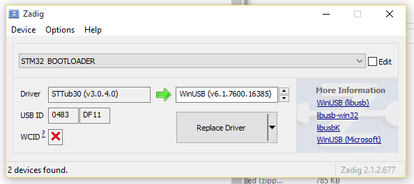

# USB 刷写

部分提供完整 USB 支持的新板卡必须在 USB DFU 模式下刷写。对于 Betaflight 地面站 0.67 及更高版本，流程很直接。标准刷写流程通常可成功完成，但需注意下文列出的平台相关问题。

“无重启序列”复选框无效：设备已处于 Bootloader 模式时会被自动检测；此时连接下拉框中会显示 DFU 设备。“全芯片擦除”复选框照常生效。“波特率”复选框会被忽略，因为波特率与 USB 无关。

### 仅充电线缆

若将板卡接入电脑后主机毫无反应，请用手机或其他 USB 设备检查线缆。部分充电线缆只连接了电源针脚：它们会让板卡上电、LED 点亮，但电脑完全不会识别设备。必须使用完整数据线才能将板卡连接至 Betaflight 地面站。

### 进入 DFU 模式

要强制进入 DFU 模式，在插入 USB 线缆时按住 Boot 按钮；USB 接通后即可松开。若设备仍无法识别，例如 Windows 显示为“Unknown USB Device (Device Descriptor Failed)”，可能需要拆除 UART1 数据线焊接，因为它们会阻碍板卡正确进入 DFU 模式。详情见 Joshua Bardwell 的[视频](https://www.youtube.com/watch?v=Zj24aEOyTWs)。

## 平台说明：Linux

为了让 Betaflight App 访问串口，你的账户必须属于 `dialout` 组。可通过以下命令添加：

```
sudo usermod -a -G dialout <username>
```

若日志显示 `unable to open serial port`，可能遗漏了此步骤。

### Ubuntu

Linux 需要通过 udev 规则向用户授予 USB 设备写入权限。Ubuntu 可使用以下示例命令：

```
(echo '# DFU (Internal bootloader for STM32 and AT32 MCUs)'
 echo 'SUBSYSTEM=="usb", ATTRS{idVendor}=="2e3c", ATTRS{idProduct}=="df11", MODE="0664", GROUP="plugdev"'
 echo 'SUBSYSTEM=="usb", ATTRS{idVendor}=="0483", ATTRS{idProduct}=="df11", MODE="0664", GROUP="plugdev"') | sudo tee /etc/udev/rules.d/45-stdfu-permissions.rules > /dev/null
```

此规则会将设备分配到 `plugdev` 组（Ubuntu 的标准组）。在 shell 中执行 `groups`，确认输出包含 `plugdev`。若没有，可用以下命令添加账户（用你的用户名替换 `<username>`）：

```
sudo usermod -a -G plugdev <username>
```

### Fedora

使用 Fedora 时，无需将账户加入 `plugdev` 组；应在 DFU 的 udev 规则中改用 `uaccess` 标签：

```
(echo '# DFU (Internal bootloader for STM32 and AT32 MCUs)'
 echo 'SUBSYSTEM=="usb", ATTRS{idVendor}=="2e3c", ATTRS{idProduct}=="df11", MODE="0664", TAG+="uaccess"'
 echo 'SUBSYSTEM=="usb", ATTRS{idVendor}=="0483", ATTRS{idProduct}=="df11", MODE="0664", TAG+="uaccess"') | sudo tee /etc/udev/rules.d/45-stdfu-permissions.rules > /dev/null
```

### 连接问题：ModemManager

若板卡接入后 `ttyUSB` 设备立即消失，可能是处理网络连接的 ModemManager 服务将其误认为 GSM 调制解调器。可执行以下命令停止服务：

```
sudo systemctl stop ModemManager.service
```

若系统没有 `systemctl`，请使用系统中可禁用服务的等效命令。若需要使用蜂窝网络，可将设备 ID 添加至黑名单配置文件，防止 ModemManager 访问它；这超出 Betaflight 文档范围。

若通过 USB 接入飞控后，`ttyUSB` 设备在 Betaflight App 列表中出现又立即消失，可能是 NetworkManager 将板卡视为 GSM 调制解调器，并将其交给 ModemManager 守护进程处理，因为飞控不在黑名单中。

## 平台说明：Windows

Chrome 在 Windows 上访问 USB 设备可能出现问题。Windows 会自动为 DFU 模式的 ST 设备安装驱动，但该驱动不一定能让 Chrome 访问。解决方法是将 ST 驱动替换为 libusb 驱动；最简单的方式是下载 [Zadig](http://zadig.akeo.ie/)。连接板卡并使其处于 Bootloader 模式（通过串口发送字符 `R` 重置，或在 Configurator 中选择正确串口后尝试刷写）：

- 打开 Zadig。
- 选择 Options > List All Devices。
- 在设备列表中选择 `STM32 BOOTLOADER`。
- 在右侧框中选择 `WinUSB (v6.x.x.x)`。
  
- 点击 Replace Driver。
- 重启 Chrome，确保它完全关闭；不确定时先注销再登录。
- Configurator 现在应能识别 DFU 设备。

## 另请参阅

- [固件安装](/docs/wiki/getting-started/Firmware-Installation) - 标准固件刷写流程
- [USB 损坏救援](/docs/wiki/guides/current/Broken-USB-Rescue) - 通过 USB 无法连接板卡时的恢复方法
- [DFU 劫持](/docs/wiki/guides/current/DFU-Hijacking) - 高级 DFU 模式恢复技术
